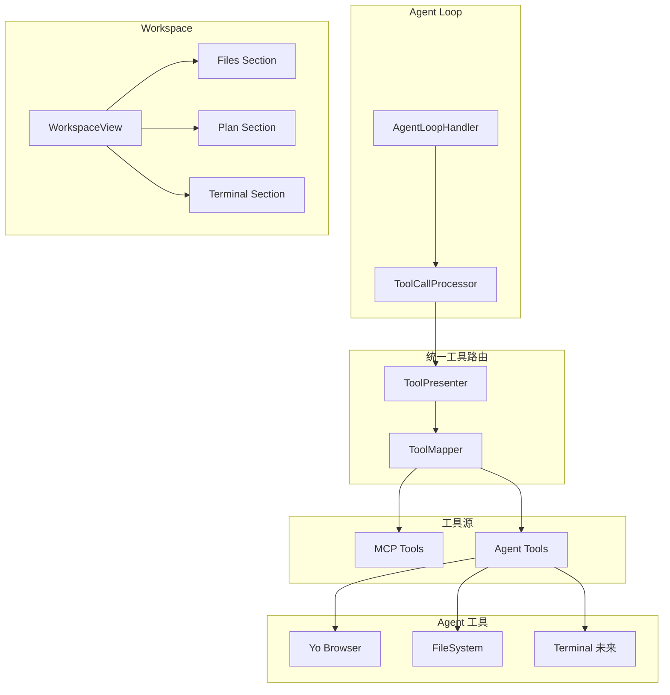

# 通用 Workspace 和 Agent 能力重构计划

## 架构概览




## 核心变更

### 1. 统一工具路由架构

**目标**：抽象统一的工具路由层，统一管理所有工具源，使用 MCP 规范的工具定义格式。**实现**：

- 创建 `ToolPresenter` 类，统一管理所有工具（MCP、Agent 等）
- 创建 `ToolMapper` 类，实现工具名称到工具源的映射机制
- 所有工具定义统一使用 MCP 规范格式（`MCPToolDefinition`）
- 工具调用时根据映射路由到对应的工具源处理器
- 未来支持工具去重和映射（如果 MCP 和 Agent 有同名工具，可以映射到 MCP 工具）

### 2. Agent 工具管理简化

**目标**：简化 Agent 工具管理，根据 chatMode 决定工具注入。**实现**：

- 创建 `AgentToolManager` 类，管理所有 Agent 工具
- Agent 工具包括：
- **Yo Browser**：保持现有实现，工具名称使用 `browser_` 前缀（如 `browser_navigate`）
- **FileSystem**：新增，工具名称**不加前缀**（如 `read_file`, `write_file`）
- **Terminal**：未来扩展
- 工具注入逻辑：
- **chat 模式**：不注入 Agent 工具（只有 MCP 工具）
- **agent 模式**：注入所有 Agent 工具（yo browser、filesystem 等）
- **acp agent 模式**：根据 ACP 逻辑决定（后续补充具体实现）
- 保留扩展能力，未来可以扩展成按需注入

### 3. 文件系统能力抽象

**目标**：将 filesystem MCP 重构为 Agent 工具，从 MCP 系统中移除。**实现**：

- 创建 `AgentFileSystemHandler` 类，封装文件操作能力
- 工具名称不加前缀，例如：`read_file`, `write_file`, `list_directory` 等
- 从 `mcpConfHelper.ts` 中移除 `buildInFileSystem` 配置
- 从 `inMemoryServers/builder.ts` 中移除 filesystem server 的创建逻辑

### 4. 通用 Mode Switch 配置

**目标**：添加通用的 Mode Switch，支持三种模式（chat、agent、acp agent），支持数据库持久化。**实现**：

- 在配置存储（ElectronStore）中添加 `chatMode: 'chat' | 'agent' | 'acp agent'` 字段
- 在 `chatConfig` 中添加 `chatMode` 字段（从配置存储读取）
- 创建 `useChatMode` composable，管理模式状态
- 在 `ChatInput.vue` 中添加 Mode Switch 选择器（下拉选择或按钮组）
- 三种模式的区别：
- **chat**：基础聊天模式，只有 MCP 工具，不支持 yo browser、文件读写等功能
- **agent**：内置 agent 模式，包含 workdir 设置、各种工具（yo browser、文件读写等）、agent loop 定制内容
- **acp agent**：ACP 模式，只有这个模式才能选择 ACP 模型，loop 和逻辑会有不同（后续补充具体实现）
- 确保配置的持久化和统一化管理
- **注意**：这个 mode switch 和 ACP agent 里面的 mode（session mode）不是一回事

### 5. Workspace 组件通用化

**目标**：将 `AcpWorkspaceView` 重构为通用的 `WorkspaceView`，支持所有模型。**实现**：

- 重命名 `AcpWorkspaceView.vue` → `WorkspaceView.vue`
- 重命名 `acpWorkspace` store → `workspace` store
- 重命名 `AcpWorkspacePresenter` → `WorkspacePresenter`
- 移除 ACP 特定的依赖，改为基于 Agent 模式判断

### 6. Workspace 路径选择（统一化）

**目标**：统一化目录选择按钮，不同模式使用不同的工作目录。**实现**：

- 在 `chatConfig` 中添加 `agentWorkspacePath: string | null` 字段
- 创建 `useAgentWorkspace` composable，统一管理工作目录选择
- 在 `ChatInput.vue` 的 Tools 区域添加目录选择按钮（在 agent 或 acp agent 模式下显示）
- 目录选择按钮逻辑统一化：
- **acp agent 模式**：使用 ACP workdir（现有的 ACP workdir 逻辑）
- **agent 模式**：使用 filesystem 工具的工作目录，以及未来各种工具的工作目录
- 按钮样式和行为：参考现有的 ACP workdir 按钮

## 文件变更清单

### 新增文件

1. `src/main/presenter/toolPresenter/index.ts` - 统一工具路由 Presenter，管理所有工具源
2. `src/main/presenter/toolPresenter/toolMapper.ts` - 工具映射器，实现工具名称到工具源的映射
3. `src/main/presenter/llmProviderPresenter/agent/agentToolManager.ts` - Agent 工具管理器，管理所有 Agent 工具
4. `src/main/presenter/llmProviderPresenter/agent/agentFileSystemHandler.ts` - 文件系统能力处理器，工具名称不加前缀
5. `src/renderer/src/stores/workspace.ts` - 通用 Workspace Store（从 acpWorkspace 重构）
6. `src/main/presenter/workspacePresenter/index.ts` - 通用 Workspace Presenter（从 acpWorkspacePresenter 重构）
7. `src/renderer/src/components/workspace/WorkspaceView.vue` - 通用 Workspace 组件（从 acp-workspace 重构）
8. `src/renderer/src/components/workspace/WorkspaceFiles.vue` - 文件列表组件
9. `src/renderer/src/components/workspace/WorkspacePlan.vue` - 计划组件
10. `src/renderer/src/components/workspace/WorkspaceTerminal.vue` - 终端组件
11. `src/renderer/src/components/chat-input/composables/useChatMode.ts` - Chat Mode Switch composable（参考 useInputSettings 实现，使用 configPresenter.setSetting/getSetting 持久化）
12. `src/renderer/src/components/chat-input/composables/useAgentWorkspace.ts` - Workspace 路径选择 composable（统一化，根据 chatMode 使用不同的逻辑：acp agent 模式使用 ACP workdir，agent 模式使用 filesystem 工作目录）

### 修改文件

1. `src/main/presenter/llmProviderPresenter/managers/agentLoopHandler.ts` - 使用统一的 ToolPresenter，简化工具注入逻辑
2. `src/main/presenter/llmProviderPresenter/managers/toolCallProcessor.ts` - 使用 ToolPresenter 进行工具调用路由
3. `src/main/presenter/configPresenter/index.ts` - 无需修改，使用现有的 setSetting/getSetting 方法即可（chatMode 通过 'input_chatMode' key 存储）
4. `src/main/presenter/configPresenter/mcpConfHelper.ts` - 移除 buildInFileSystem 配置
5. `src/main/presenter/mcpPresenter/inMemoryServers/builder.ts` - 移除 filesystem server
6. `src/renderer/src/stores/chat.ts` - 添加 chatMode 和 agentWorkspacePath 配置
7. `src/shared/presenter.d.ts` - 更新类型定义，添加 ToolPresenter 接口和 ChatMode 类型
8. `src/renderer/src/components/chat-input/ChatInput.vue` - 添加 Mode Switch 选择器和路径选择器

- 添加 Mode Switch 选择器：使用 icon + 下拉选择（类似模型选择器，但更简约）
- Icon 映射：chat 用 `message-circle-more`，agent 用 `bot`，acp agent 用 `bot-message-square`
- 在 agent 或 acp agent 模式时显示统一的目录选择按钮
- 集成 `useChatMode` 和 `useAgentWorkspace` composables

9. `src/renderer/src/components/ModelChooser.vue` - 更新模型选择逻辑，只在 acp agent 模式下显示 ACP 模型
10. `src/renderer/src/components/chat/ChatView.vue` - 使用通用 WorkspaceView

### 删除/废弃文件

1. `src/renderer/src/components/acp-workspace/` - 整个目录（重构为 workspace）
2. `src/renderer/src/stores/acpWorkspace.ts` - 重构为 workspace.ts
3. `src/main/presenter/acpWorkspacePresenter/` - 重构为 workspacePresenter

## 实施步骤

### Phase 1: 统一工具路由架构

1. 创建 `ToolPresenter` 类：

- 统一管理所有工具源（MCP、Agent）
- 提供 `getAllToolDefinitions()` 方法，返回统一的 MCP 规范格式工具定义
- 提供 `callTool()` 方法，根据工具映射路由到对应的处理器

2. 创建 `ToolMapper` 类：

- 实现工具名称到工具源的映射机制
- 支持未来扩展工具去重和映射功能

3. 创建 `AgentToolManager` 类：

- 管理所有 Agent 工具（Yo Browser、FileSystem 等）
- 只要 Agent 模式启用，所有工具都注入
- 工具定义统一使用 MCP 规范格式

4. 创建 `AgentFileSystemHandler` 类：

- 封装文件系统操作能力
- 工具名称不加前缀（如 `read_file`, `write_file`）
- 工具定义使用 MCP 规范格式

### Phase 2: 集成工具路由

1. 更新 `AgentLoopHandler`：

- 使用 `ToolPresenter` 获取所有工具定义
- 简化工具注入逻辑，不再区分工具源

2. 更新 `ToolCallProcessor`：

- 使用 `ToolPresenter.callTool()` 进行工具调用
- 根据工具映射自动路由到对应的处理器

### Phase 3: 通用 Mode Switch 配置

1. 创建 `useChatMode` composable（参考 `useInputSettings` 的实现方式）：

- 使用 `configPresenter.setSetting('input_chatMode', value)` 保存模式
- 使用 `configPresenter.getSetting('input_chatMode')` 读取模式
- 管理模式状态（chat、agent、acp agent）
- 默认值：`'chat'`
- 在 `onMounted` 时自动加载保存的模式
- 提供 `setMode()` 方法切换模式并持久化

2. 在 `chatConfig` 中添加 `chatMode` 字段：

- 从 `useChatMode` composable 读取当前模式
- 支持会话级别的覆盖（如果需要）

3. 在 `ChatInput.vue` 中添加 Mode Switch 选择器：

- 使用下拉选择（类似模型选择器），但样式更简约
- 在 ChatInput 中只显示一个 icon，hover 时显示当前模式
- Icon 映射：
- chat: `lucide:message-circle-more`
- agent: `lucide:bot`
- acp agent: `lucide:bot-message-square`
- 点击 icon 或 hover 时显示下拉选择器
- 集成 `useChatMode` composable
- 根据当前模式显示不同的 UI 和功能

4. 更新模型选择逻辑：

- 只有在 `acp agent` 模式下才显示 ACP 模型
- 其他模式隐藏 ACP 模型选项

### Phase 4: MCP Filesystem 移除

1. 从 `mcpConfHelper.ts` 移除 `buildInFileSystem` 配置
2. 从 `inMemoryServers/builder.ts` 移除 filesystem server
3. 添加数据迁移逻辑，将现有 buildInFileSystem 配置迁移

### Phase 5: Workspace 组件通用化

1. 创建通用 `WorkspacePresenter`
2. 创建通用 `workspace` store
3. 重构 Workspace 组件，移除 ACP 依赖
4. 更新事件系统，支持通用 Workspace

### Phase 6: Workspace 路径选择（统一化）

1. 在 `chatConfig` 中添加 `agentWorkspacePath` 字段
2. 创建 `useAgentWorkspace` composable，统一管理工作目录：

- 根据当前 `chatMode` 决定工作目录的用途
- **acp agent 模式**：使用现有的 ACP workdir 逻辑（`useAcpWorkdir`）
- **agent 模式**：使用 filesystem 工具的工作目录
- 支持未来扩展其他工具的工作目录
- 提供统一的接口和状态管理

3. 在 `ChatInput.vue` 中添加统一的目录选择按钮：

- 在 `agent` 或 `acp agent` 模式下显示
- 参考现有的 ACP workdir 按钮实现
- 根据模式显示不同的 tooltip 和逻辑
- 按钮样式和行为统一

4. 实现临时目录创建和管理逻辑

### Phase 7: 集成和测试

1. 更新所有引用 ACP Workspace 的地方
2. 添加 i18n 翻译
3. 测试各种场景（切换不同模式、路径选择、模型选择等）
4. 更新文档

## 关键技术点

### 工具命名规范

- **MCP 工具**：保持原样（如 `read_files`, `write_file`）
- **Agent 工具**：**不加前缀**（如 `read_file`, `write_file`, `browser_navigate`）
- Yo Browser：保持 `browser_` 前缀（已存在）
- FileSystem：不加前缀（如 `read_file`, `write_file`）
- Terminal：未来不加前缀（如 `execute_command`）

### 工具路由机制

- 所有工具定义统一使用 MCP 规范格式（`MCPToolDefinition`）
- `ToolMapper` 维护工具名称到工具源的映射
- 工具调用时根据映射自动路由：
- 如果工具名称映射到 MCP → 调用 `mcpPresenter.callTool()`
- 如果工具名称映射到 Agent → 调用 `agentToolManager.callTool()`
- 未来支持工具去重：如果 MCP 和 Agent 有同名工具，可以配置映射到 MCP 工具

### Agent 工具注入机制（基于 Mode）

- 根据 `chatMode` 决定工具注入：
- **chat 模式**：不注入 Agent 工具，只有 MCP 工具
- **agent 模式**：注入所有 Agent 工具（yo browser、filesystem 等）
- **acp agent 模式**：根据 ACP 逻辑决定（后续补充具体实现）
- 工具注入逻辑：
- Yo Browser：在 agent 或 acp agent 模式下，当浏览器窗口打开时注入
- FileSystem：在 agent 或 acp agent 模式下注入
- Terminal：未来按需扩展
- 保留扩展能力，未来可以扩展成按需注入机制

### 配置持久化

- `chatMode` 通过 `configPresenter.setSetting('input_chatMode', value)` 存储
- 通过 `configPresenter.getSetting('input_chatMode')` 读取
- 类型：`'chat' | 'agent' | 'acp agent'`
- 默认值：`'chat'`
- 存储方式：与 `input_webSearch`、`input_deepThinking` 相同，存储在 ElectronStore 中
- 在 `useChatMode` composable 的 `onMounted` 时自动加载保存的模式
- 配置统一化管理，通过 `ConfigPresenter` 访问
- 会话级别的配置可以覆盖全局配置（如果需要）

### Mode Switch 与 ACP Session Mode 的区别

- **Chat Mode Switch**：全局模式选择，决定整个会话的行为和可用功能
- chat：基础聊天模式
- agent：内置 agent 模式
- acp agent：ACP 专用模式
- **ACP Session Mode**：ACP agent 模式下的会话模式（如 plan、code 等），由 ACP agent 内部定义
- 两者是不同层级的概念，互不干扰

### 路径安全

- Agent 模式下的文件操作必须限制在用户选择的 workspace 路径内
- 临时目录在会话结束后自动清理
- 所有路径操作都需要验证权限

### 向后兼容

- 保留 ACP Provider 的现有功能
- 迁移现有 ACP Workspace 数据到通用 Workspace
- 确保现有 MCP filesystem 配置能平滑迁移

## ChatInput.vue 重构细节

### Mode Switch 选择器实现

**位置**：在 Tools 区域，搜索开关之后，MCP Tools 之前**实现方式**：Icon + 下拉选择（类似模型选择器，但更简约）**Icon 映射**：

- chat: `lucide:message-circle-more`
- agent: `lucide:bot`
- acp agent: `lucide:bot-message-square`

**实现示例**：

```vue
<Popover v-model:open="modeSelectOpen">
  <PopoverTrigger as-child>
    <Tooltip>
      <TooltipTrigger as-child>
        <Button
          variant="outline"
          :class="[
            'w-7 h-7 text-xs rounded-lg',
            variant === 'chat' ? 'text-accent-foreground' : ''
          ]"
          size="icon"
        >
          <Icon :icon="chatMode.currentIcon.value" class="w-4 h-4" />
        </Button>
      </TooltipTrigger>
      <TooltipContent>
        {{ t('chat.mode.current', { mode: chatMode.currentLabel.value }) }}
      </TooltipContent>
    </Tooltip>
  </PopoverTrigger>
  <PopoverContent align="start" class="w-64 border-none bg-transparent p-0 shadow-none">
    <div class="rounded-lg border bg-card p-1 shadow-md">
      <div
        v-for="mode in chatMode.modes"
        :key="mode.value"
        :class="[
          'flex items-center gap-2 rounded-md px-2 py-1.5 text-sm cursor-pointer transition-colors',
          chatMode.currentMode.value === mode.value
            ? 'bg-primary text-primary-foreground'
            : 'hover:bg-muted'
        ]"
        @click="chatMode.setMode(mode.value); modeSelectOpen = false"
      >
        <Icon :icon="mode.icon" class="w-4 h-4" />
        <span class="flex-1">{{ mode.label }}</span>
        <Icon
          v-if="chatMode.currentMode.value === mode.value"
          icon="lucide:check"
          class="w-4 h-4"
        />
      </div>
    </div>
  </PopoverContent>
</Popover>
```

**useChatMode composable 需要添加**：

```typescript
const modeIcons = {
  chat: 'lucide:message-circle-more',
  agent: 'lucide:bot',
  'acp agent': 'lucide:bot-message-square'
}

const currentIcon = computed(() => modeIcons[currentMode.value])
```

**useChatMode composable 实现示例**（参考 useInputSettings）：

```typescript
export function useChatMode() {
  const configPresenter = usePresenter('configPresenter')
  const currentMode = ref<'chat' | 'agent' | 'acp agent'>('chat')
  
  const setMode = async (mode: 'chat' | 'agent' | 'acp agent') => {
    const previousValue = currentMode.value
    currentMode.value = mode
    
    try {
      await configPresenter.setSetting('input_chatMode', mode)
    } catch (error) {
      currentMode.value = previousValue
      console.error('Failed to save chat mode:', error)
    }
  }
  
  const loadMode = async () => {
    try {
      const saved = await configPresenter.getSetting<string>('input_chatMode')
      currentMode.value = (saved as 'chat' | 'agent' | 'acp agent') || 'chat'
    } catch (error) {
      currentMode.value = 'chat'
      console.error('Failed to load chat mode, using default:', error)
    }
  }
  
  onMounted(async () => {
    await loadMode()
  })
  
  return {
    currentMode,
    setMode,
    loadMode
  }
}
```


### 目录选择按钮实现（统一化）

**位置**：在 Tools 区域，Mode Switch 之后，仅在 `agent` 或 `acp agent` 模式下显示**代码位置**：在 Tools 区域添加**显示条件**：`chatMode.currentMode.value === 'agent' || chatMode.currentMode.value === 'acp agent'`**统一化逻辑**：

- **acp agent 模式**：使用现有的 ACP workdir 逻辑（`useAcpWorkdir`）
- **agent 模式**：使用 filesystem 工具的工作目录（`useAgentWorkspace`）
- 按钮样式和行为统一，但根据模式显示不同的 tooltip 和逻辑

**实现示例**：

```vue
<Tooltip v-if="chatMode.isAgentMode.value">
  <TooltipTrigger>
    <Button
      :class="[
        'w-7 h-7 text-xs rounded-lg',
        variant === 'chat' ? 'text-accent-foreground' : '',
        workspace.hasWorkspace.value
          ? 'bg-primary text-primary-foreground hover:bg-primary/90'
          : ''
      ]"
      :variant="workspace.hasWorkspace.value ? 'default' : 'outline'"
      size="icon"
      :disabled="workspace.loading.value"
      @click="workspace.selectWorkspace"
    >
      <Icon
        :icon="workspace.hasWorkspace.value ? 'lucide:folder-open' : 'lucide:folder'"
        class="w-4 h-4"
      />
    </Button>
  </TooltipTrigger>
  <TooltipContent class="max-w-xs">
    <p class="text-xs font-semibold">
      {{ workspace.tooltipTitle }}
    </p>
    <p v-if="workspace.hasWorkspace.value" class="text-xs text-muted-foreground mt-1">
      {{ workspace.tooltipCurrent }}
    </p>
    <p v-else class="text-xs text-muted-foreground mt-1">
      {{ workspace.tooltipSelect }}
    </p>
  </TooltipContent>
</Tooltip>
```

**useAgentWorkspace composable 需要根据模式统一化**：

```typescript
export function useAgentWorkspace(options: {
  chatMode: Ref<'chat' | 'agent' | 'acp agent'>
  // ... other options
}) {
  const acpWorkdir = useAcpWorkdir(...) // 用于 acp agent 模式
  const agentWorkspace = ref<string | null>(null) // 用于 agent 模式
  
  const hasWorkspace = computed(() => {
    if (options.chatMode.value === 'acp agent') {
      return acpWorkdir.hasWorkdir.value
    }
    return agentWorkspace.value !== null
  })
  
  const workspacePath = computed(() => {
    if (options.chatMode.value === 'acp agent') {
      return acpWorkdir.workdir.value
    }
    return agentWorkspace.value
  })
  
  const tooltipTitle = computed(() => {
    if (options.chatMode.value === 'acp agent') {
      return t('chat.input.acpWorkdirTooltip')
    }
    return t('chat.input.agentWorkspaceTooltip')
  })
  
  // ... 其他逻辑
}
```


## 注意事项

1. **文件大小限制**：确保每个文件不超过 200 行（TypeScript）
2. **文件夹文件数限制**：每个文件夹不超过 8 个文件
3. **UI 一致性**：Mode Switch 和目录选择按钮的样式和行为应该与现有的 UI 元素保持一致