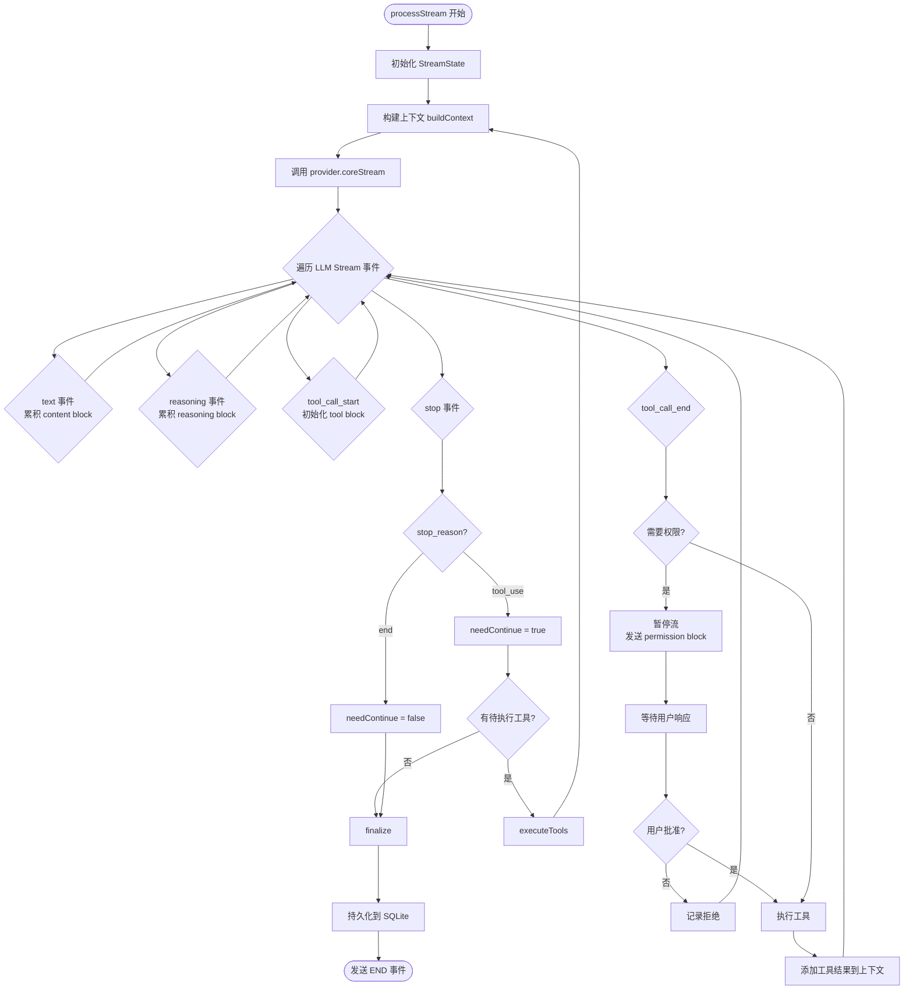
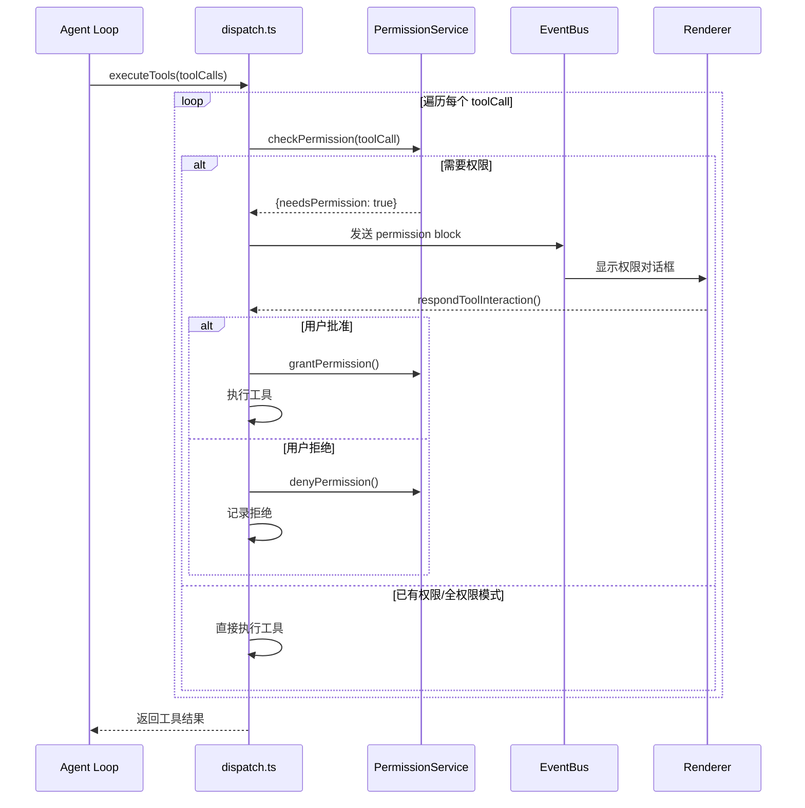
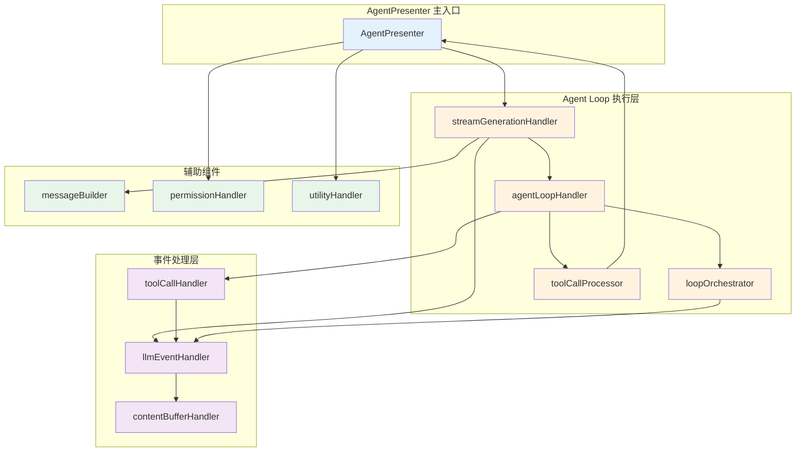

# Agent 系统架构详解

本文档详细介绍 Agent 系统的设计和实现，包括 Session 管理、Agent Loop、流生成、事件处理和权限协调。

## 架构概览

DeepChat 采用两层 Agent 架构：

```
┌─────────────────────────────────────────────────────────────────┐
│                        Renderer (IPC)                           │
└───────────────────────────────┬─────────────────────────────────┘
                                │
                                ▼
┌─────────────────────────────────────────────────────────────────┐
│                    NewAgentPresenter                            │
│  (Session Manager - IPC-facing, routing, orchestration)         │
│                                                                 │
│  - Owns AgentRegistry (maps agentId -> implementation)          │
│  - Owns NewSessionManager (session records + window bindings)   │
│  - Routes calls to appropriate agent implementation             │
│  - Handles multi-agent support (deepchat + ACP agents)          │
└───────────────────────────────┬─────────────────────────────────┘
                                │ resolves via AgentRegistry
                                ▼
┌─────────────────────────────────────────────────────────────────┐
│                  DeepChatAgentPresenter                         │
│  (Agent Loop - IAgentImplementation for "deepchat" agent)       │
│                                                                 │
│  - Owns SessionStore (runtime state per session)                │
│  - Owns MessageStore (message persistence)                      │
│  - Owns CompactionManager (context summarization)               │
│  - Implements processMessage() -> processStream() loop          │
│  - Handles tool execution via ToolPresenter                     │
└─────────────────────────────────────────────────────────────────┘
```

## 核心组件

### NewAgentPresenter - Session Manager Layer

**文件位置**: `src/main/presenter/newAgentPresenter/`

```
newAgentPresenter/
├── index.ts              # Main presenter - orchestrates sessions
├── sessionManager.ts     # Session CRUD operations
├── messageManager.ts     # Message lookup across agents
├── agentRegistry.ts      # Agent registration and resolution
└── legacyImportService.ts # Legacy chat import functionality
```

#### 主要方法

| 方法 | 用途 |
|------|------|
| `createSession(input, webContentsId)` | 创建新会话并发送第一条消息 |
| `sendMessage(sessionId, content)` | 向现有会话发送消息 |
| `retryMessage(sessionId, messageId)` | 从某条消息重试生成 |
| `editUserMessage(sessionId, messageId, text)` | 编辑用户消息并重新生成 |
| `forkSession(sourceSessionId, targetMessageId)` | 从某条消息分叉会话 |
| `getSessionList(filters)` | 获取会话列表 |
| `activateSession(webContentsId, sessionId)` | 绑定会话到窗口 |
| `deleteSession(sessionId)` | 删除会话并清理资源 |
| `cancelGeneration(sessionId)` | 取消正在进行的生成 |
| `respondToolInteraction(...)` | 响应权限/问题提示 |
| `setSessionModel(sessionId, providerId, modelId)` | 更换模型 |
| `getAgents()` | 获取可用的 agent 列表 |

### DeepChatAgentPresenter - Agent Loop Implementation

**文件位置**: `src/main/presenter/deepchatAgentPresenter/`

```
deepchatAgentPresenter/
├── index.ts              # Agent implementation (IAgentImplementation)
├── process.ts            # Core stream processing loop
├── dispatch.ts           # Tool execution and finalization
├── types.ts              # Stream state, process params, results
├── accumulator.ts        # Stream event -> block accumulator
├── contextBuilder.ts     # Build LLM context from history
├── messageStore.ts       # Message persistence (SQLite wrapper)
├── sessionStore.ts       # Session runtime state
├── echo.ts               # Real-time block streaming to renderer
├── toolOutputGuard.ts    # Tool output validation/truncation
├── compactionManager.ts  # Context compaction via summarization
└── pendingInteractions.ts # Manage paused tool interactions
```

#### 主要方法

| 方法 | 用途 |
|------|------|
| `initSession(sessionId, config)` | 初始化会话运行时状态 |
| `destroySession(sessionId)` | 清理会话资源 |
| `processMessage(sessionId, input, options)` | 处理用户消息（生成主入口） |
| `getMessages(sessionId)` | 获取会话所有消息 |
| `cancelGeneration(sessionId)` | 中止当前生成 |
| `respondToolInteraction(...)` | 恢复暂停的交互（权限批准/回答问题） |
| `setSessionModel(...)` | 切换 provider/model |
| `setPermissionMode(...)` | 更改权限模式 |

#### 内部模块职责

| 模块 | 职责 |
|------|------|
| `processStream()` | 核心 LLM 循环: stream -> accumulate -> tool_use loop -> finalize |
| `executeTools()` | 执行工具调用，处理权限，构建工具消息 |
| `finalize/finalizeError/finalizePaused` | 消息完成状态处理 |
| `StreamState` | 流式过程中的可变状态（blocks, metadata, tool calls） |
| `accumulate()` | 纯函数: LLM events -> assistant message blocks |
| `DeepChatMessageStore` | 持久化消息到 SQLite |
| `DeepChatSessionStore` | 持久化会话运行时状态 |
| `buildContext()` | 构建 LLM 上下文，包含 token 预算和历史选择 |
| `startEcho()` | 实时流式传输 blocks 到 renderer |
| `ToolOutputGuard` | 验证/截断工具输出 |
| `CompactionManager` | 当上下文过长时总结旧消息 |

## 核心流程

### 发送消息流程

```
Renderer IPC -> NewAgentPresenter.sendMessage()
  -> resolveAgentImplementation(session.agentId)  // via AgentRegistry
  -> agent.processMessage(sessionId, input)       // DeepChatAgentPresenter
    -> buildContext()                             // history -> ChatMessage[]
    -> processStream()                            // LLM loop
      -> accumulate()                             // events -> blocks
      -> executeTools()                           // MCP tool calls
      -> finalize()                               // persist to DB
```

### Agent Loop 主循环



### 权限流程



## 权限模式

### 三种权限模式

| 模式 | 行为 |
|------|------|
| `default` | 每次工具调用都需要用户批准 |
| `ask` | 首次询问，之后记住决策 |
| `full` | 自动批准所有工具调用（受 projectDir 限制） |

### 权限类型

| 类型 | 说明 |
|------|------|
| `read` | 读取文件权限 |
| `write` | 写入文件权限 |
| `all` | 完全访问权限 |
| `command` | 执行命令权限 |

## P0 功能实现状态

| 功能 | 状态 | 说明 |
|------|------|------|
| Session 状态跟踪 | ✅ 完成 | 通过 `session.status` + `messageStore.isStreaming` |
| 输入禁用 + Stop | ✅ 完成 | Stop UX 在 `ChatInputToolbar.vue` |
| 取消生成 | ✅ 完成 | Abort controller 集成 |
| 权限审批流程 | 🟡 部分 | 核心流程已实现，remember 持久化待完成 |
| Session 列表刷新 | ✅ 完成 | 事件驱动 `SESSION_EVENTS.LIST_UPDATED` |
| 乐观消息 | ✅ 完成 | `addOptimisticUserMessage()` |
| 缓存版本 | ⚪ 延迟 | 内存缓存足够 P0 |

详见 [P0 Implementation Summary](../P0_IMPLEMENTATION_SUMMARY.md)

## 关键文件位置

### 新架构

| 组件 | 位置 |
|------|------|
| NewAgentPresenter | `src/main/presenter/newAgentPresenter/index.ts` |
| DeepChatAgentPresenter | `src/main/presenter/deepchatAgentPresenter/index.ts` |
| processStream | `src/main/presenter/deepchatAgentPresenter/process.ts` |
| executeTools | `src/main/presenter/deepchatAgentPresenter/dispatch.ts` |
| buildContext | `src/main/presenter/deepchatAgentPresenter/contextBuilder.ts` |
| accumulate | `src/main/presenter/deepchatAgentPresenter/accumulator.ts` |
| MessageStore | `src/main/presenter/deepchatAgentPresenter/messageStore.ts` |
| SessionStore | `src/main/presenter/deepchatAgentPresenter/sessionStore.ts` |

### 前端组件

| 组件 | 位置 |
|------|------|
| ChatPage | `src/renderer/src/pages/ChatPage.vue` |
| ChatInputToolbar | `src/renderer/src/components/chat/ChatInputToolbar.vue` |
| ChatToolInteractionOverlay | `src/renderer/src/components/chat/ChatToolInteractionOverlay.vue` |
| sessionStore | `src/renderer/src/stores/ui/session.ts` |
| messageStore | `src/renderer/src/stores/ui/message.ts` |

---

## Legacy Architecture (旧架构)

以下内容描述旧的 AgentPresenter 架构，保留作为历史参考。新开发应使用上述新架构。

### 旧架构组件概览

| 组件 | 文件位置 | 职责 |
|------|---------|------|
| **AgentPresenter** | `src/main/presenter/agentPresenter/index.ts` | Agent 编排主入口，实现 IAgentPresenter 接口 |
| **agentLoopHandler** | `src/main/presenter/agentPresenter/loop/agentLoopHandler.ts` | Agent Loop 主循环（while 循环） |
| **streamGenerationHandler** | `src/main/presenter/agentPresenter/streaming/streamGenerationHandler.ts` | 流生成协调 |
| **loopOrchestrator** | `src/main/presenter/agentPresenter/loop/loopOrchestrator.ts` | Loop 状态管理器 |
| **toolCallProcessor** | `src/main/presenter/agentPresenter/loop/toolCallProcessor.ts` | 工具调用执行 |
| **llmEventHandler** | `src/main/presenter/agentPresenter/streaming/llmEventHandler.ts` | 标准化 LLM 事件 |
| **permissionHandler** | `src/main/presenter/agentPresenter/permission/permissionHandler.ts` | 权限请求响应协调 |

### 旧架构关系图



### 旧架构关键文件位置

- **AgentPresenter**: `src/main/presenter/agentPresenter/index.ts`
- **agentLoopHandler**: `src/main/presenter/agentPresenter/loop/agentLoopHandler.ts`
- **streamGenerationHandler**: `src/main/presenter/agentPresenter/streaming/streamGenerationHandler.ts`
- **loopOrchestrator**: `src/main/presenter/agentPresenter/loop/loopOrchestrator.ts`
- **toolCallProcessor**: `src/main/presenter/agentPresenter/loop/toolCallProcessor.ts`
- **llmEventHandler**: `src/main/presenter/agentPresenter/streaming/llmEventHandler.ts`
- **permissionHandler**: `src/main/presenter/agentPresenter/permission/permissionHandler.ts`
- **messageBuilder**: `src/main/presenter/agentPresenter/message/messageBuilder.ts`
- **contentBufferHandler**: `src/main/presenter/agentPresenter/streaming/contentBufferHandler.ts`

---

## 相关阅读

- [整体架构概览](../ARCHITECTURE.md)
- [工具系统详解](./tool-system.md)
- [核心流程](../FLOWS.md)
- [会话管理详解](./session-management.md)
- [事件系统](./event-system.md)