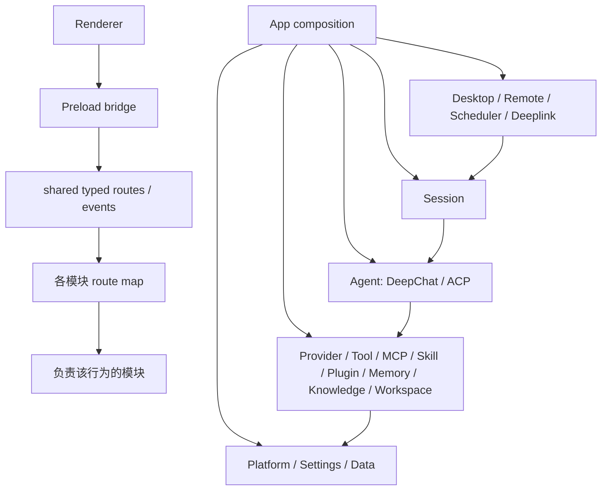

# DeepChat 当前架构概览

本文档描述 `2026-07-16` 的 main 进程实际结构。旧的全局 `Presenter`、
`LifecycleManager`、全局 `EventBus` 和业务模块查找入口已经删除。

## 总体结构



`src/main/app/composition.ts` 是唯一的组合入口。它创建模块、传入明确依赖、注册 route、
排定启动与停止顺序，但不导出模块列表，也不提供按名称查找模块的方法。

依赖方向是：

```text
App composition
  -> Desktop / Remote / Scheduler / Deeplink
  -> Session
  -> Agent runtime
  -> Provider / Tool / MCP / Skill / Plugin / Memory / Knowledge / Workspace
  -> Platform / Settings / Data
```

下层模块不能反向读取 App、Desktop、Remote 或 Scheduler。需要通知 renderer 时，App 在创建模块时
传入有类型的发送函数。

## 生命周期

### App

`src/main/appMain.ts` 负责 Electron 进程入口、single-instance、deeplink 缓存和退出请求。
`src/main/app/mainProcess.ts` 负责数据库解锁、连接、迁移和启动失败清理。
`src/main/app/composition.ts` 负责创建、连接、启动和停止业务模块。

`startMainProcess()` 只返回 `MainProcessControl`。它只能聚焦主窗口、处理 deeplink、清理权限、
确认退出、查询主窗口和停止 main 进程，不能读取业务模块。

### Session

`src/main/session/` 负责可长期保存的 Session 规则：

- `lifecycle.ts`：创建、草稿、关闭和基础生命周期；
- `turn.ts`：发送、排队、停止和交互回复；
- `assignment.ts`：Agent、model、project、fork 和 subagent 结果处理；
- `query.ts`：不会偷偷载入 Agent 的查询；
- `deletion.ts`：删除顺序和两类 backend 清理；
- `data/`：transcript、Tape、pending input、settings、search 和 trace。

窗口与 Session 的绑定不在 Session 数据中，由 `DesktopSessionBinding` 负责。窗口关闭不会默认删除
Session，也不会默认停止仍由其他入口使用的任务。

### Agent

`AgentManager` 根据 `AgentDescriptor.kind` 选择两套独立实现：

- `DeepChat`：`DeepChatAgentRuntime`、`DeepChatAgentInstance` 和 `DeepChatLoopEngine`；
- `ACP`：`AcpAgentRuntime`、`AcpAgentInstance` 和 ACP protocol runtime。

一个已载入的 Session 只有一个对应 instance。每次 Turn 使用独立 Run 保存取消信号、provider round、
request sequence 和临时输出状态。Session 拥有长期数据，Agent runtime 只通过窄接口读写这些数据。

## 模块职责

| 模块 | 位置 | 负责内容 |
| --- | --- | --- |
| App | `src/main/app/` | 进程启动、退出、维护状态、组合依赖 |
| Desktop | `src/main/desktop/` | window、tab、tray、shortcut、floating、browser、renderer binding |
| Session | `src/main/session/` | Session 生命周期、Turn、查询、长期数据和删除规则 |
| Agent | `src/main/agent/` | Agent catalog、backend 选择、DeepChat/ACP instance 和执行 |
| Provider | `src/main/provider/` | Provider/model 配置、实例、请求和认证 |
| Tool | `src/main/tool/` | Tool catalog、执行、权限和本地 Agent tools |
| MCP | `src/main/mcp/` | MCP 配置、server/client 生命周期和 MCP 调用 |
| Skill | `src/main/skill/` | Skill 文件、扫描、同步、选择和贡献 |
| Plugin | `src/main/plugin/` | Plugin package、安装状态和能力登记 |
| Memory | `src/main/memory/` | 长期记忆、检索、写入、索引和后台维护 |
| Knowledge | `src/main/knowledge/` | 内置知识库、切片、索引和检索 |
| Workspace / File | `src/main/workspace/`、`src/main/file/` | Workspace 授权、文件树、搜索、转换和临时文件 |
| Remote | `src/main/remote/` | channel runtime、endpoint binding、远程命令和结果发送 |
| Scheduler | `src/main/scheduler/` | Cron job、run、delivery 和 detached Session |
| Settings | `src/main/settings/`、各模块 `settings.ts` | 底层设置存储和各模块自己的配置解释 |
| Data | `src/main/data/`、各模块 `data/` | SQLite 连接、schema，以及各模块自己的 table 访问 |

Desktop 内仍有 `WindowPresenter`、`TabPresenter` 等历史类名。它们只是 Desktop 模块内部的具体实现，
不是全局入口，也不能被业务模块用来查找其他能力。

## 数据边界

`MainDatabase` 只负责连接、事务、schema、诊断、修复、备份和 reopen。业务 table 由各模块自己的
database 对象取得。长期运行对象不能缓存一次打开数据库时创建的旧 table；数据库维护完成后，
它们通过稳定的 database owner 读取当前连接。

通用 `SettingsStore` 和 `SecretStore` 只提供底层存储。Provider、MCP、Agent、Desktop、Sync、
Knowledge、Hook、Skill、Project 和 Upgrade 分别解释自己的配置，不通过一个通用 Config 业务入口。

## 通信边界

- Renderer 调用使用 `src/shared/contracts/` 中的 typed route。
- 各模块在自己的 `routes.ts` 创建 route map；App 统一注册并拒绝重名。
- 发给 renderer 的通知使用 typed event envelope。
- main 内部业务操作使用直接调用，不通过全局 event bus。
- route 只做通信适配；event 只表示已经发生的事实。

## 自动检查

`scripts/architecture-guard.mjs` 和对应测试会阻止：

- 恢复 `src/main/presenter/`、全局 `presenter` 或 `getInstance()`；
- 恢复全局 `EventBus` 或 `sendToMain()`；
- Agent 或 Session 反向导入 Desktop、Remote、Scheduler、Routes 或 App；
- 恢复旧 shared Presenter 类型聚合；
- 新增汇总全部 Session 或业务模块的替代总入口；
- 恢复已经删除的 route、event 和兼容路径。

当前重构的完整决定和实施记录见
[main-process-architecture-realignment](./architecture/main-process-architecture-realignment/spec.md)。
