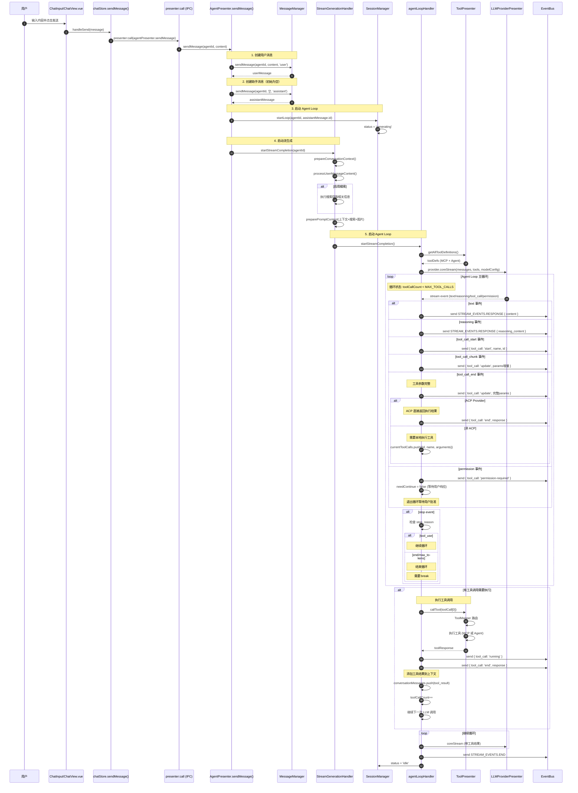
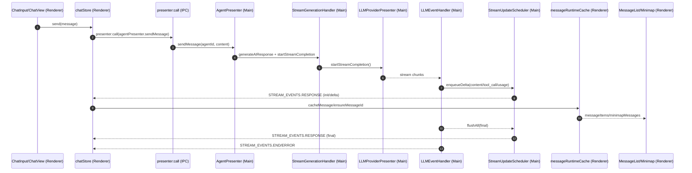
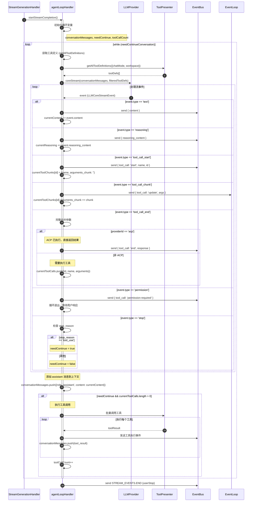
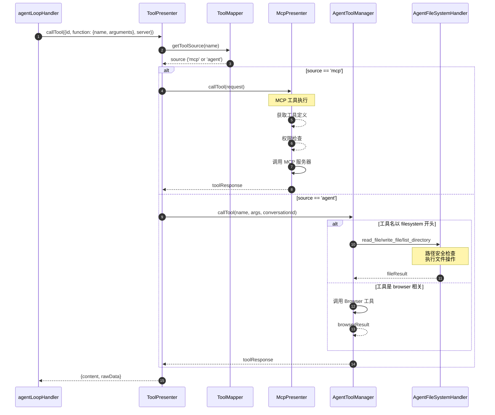
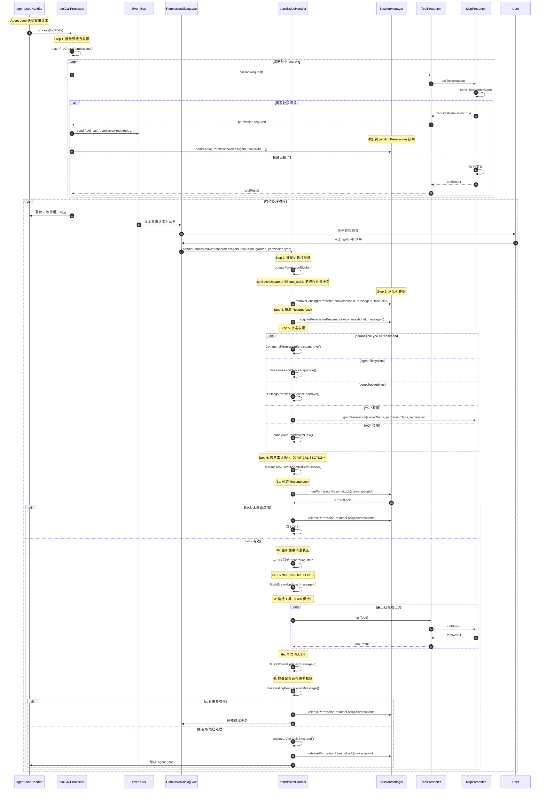
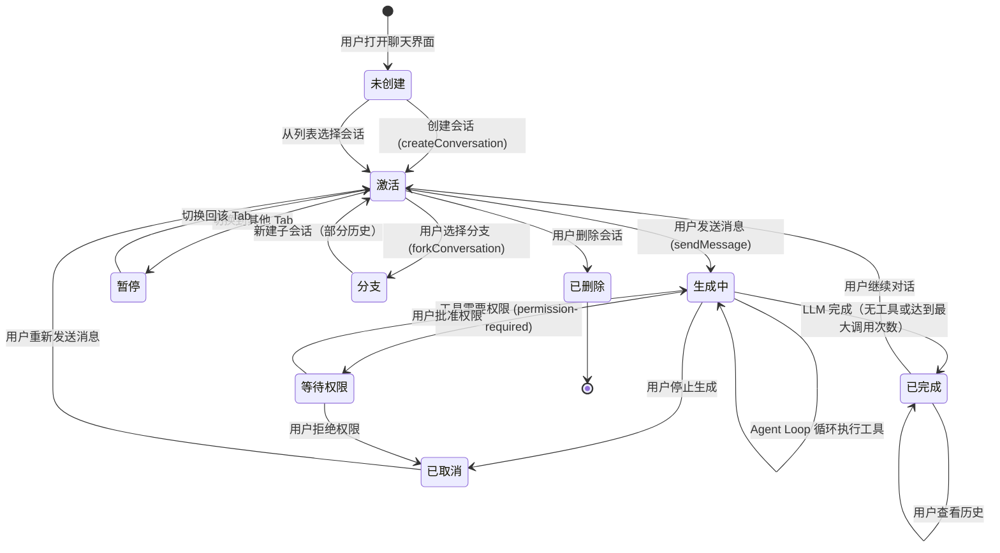
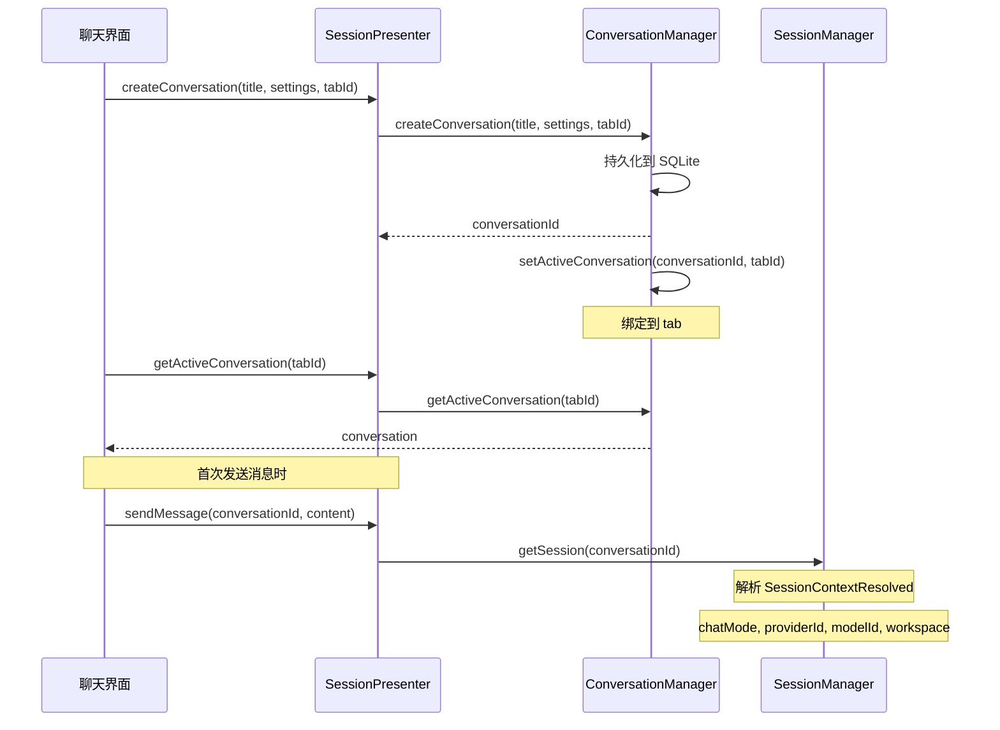
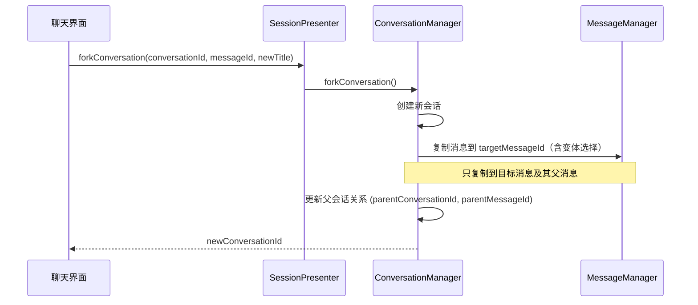
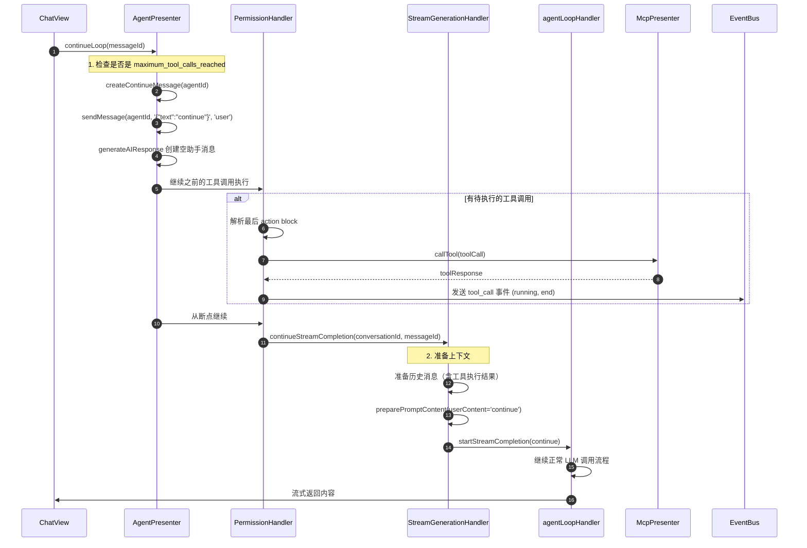

# DeepChat 核心流程

本文档使用时序图详细描述 DeepChat 的关键业务流程，帮助开发者理解运行时行为。

## 1. 发送消息完整流程



**关键文件位置**：
- AgentPresenter.sendMessage: `src/main/presenter/agentPresenter/index.ts:139-176`
- SessionManager.startLoop: `src/main/presenter/sessionPresenter/session/sessionManager.ts:140-150`
- StreamGenerationHandler.startStreamCompletion: `src/main/presenter/agentPresenter/streaming/streamGenerationHandler.ts:54-179`
- agentLoopHandler.startStreamCompletion: `src/main/presenter/agentPresenter/loop/agentLoopHandler.ts:145-668`

## 2. 渲染与流式更新流程（含 Minimap）



**关键文件位置**：
- chatStore.sendMessage + stream handlers: `src/renderer/src/stores/chat.ts`
- Presenter IPC: `src/renderer/src/composables/usePresenter.ts`, `src/main/presenter/index.ts`
- AgentPresenter.sendMessage: `src/main/presenter/agentPresenter/index.ts`
- StreamGenerationHandler.startStreamCompletion: `src/main/presenter/agentPresenter/streaming/streamGenerationHandler.ts`
- LLMEventHandler + StreamUpdateScheduler: `src/main/presenter/agentPresenter/streaming/llmEventHandler.ts`, `src/main/presenter/agentPresenter/streaming/streamUpdateScheduler.ts`
- MessageList/Minimap: `src/renderer/src/components/message/MessageList.vue`, `src/renderer/src/components/message/MessageMinimap.vue`

## 3. Agent Loop 详细流程



**关键代码位置**：
- agentLoopHandler 主循环: `src/main/presenter/agentPresenter/loop/agentLoopHandler.ts:223-626`

## 3. 工具调用路由流程



**工具定义收集流程**：

```typescript
// 1. ToolPresenter.getAllToolDefinitions()
async getAllToolDefinitions({chatMode, supportsVision, agentWorkspacePath}) {
  // 2. 获取 MCP 工具
  const mcpDefs = await mcpPresenter.getAllToolDefinitions()
  this.mapper.registerTools(mcpDefs, 'mcp')

  // 3. chatMode != 'chat' 时获取 Agent 工具
  if (chatMode !== 'chat') {
    const agentDefs = await agentToolManager.getAllToolDefinitions()

    // 4. 过滤名称冲突（优先 MCP）
    const filtered = agentDefs.filter(t => !mapper.hasTool(t.name))
    this.mapper.registerTools(filtered, 'agent')

    return [...mcpDefs, ...filtered]
  }

  return mcpDefs
}
```

**关键文件位置**：
- ToolPresenter: `src/main/presenter/toolPresenter/index.ts:49-99`
- ToolMapper: `src/main/presenter/toolPresenter/toolMapper.ts`
- AgentToolManager: `src/main/presenter/agentPresenter/acp/agentToolManager.ts`
- AgentFileSystemHandler: `src/main/presenter/agentPresenter/acp/agentFileSystemHandler.ts`

## 4. 权限请求与响应流程（Batch-level Permission + Resume Lock）

### 完整流程



### 关键机制说明

#### 1. Batch-level Permission Update

```typescript
// 同一个 tool_call 的多个权限块可以批量更新
function canBatchUpdate(target, granted, grantedType): boolean {
  // 必须相同状态: pending
  // 必须相同类型: tool_call_permission
  // 必须相同 server
  // CRITICAL: 必须相同 tool_call.id（防止误批准其他工具）
  // 权限层级必须满足: grantedType >= targetType
}
```

#### 2. Resume Lock（MessageId-level）

```typescript
// 获取锁
acquirePermissionResumeLock(conversationId: string, messageId: string): boolean

// 验证锁（防止过期/错误的恢复）
getPermissionResumeLock(conversationId: string): {messageId, timestamp} | null

// 释放锁（单一出口点）
releasePermissionResumeLock(conversationId: string): void

// CRITICAL SECTION 保证：
// - Early-exit checks prevent stale execution
// - Synchronous flush before executing tools
// - Lock released only at single exit point
// - All tools executed atomically (no lock release between tools)
```

#### 3. Pending Permissions Queue

```typescript
// 支持多个并发权限请求
interface PendingPermission {
  messageId: string
  toolCallId: string
  permissionType: string
  serverName: string
  timestamp: number
}

// SessionManager 管理队列
pendingPermissions: PendingPermission[]

// 队列操作
addPendingPermission(conversationId, permission)
removePendingPermission(conversationId, messageId, toolCallId)
getNextPendingPermission(conversationId): PendingPermission | undefined
```

#### 4. Synchronous Flush

```typescript
// 工具执行前同步刷新 UI 状态
await llmEventHandler.flushStreamUpdates(messageId)

// 保证：
// - 所有 tool_call 块已持久化到 DB
// - 前端 UI 状态已同步
// - 断点恢复时状态一致
```

### 权限类型层级

| 类型 | 层级 | 适用场景 |
|------|------|---------|
| `all` | 3 | 授予全部权限 |
| `write` | 2 | 写入操作（write_file, delete_file） |
| `read` | 1 | 读取操作（read_file, list_directory） |
| `command` | 0 | 命令执行（精确匹配） |

**权限升级规则**：`all` > `write` > `read`，授予高级权限自动满足低级权限需求。

**关键文件位置**：
- PermissionHandler: `src/main/presenter/agentPresenter/permission/permissionHandler.ts`
- ToolCallProcessor: `src/main/presenter/agentPresenter/loop/toolCallProcessor.ts`
- SessionManager: `src/main/presenter/agentPresenter/session/sessionManager.ts`

## 5. 会话生命周期



**会话创建与绑定流程**：



**会话分支（Fork）流程**：



**关键文件位置**：
- ConversationManager: `src/main/presenter/sessionPresenter/managers/conversationManager.ts`
- forkConversation: `src/main/presenter/sessionPresenter/managers/conversationManager.ts:818-861`
- SessionManager.getSession: `src/main/presenter/sessionPresenter/session/sessionManager.ts:35-61`

## 6. 继续生成（Continue）流程



**关键文件位置**：
- AgentPresenter.continueLoop: `src/main/presenter/agentPresenter/index.ts:178-204`
- StreamGenerationHandler.continueStreamCompletion: `src/main/presenter/agentPresenter/streaming/streamGenerationHandler.ts:181-350`

---

> 💡 **提示**：所有时序图均基于当前实际代码结构绘制，代码位置标注了文件的 approximate 行数，方便快速定位。
