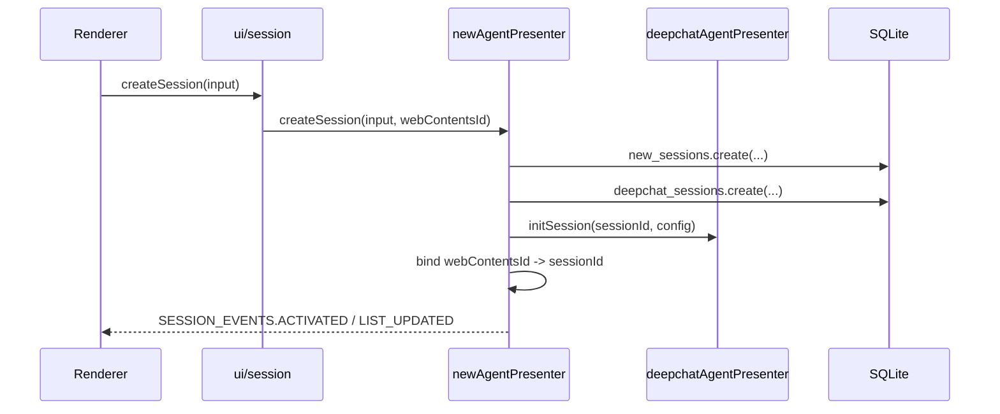
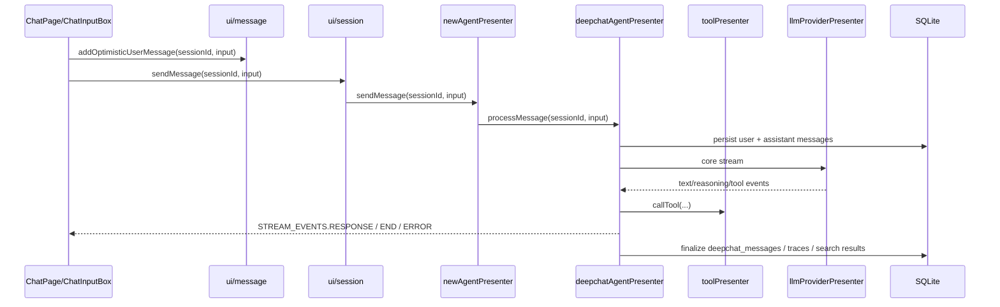
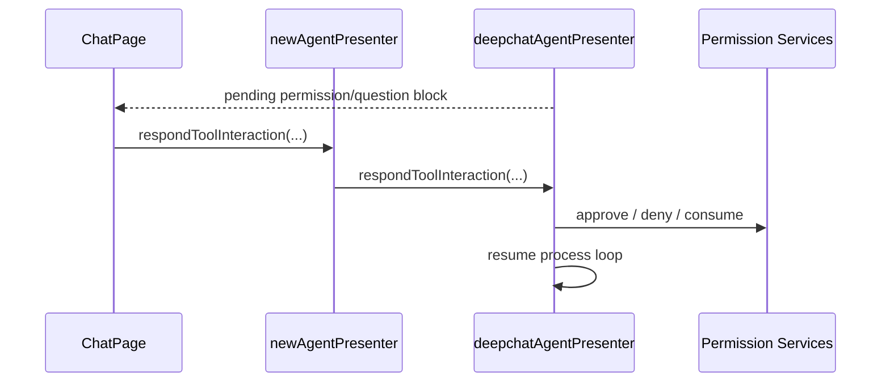
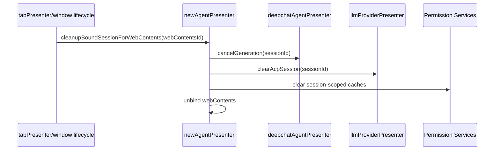
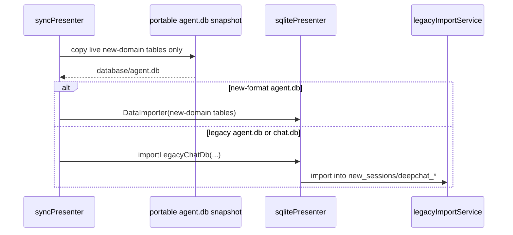

# DeepChat Flows

## 1. Create And Activate Session

```mermaid
sequenceDiagram
    participant UI as Renderer
    participant SessionStore as ui/session
    participant NewAgent as newAgentPresenter
    participant DeepChat as deepchatAgentPresenter
    participant DB as SQLite

    UI->>SessionStore: createSession(input)
    SessionStore->>NewAgent: createSession(input, webContentsId)
    NewAgent->>DB: new_sessions.create(...)
    NewAgent->>DB: deepchat_sessions.create(...)
    NewAgent->>DeepChat: initSession(sessionId, config)
    NewAgent->>NewAgent: bind webContentsId -> sessionId
    NewAgent-->>UI: SESSION_EVENTS.ACTIVATED / LIST_UPDATED
```

## 2. Send Message

```mermaid
sequenceDiagram
    participant UI as ChatPage/ChatInputBox
    participant MsgStore as ui/message
    participant SessionStore as ui/session
    participant NewAgent as newAgentPresenter
    participant DeepChat as deepchatAgentPresenter
    participant Tool as toolPresenter
    participant LLM as llmProviderPresenter
    participant DB as SQLite

    UI->>MsgStore: addOptimisticUserMessage(sessionId, input)
    UI->>SessionStore: sendMessage(sessionId, input)
    SessionStore->>NewAgent: sendMessage(sessionId, input)
    NewAgent->>DeepChat: processMessage(sessionId, input)
    DeepChat->>DB: persist user + assistant messages
    DeepChat->>LLM: core stream
    LLM-->>DeepChat: text/reasoning/tool events
    DeepChat->>Tool: callTool(...)
    DeepChat-->>UI: STREAM_EVENTS.RESPONSE / END / ERROR
    DeepChat->>DB: finalize deepchat_messages / traces / search results
```

## 3. Tool Interaction Resume

```mermaid
sequenceDiagram
    participant UI as ChatPage
    participant NewAgent as newAgentPresenter
    participant DeepChat as deepchatAgentPresenter
    participant Perm as Permission Services

    DeepChat-->>UI: pending permission/question block
    UI->>NewAgent: respondToolInteraction(...)
    NewAgent->>DeepChat: respondToolInteraction(...)
    DeepChat->>Perm: approve / deny / consume
    DeepChat->>DeepChat: resume process loop
```

## 4. Session Cleanup

```mermaid
sequenceDiagram
    participant Tab as tabPresenter/window lifecycle
    participant NewAgent as newAgentPresenter
    participant DeepChat as deepchatAgentPresenter
    participant LLM as llmProviderPresenter
    participant Perm as Permission Services

    Tab->>NewAgent: cleanupBoundSessionForWebContents(webContentsId)
    NewAgent->>DeepChat: cancelGeneration(sessionId)
    NewAgent->>LLM: clearAcpSession(sessionId)
    NewAgent->>Perm: clear session-scoped caches
    NewAgent->>NewAgent: unbind webContents
```

## 5. Backup And Legacy Import

```mermaid
sequenceDiagram
    participant Sync as syncPresenter
    participant Portable as portable agent.db snapshot
    participant SQLite as sqlitePresenter
    participant Legacy as legacyImportService

    Sync->>Portable: copy live new-domain tables only
    Portable-->>Sync: database/agent.db

    alt new-format agent.db
        Sync->>SQLite: DataImporter(new-domain tables)
    else legacy agent.db or chat.db
        Sync->>SQLite: importLegacyChatDb(...)
        SQLite->>Legacy: import into new_sessions/deepchat_*
    end
```
