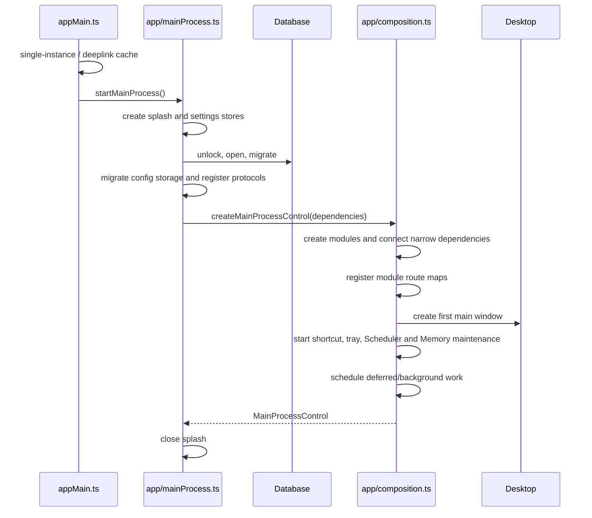
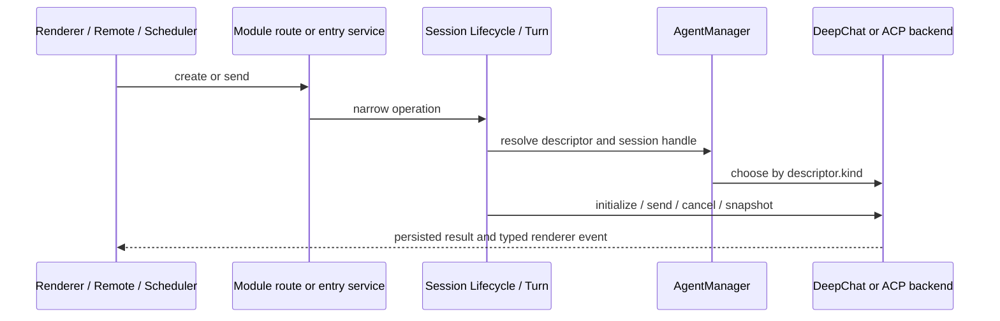
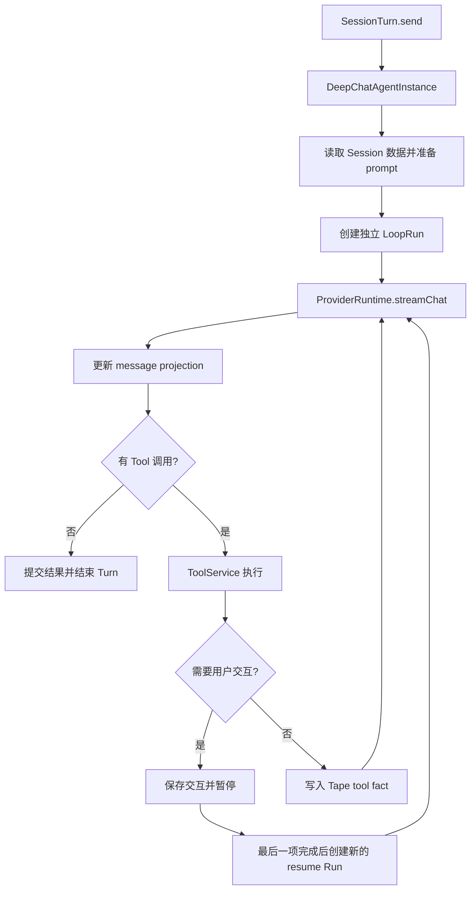
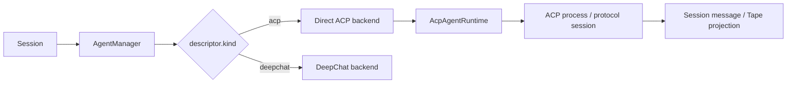
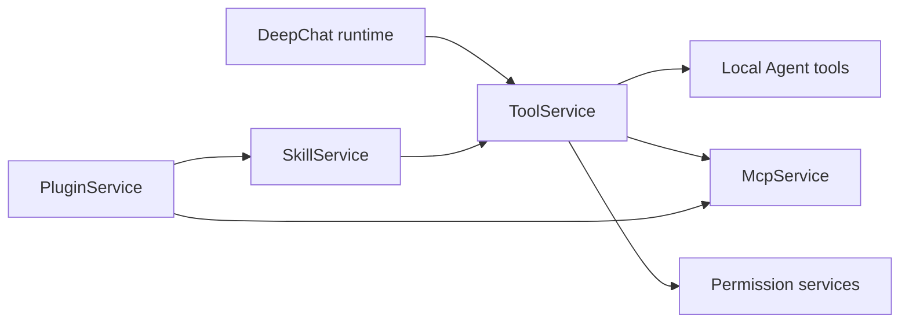
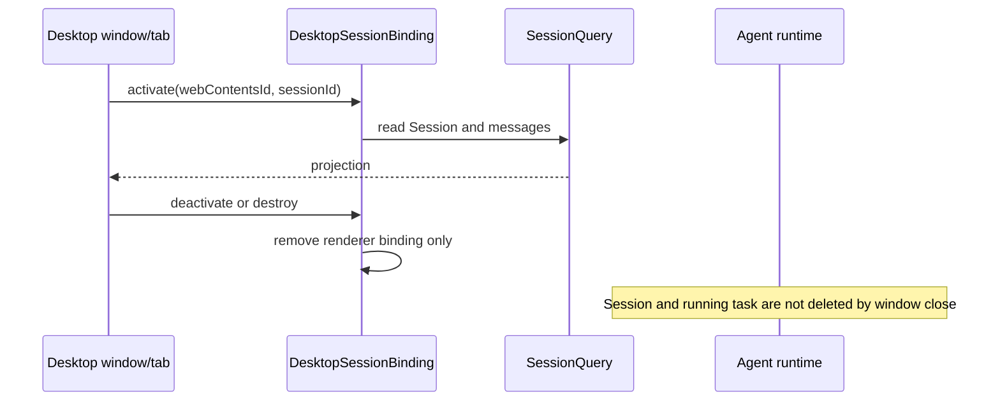
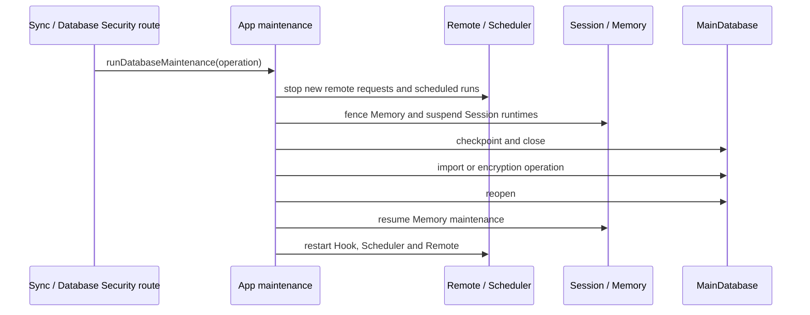

# DeepChat 当前核心流程

本文档描述 `2026-07-16` 的实际流程。旧 `Presenter`、通用 lifecycle hook 和全局 `EventBus`
不再属于当前流程。

## 1. main 进程启动


```mermaid
sequenceDiagram
    participant Entry as appMain.ts
    participant Main as app/mainProcess.ts
    participant DB as Database
    participant App as app/composition.ts
    participant Desktop as Desktop

    Entry->>Entry: single-instance / deeplink cache
    Entry->>Main: startMainProcess()
    Main->>Main: create splash and settings stores
    Main->>DB: unlock, open, migrate
    Main->>Main: migrate config storage and register protocols
    Main->>App: createMainProcessControl(dependencies)
    App->>App: create modules and connect narrow dependencies
    App->>App: register module route maps
    App->>Desktop: create first main window
    App->>App: start shortcut, tray, Scheduler and Memory maintenance
    App->>App: schedule deferred/background work
    App-->>Main: MainProcessControl
    Main->>Main: close splash
```

首个窗口之前必须完成数据库、配置迁移、route 注册和 ACP registry migration。Skill 扫描、MCP、
Remote、Provider warmup、legacy import 和统计回填在窗口可用后调度。

## 2. 创建 Session 并发送消息


```mermaid
sequenceDiagram
    participant R as Renderer / Remote / Scheduler
    participant Route as Module route or entry service
    participant Session as Session Lifecycle / Turn
    participant Manager as AgentManager
    participant Backend as DeepChat or ACP backend

    R->>Route: create or send
    Route->>Session: narrow operation
    Session->>Manager: resolve descriptor and session handle
    Manager->>Backend: choose by descriptor.kind
    Session->>Backend: initialize / send / cancel / snapshot
    Backend-->>R: persisted result and typed renderer event
```

Desktop、Remote 和 Scheduler 共用同一套 Session 生命周期。Scheduler 每次运行创建新的 detached
Session；Remote 保存自己的 endpoint binding；Desktop 只保存 renderer binding。

## 3. DeepChat 执行


```mermaid
flowchart TD
    Send["SessionTurn.send"] --> Instance["DeepChatAgentInstance"]
    Instance --> Prepare["读取 Session 数据并准备 prompt"]
    Prepare --> Run["创建独立 LoopRun"]
    Run --> Provider["ProviderRuntime.streamChat"]
    Provider --> Output["更新 message projection"]
    Output --> Tool{"有 Tool 调用?"}
    Tool -->|否| Settle["提交结果并结束 Turn"]
    Tool -->|是| Execute["ToolService 执行"]
    Execute --> Interaction{"需要用户交互?"}
    Interaction -->|是| Pause["保存交互并暂停"]
    Interaction -->|否| Tape["写入 Tape tool fact"]
    Tape --> Provider
    Pause --> Resume["最后一项完成后创建新的 resume Run"]
    Resume --> Provider
```

Provider、Tool、Skill、Memory 和 Session data 都通过创建时传入的必需接口使用。DeepChat runtime
不能从 App、Routes、Desktop、Remote 或 Scheduler 查找依赖。

- `generationSettings` 在 Session 创建、草稿和 active Session 中统一传递，包括 system prompt、
  temperature、topP、max tokens、reasoning effort 和 verbosity。
- `providerRoundCount` 按 outer round 递增，`requestSeq` 按实际 Provider attempt 递增；strict retry
  不会伪造新的 outer round。
- Memory prompt contribution 必须等待结果、清理内容、限制大小并允许失败；terminal extraction 在后台
  执行，并保持 epoch、cursor 和 fence 约束。
- `TapeRecorder.appendToolFact` 在 message projection 完成后写 terminal tool call/result；写入失败不影响
  当前回复完成。

## 4. ACP 执行


```mermaid
flowchart LR
    Session["Session"] --> Manager["AgentManager"]
    Manager --> Kind{"descriptor.kind"}
    Kind -->|acp| Direct["Direct ACP backend"]
    Direct --> Runtime["AcpAgentRuntime"]
    Runtime --> Process["ACP process / protocol session"]
    Process --> Projection["Session message / Tape projection"]
    Kind -->|deepchat| Deep["DeepChat backend"]
```

Direct ACP 不进入 `DeepChatLoopEngine`。`kind=deepchat + providerId=acp` 仍是独立的兼容组合，
它使用 DeepChat loop，并把 ACP 当作 Provider。

## 5. Tool、MCP、Skill 和 Plugin


```mermaid
flowchart LR
    Agent["DeepChat runtime"] --> Tool["ToolService"]
    Tool --> Local["Local Agent tools"]
    Tool --> MCP["McpService"]
    Tool --> Permission["Permission services"]
    Skill["SkillService"] --> Tool
    Plugin["PluginService"] --> Skill
    Plugin --> MCP
```

Tool 负责 catalog、权限预检查和执行路由。MCP 负责 server/client 生命周期。Skill 负责 Skill 文件和
选择。Plugin 只登记 package 提供的能力，不接管 MCP、Skill 或 Tool 的运行状态。

模型只能看到 `tape_search` 和 `tape_context`。Subagent 完成后，父 Session 保存指向 child Tape
固定 head 的 link；查询时通过明确的 linked Tape view 读取，不把 child entries 复制到父 Tape。
`subagent_orchestrator` 只在当前 Agent policy 开启且存在有效 slot 时提供，Subagent child 不能继续递归
创建 Subagent。

## 6. renderer binding


```mermaid
sequenceDiagram
    participant Window as Desktop window/tab
    participant Binding as DesktopSessionBinding
    participant Query as SessionQuery
    participant Runtime as Agent runtime

    Window->>Binding: activate(webContentsId, sessionId)
    Binding->>Query: read Session and messages
    Query-->>Window: projection
    Window->>Binding: deactivate or destroy
    Binding->>Binding: remove renderer binding only
    Note over Runtime: Session and running task are not deleted by window close
```

普通列表、历史和 binding 查询不会载入 Agent instance。只有执行、完整 restore 或明确的 backend
设置操作可以 hydrate runtime。

## 7. 数据库维护


```mermaid
sequenceDiagram
    participant Route as Sync / Database Security route
    participant App as App maintenance
    participant Entry as Remote / Scheduler
    participant Runtime as Session / Memory
    participant DB as MainDatabase

    Route->>App: runDatabaseMaintenance(operation)
    App->>Entry: stop new remote requests and scheduled runs
    App->>Runtime: fence Memory and suspend Session runtimes
    App->>DB: checkpoint and close
    App->>DB: import or encryption operation
    App->>DB: reopen
    App->>Runtime: resume Memory maintenance
    App->>Entry: restart Hook, Scheduler and Remote
```

维护期间新的 `chat.*`、`sessions.*`、`remoteControl.*` 和 `cronJobs.*` route 会被拒绝。
恢复失败时 App 进入 failed 并停止，不在关闭了一半的数据库上继续运行。

## 8. 退出

`before-quit` 先询问 Knowledge 是否允许退出。确认后，`MainProcessControl.stop()` 只运行一次，
并按明确顺序停止：

```text
cancel startup work
  -> stop Scheduler / Remote / Hook
  -> suspend Session runtimes
  -> stop Plugin / MCP / browser / Desktop resources
  -> stop Workspace / Skill / watcher / exec host
  -> fence and drain Memory
  -> stop Knowledge / Provider / ACP
  -> close SQLite
  -> destroy shortcut / notification / tray
```

更新安装复用同一条停止路径。数据重置和 App restart 也先完成停止，再由 Device 执行最终操作。
