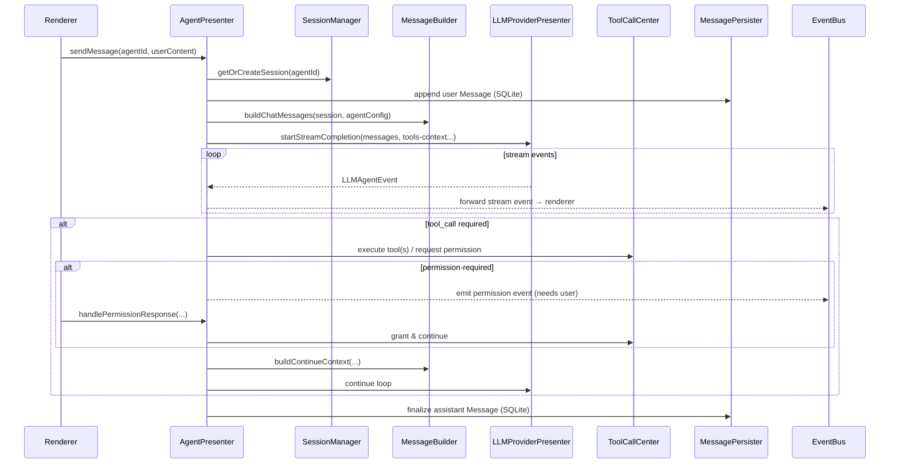

# AgentPresenter 架构重构（最终设计稿 & 开发计划）

> 本文档整合并优化自：
>
> - `docs/agent-presenter-refactoring.md`
> - `docs/agent架构重构计划_788bd5bd.md`
> - `docs/agent-presenter-refactoring-todos.md`
>
> 并对照当前代码实现（`ThreadPresenter` / `ToolPresenter` / `AgentLoopHandler` / `ToolCallProcessor` / `WorkspacePresenter` 等）校准落点与迁移顺序，目标是产出一份“可直接开工且可控风险”的最终方案。

---

## 1. 背景与核心问题（基于现状校准）

当前 main presenter 层围绕 `src/main/presenter/threadPresenter/` 聚合了过多职责（会话/消息/上下文构建/工具调用/权限/搜索/导出/流式事件处理/缓冲/ACP 兼容等），带来：

- **可维护性差**：文件过大（`threadPresenter/index.ts` + `searchManager.ts` 等），跨模块改动牵一发动全身。
- **职责边界不清**：同一概念（工具、mode、workspace、上下文裁切）在 `promptBuilder`、`AgentLoopHandler`、`ToolPresenter`、`PermissionHandler` 等处重复实现或重复决策。
- **工具调用链路分裂**：
  - “工具定义获取”在 `promptBuilder.ts` 里直接拉 `mcpPresenter + yoBrowserPresenter`；
  - “工具执行”在 `ToolPresenter + ToolCallProcessor`；
  - “权限交互/恢复 loop”在 `PermissionHandler`；
  - 结果是 token 预算/上下文裁切与实际 tools 注入可能不一致。
- **Mode 语义混乱**：`chatMode` 当前主要来自全局配置 `input_chatMode`，但 Conversation settings 里也存在 `chatMode / agentWorkspacePath / acpWorkdirMap` 等；导致“会话级配置”和“全局开关”混用。
- **Agent Loop 可读性不足**：generator + 多层 handler 组合，状态分散在多处 Map/handler 内，难以单测与回归验证。

同时，代码库已经完成了一部分关键铺垫（应纳入最终设计，而非推倒重来）：

- `src/main/presenter/toolPresenter/` 已实现 MCP + Agent 工具统一路由（`ToolPresenter/ToolMapper`）。
- `src/main/presenter/llmProviderPresenter/managers/toolCallProcessor.ts` 已实现：
  - function calling vs legacy `<function_call>` 两套写入方式；
  - 工具执行事件的标准化输出（`LLMAgentEvent`）。
- `src/main/presenter/workspacePresenter/` 已提供通用 workspace 能力（文件树/搜索等）。

最终设计应以“**收口入口、复用已有能力、逐步替换**”为核心策略。

---

## 2. 目标与非目标

### 2.1 重构目标

- **模块边界清晰**：按“配置层 Agent（Conversation）/运行时 Session/上下文 Message/工具 Tool/编排 Loop/杂项 Utility/持久化 Persistence”拆分。
- **工具管理统一**：工具定义、去重、权限、执行路径在单一中心聚合；上下文 token 预算与 tools 注入一致。
- **Loop 压平**：形成单一线性 `async/await` 编排入口，状态集中管理（可单测、可恢复、可取消）。
- **ACP 通过适配器接入**：避免双路径逻辑散落各处；ACP 特性（workdir 隔离、tool 过滤/权限）集中处理。
- **零数据迁移**：保持 SQLite schema 与消息数据结构不变，保证历史会话可直接加载。
- **可渐进迁移**：允许在任一阶段保持“可运行/可回滚/可对照验证”。

### 2.2 非目标（本轮不做）

- 不更改 SQLite 表结构、不做数据迁移脚本。
- 不重写 provider 层（`BaseLLMProvider` 及各 provider 实现）协议与调用方式。
- 不一次性替换 renderer 所有 `threadPresenter` 调用（按模块/能力域渐进迁移；但模块完成后需一次性切换并移除 `ThreadPresenter` 对等入口，避免逻辑分叉）。

---

## 3. 术语与语义统一（最终口径）

- **Conversation（现存 DB 概念）**：持久化实体，包含标题、settings、分叉信息等。
- **Agent（配置层概念）**：对 renderer 而言，一个“Agent”就是一个 Conversation 的**配置视角**（mode、model、systemPrompt、tools/workspace 等）。默认 `agentId === conversationId`。
- **Session（运行时概念）**：某个 Agent 在 main 进程中的运行时上下文容器，负责：
  - 维护本次/多次 loop 的状态（generating/paused/pendingPermission/cancel 等）；
  - 持有必要的缓存（工具定义、上下文裁切结果、pending tool call、buffer 状态等）。
- **Loop（一次生成编排）**：从“构建上下文 → 调用 LLM（stream）→ 解析 tool call → 执行工具/权限 → 续跑/结束”的完整闭环。
- **Chat Mode（chat/agent/acp agent）**：
  - **最终口径**：以 Conversation settings 为准（会话级），全局 `input_chatMode` 仅作为“新会话默认值/兼容回退”。
  - ACP session mode（ACP agent 内部 mode）与 Chat Mode 独立，不混用。

---

## 4. 目标架构总览

### 4.1 目录结构（目标态，遵循现有 camelCase 命名习惯）

```text
src/main/presenter/
└── agentPresenter/                       # NEW: 统一入口（Facade + Orchestration）
    ├── index.ts                          # AgentPresenter（对 IPC 暴露）
    ├── types.ts                          # agentPresenter 内部类型（SessionContext 等）
    ├── events.ts                         # agentPresenter 内部事件定义（可选）
    ├── agent/                            # 配置层（Conversation/Agent）
    │   ├── agentManager.ts               # Agent 生命周期（创建/读取/更新/删除/绑定 tab）
    │   └── agentStore.ts                 # 仅持久化/查询（可复用现有 sqlitePresenter）
    ├── session/                          # 运行时层（Session）
    │   ├── sessionManager.ts             # Session 生命周期 + 状态机（in-memory）
    │   ├── acpAdapter.ts                 # ACP 特性适配（tool 过滤、workdir 隔离等）
    │   └── sessionContext.ts             # SessionContext（loop 状态/缓存）
    ├── message/                          # 上下文构建与格式转换（纯函数优先）
    │   ├── messageBuilder.ts             # system+tools+browser+workspace → ChatMessage[]
    │   ├── messageFormatter.ts           # UI Message ↔ ChatMessage（含 legacy/function_call）
    │   ├── messageTruncator.ts           # selectContextMessages（上下文裁切）
    │   └── messageCompressor.ts          # compressToolCallsFromContext（压缩）
    ├── persistence/                      # 纯 SQLite CRUD（无业务逻辑）
    │   ├── conversationPersister.ts      # Conversation CRUD（从 conversationManager 抽离）
    │   └── messagePersister.ts           # Message CRUD（从 messageManager 抽离）
    ├── tool/                             # 统一工具中心（演进自 ToolPresenter）
    │   ├── toolCallCenter.ts             # 统一入口（定义/去重/执行/权限请求）
    │   ├── toolRegistry.ts               # 注册表（mcp/agent/browser/builtin）
    │   └── toolRouter.ts                 # 路由与权限策略（MCP/command/ACP）
    ├── loop/                             # async/await loop（可单测）
    │   ├── agentLoopHandler.ts           # 线性 loop（替代 generator）
    │   ├── loopState.ts                  # LoopState（可序列化的最小状态）
    │   └── loopOrchestrator.ts           # 事件编排/流式更新/错误恢复
    └── utility/                          # 非主 loop 杂项能力（可选插件化）
        ├── utilityPresenter.ts
        ├── searchHandler.ts
        ├── contentBufferHandler.ts
        └── promptEnhancer.ts
```

> 注：现有 `src/main/presenter/toolPresenter/` 建议作为 `tool/` 的实现基底迁移/复用；现有 `ThreadPresenter` 与各 handler 在迁移期保留，逐步瘦身。

### 4.2 一次“用户发送消息”的数据流（目标态）



---

## 5. 模块设计（以“可落地、可演进”为准）

### 5.1 AgentPresenter（Facade / IPC 入口）

**职责**

- 对 renderer 提供统一入口（新增 `IAgentPresenter`），并在迁移期可选提供对 `IThreadPresenter` 的兼容封装。
- 组合 `AgentManager / SessionManager / LoopOrchestrator / ToolCallCenter / UtilityPresenter / Persisters`。
- 负责事件发送策略（复用现有 `eventBus` + 既有事件名，减少 renderer 改动）。

**关键设计点**

- AgentPresenter 不直接做 SQLite CRUD、不直接拼 prompt、不直接执行工具，全部下沉到子模块。
- 所有“会话级决策”（mode/workspace/tools 过滤）由 `SessionContext` 统一给出，避免散落在 `promptBuilder/AgentLoopHandler`。

### 5.2 Agent（配置层）= Conversation（持久化）

**职责拆分**

- `ConversationPersister`：只负责 SQLite CRUD（无业务逻辑、无事件发送）。
- `AgentManager`：站在“配置层/产品语义”做编排：
  - 创建/获取/更新/删除 Conversation（含默认 settings 合并策略）；
  - 维护“tab ↔ active conversation”绑定（可复用/迁移自现有 `ConversationManager`）；
  - 触发 renderer 侧需要的事件（复用现有 `CONVERSATION_EVENTS` / `TAB_EVENTS`）。

**关键口径**

- `agentId === conversationId`（默认 1:1），避免短期内全链路重命名引发大面积 churn。
- 会话级 `chatMode` 以 `CONVERSATION_SETTINGS.chatMode` 为准；全局 `input_chatMode` 仅作为：
  - 新建会话默认值；
  - 历史数据缺失字段时的回退值。

**现状对照（落点）**

- 现有 `src/main/presenter/threadPresenter/managers/conversationManager.ts` 同时承担了：
  - 持久化（sqlitePresenter）；
  - tab 绑定；
  - 默认 settings 计算与兼容处理；
  - 广播事件。
- 重构目标是把“持久化”沉到 `ConversationPersister`，把“tab 绑定/默认设置/事件广播”保留在 `AgentManager`。

### 5.3 SessionManager（运行时层）与 ACPAdapter

**SessionManager 职责**

- 管理 main 进程内存中的 Session 生命周期（创建/获取/销毁/重置）。
- 保证每个 `agentId` 默认只有一个 active Session（后续可扩展为多 Session/分支）。
- 统一管理运行时状态与“恢复点”（cancel、pause、pending permission、pending tool call、buffer 状态）。

**SessionContext（建议字段）**

```ts
type SessionStatus = 'idle' | 'generating' | 'paused' | 'waiting_permission' | 'error'

type SessionContext = {
  sessionId: string
  agentId: string // = conversationId
  status: SessionStatus
  createdAt: number
  updatedAt: number

  // resolved 结果：统一 mode/workspace/tools 过滤的最终口径
  resolved: {
    chatMode: 'chat' | 'agent' | 'acp agent'
    providerId: string
    modelId: string
    supportsVision: boolean
    supportsFunctionCall: boolean
    agentWorkspacePath: string | null
    enabledMcpTools?: string[]
    acpWorkdirMap?: Record<string, string | null>
  }

  runtime: {
    loopId?: string // 通常可用 messageId 作为 loopId/eventId
    currentMessageId?: string // 当前 assistant messageId
    toolCallCount: number
    userStopRequested: boolean
    pendingPermission?: {
      toolCallId: string
      permissionType: 'read' | 'write' | 'all' | 'command'
      payload: unknown
    }
  }
}
```

> 说明：`resolved` 的存在是为了把“从配置读取 + 兼容回退 + 能力探测（vision/functionCall）+ workspace 选择”收口，避免继续散落在 `promptBuilder/streamGenerationHandler/agentLoopHandler`。

**ACPAdapter（适配器/装饰器）职责**

- `acp agent` 模式下的：
  - MCP tools 过滤（复用 `src/main/presenter/mcpPresenter/agentMcpFilter.ts` 的策略）；
  - workdir 选择与隔离（来源：`CONVERSATION_SETTINGS.acpWorkdirMap[modelId]`）；
  - permission event 语义对齐（如果 ACP provider 内部有独立的 permission/approval 流，需在此处统一翻译为 renderer 可理解的事件）。

> 约束：ACP 适配器只改变“工具可见性/工作目录/权限语义”，不引入第二套 Session/Loop 代码路径。

### 5.4 Message 层（上下文构建管线）

**目标**

- 让“上下文构建”成为可单测的纯逻辑集合，明确输入/输出，减少对全局 `presenter` 的直接依赖。
- 确保 token 预算/上下文裁切与“实际 tools 注入”一致（当前最大风险点之一）。

**模块拆分**

- `messageBuilder.ts`（编排器）
  - 组装 system prompt（含日期时间、workspace、browser context 等）；
  - 通过 `ToolCallCenter.getAllToolDefinitions()` 获取 tools，并参与 token 预算；
  - 调用 `messageTruncator/messageCompressor/messageFormatter` 得到最终 `ChatMessage[]`。
- `messageFormatter.ts`（格式转换）
  - UI `Message`/`UserMessageContent` → LLM `ChatMessage`；
  - 将 legacy `<function_call>` 记录与 native tool calls 统一处理；
  - tool response 统一转为 `role: 'tool'` 或 legacy 文本插入（取决于 modelConfig）。
- `messageTruncator.ts`
  - 从 `promptBuilder.selectContextMessages()` 抽离；
  - 规则：尽量保留成对的 user/assistant 结构、尊重 `is_context_edge`、适配 vision（图片只在最后一条）。
- `messageCompressor.ts`
  - 从 `promptBuilder.compressToolCallsFromContext()` 抽离；
  - 规则：先压缩 tool_call block，再考虑丢弃消息对。

**现状落点**

- `src/main/presenter/threadPresenter/utils/promptBuilder.ts` 将：
  - system prompt + workspace + browser + tools token 预算；
  - 裁切与压缩；
  - message 合并与格式化；
  - 混在一个文件中。
- 重构的目标是把它拆成可测试、可复用的“管线”，并在迁移期允许 `ThreadPresenter` 继续调用这些新模块。

### 5.5 Persistence 层（纯 SQLite CRUD）

**MessagePersister**

- 从 `src/main/presenter/threadPresenter/managers/messageManager.ts` 抽离。
- 只做：
  - insert/update/delete/query；
  - variants/attachments 的读写；
  - sqlite → `@shared/chat` Message 的结构化转换（如需 display 文本规范化，建议移动到 `messageFormatter`，避免 persistence 混入展示逻辑）。

**ConversationPersister**

- 从 `src/main/presenter/threadPresenter/managers/conversationManager.ts` 抽离 Conversation 表 CRUD。
- 不负责 tab 绑定、不负责默认 settings 计算、不负责事件广播。

> 数据兼容：保持 `CONVERSATION` / `SQLITE_MESSAGE` / attachments/metadata 字段不变，做到“旧数据直接可用”。

### 5.6 ToolCallCenter（统一工具中心，演进自 ToolPresenter）

**最终目标**

- 把“工具定义汇总、去重、过滤、执行、权限请求”收口为一个中心模块，供：
  - MessageBuilder（token 预算、tool definitions 注入/传递）
  - Loop（执行工具、处理 permission-required、统计 toolCallCount）
  - Utility（搜索、文件解析等可能复用 tool call）

**与现状的关系（重要）**

- 现有 `src/main/presenter/toolPresenter/index.ts` 已完成 60%+ 的目标能力（汇总/去重/执行/args 修复）。
- 建议迁移期策略：
  - Phase 1：`ToolCallCenter` 先做薄封装，内部委托 `ToolPresenter`；
  - Phase 2：把权限/路由策略下沉到 `toolRouter.ts`，逐步让 `ToolPresenter` 退化为实现细节或直接迁移目录。

**ToolCallCenter 建议职责**

- `getAllToolDefinitions(context)`：
  - 输入：`enabledMcpTools/chatMode/supportsVision/agentWorkspacePath`（来自 SessionContext.resolved）；
  - 输出：去重后的 `MCPToolDefinition[]`（冲突优先 MCP，与现有一致）。
- `callTool(MCPToolCall)`：
  - 统一路由到 MCP/Agent/Builtin/Browser；
  - 统一 args 解析（JSON.parse → jsonrepair 回退）；
  - 统一返回 `{ content, rawData }`（rawData 可携带 permissionRequest）。
- `permission`：
  - MCP：`mcpPresenter.grantPermission()` + ready 等待；
  - command：`CommandPermissionHandler`（按 conversationId 缓存 signature）；
  - ACP：通过 ACPAdapter 翻译/转发（如果 provider 内部处理，ToolCallCenter 只需保持语义一致）。

### 5.7 Loop（async/await 编排，兼容迁移）

**目标态**

- 用 `async/await` 实现可读的线性 loop：
  - BuildContext → CallLLM(stream) → ApplyEvents → ExecuteTools → Continue/Finalize
- 状态集中在 `LoopState` / `SessionContext.runtime`，方便：
  - cancel / pause / resume；
  - 单元测试（每一步可 mock）；
  - 故障恢复（明确恢复点）。

**迁移期现实约束**

- 当前 `llmProviderPresenter.startStreamCompletion()` 直接委托 `AgentLoopHandler`（其内部已包含工具执行与 permission-required 事件产出）。
- 因此迁移建议分两步：
  1. **先把“编排与事件翻译”迁移出来**：新增 `agentPresenter/loop/loopOrchestrator.ts`，先作为“消费 `LLMAgentEvent` 的适配层”，把 `ThreadPresenter` 的多 handler 逻辑收敛/复用，但仍使用现有 provider loop。
  2. **再把“工具执行与循环控制”迁移出来**：引入 provider 的更底层 `coreStream`（或新增接口），让 `agentPresenter/loop/agentLoopHandler.ts` 自己驱动 tool execution 与 continue loop，从而彻底把 app-level 逻辑移出 provider。

**目标态伪代码**

```ts
async runLoop(session: SessionContext, input: { userMessageId: string }): Promise<void> {
  const { messages, promptTokens, toolDefs } = await messageBuilder.buildForLLM(session, input)
  const stream = provider.coreStream({ messages, toolDefs, modelConfig, abortSignal })

  const toolCalls = await orchestrator.consumeStream(stream) // 同步更新 renderer/UI blocks

  if (toolCalls.length) {
    const toolResults = await toolCallCenter.executeAll(toolCalls, session)
    messageBuilder.appendToolResults(session, toolResults)
    return await runLoop(session, { userMessageId: input.userMessageId })
  }

  await orchestrator.finalize(session)
}
```

---

## 6. 类型与接口（优先解决阻塞项）

### 6.1 `ChatMessage` / `ChatMessageContent`（P0 阻塞）

现状：`ChatMessage` 被大量引用于 provider/loop/mcp 相关代码，但类型定义存在缺失与错误引用（例如多个 `*.d.ts` 从 `../core/chat` 误引）。

**最终建议口径**

- 新增统一定义（推荐新文件）：`src/shared/types/core/chat-message.ts`
- 并在以下位置 re-export 以兼容历史引用：
  - `src/shared/types/core/chat.ts`（供 presenter types 引用）
  - `src/shared/types/core/llm-events.ts`（供 legacy d.ts 兼容）

建议结构（与当前代码使用对齐）：

```ts
export type ChatMessageRole = 'system' | 'user' | 'assistant' | 'tool'

export type ChatMessageToolCall = {
  id: string
  type: 'function'
  function: { name: string; arguments: string }
}

export type ChatMessageContent =
  | { type: 'text'; text: string }
  | { type: 'image_url'; image_url: { url: string; detail?: 'auto' | 'low' | 'high' } }

export type ChatMessage = {
  role: ChatMessageRole
  content?: string | ChatMessageContent[]
  tool_calls?: ChatMessageToolCall[]
  tool_call_id?: string
}
```

### 6.2 `IAgentPresenter`（新增接口，渐进迁移）

新增：`src/shared/types/presenters/agent.presenter.d.ts`

**建议最小可用接口（Phase 1）**

- `sendMessage(agentId, content, tabId?)`
- `continueLoop(agentId)`
- `cancelLoop(agentId)`
- `handlePermissionResponse(messageId, toolCallId, granted, permissionType, remember?)`
- `getMessageRequestPreview(agentId, messageId?)`（用于调试/对照）

后续逐步补齐（Phase 2+）：

- Agent/Conversation 管理（create/get/update/fork/pin/list）
- Session 生命周期（pause/resume/reset）
- Utilities（translate/askAI/export/title）

---

## 7. 迁移策略（Strangler + Feature Flag，避免 Big Bang）

> 目标：每个阶段都能“编译通过 + 基本功能可跑 + 可回滚”，并尽可能复用现有事件与 renderer 行为。

### 模块级一次性切换原则（防止逻辑分叉）

- “不一次性替换所有调用”指**按模块/能力域分批迁移**，不是长期保留两套实现。
- 每个模块完成后，必须在同一 PR 内完成：
  - renderer/preload 调用切换到 `agentPresenter`；
  - 删除 `ThreadPresenter` 内对等方法/IPC 路由/实现代码路径（同时更新 `IThreadPresenter` 类型定义），避免双入口导致逻辑分叉；
  - 最小回归（单测/集成/手测清单）通过。
- 回滚策略以 `git revert` 为主；feature flag 只用于迁移中的对照/灰度，不用于长期双实现。

### Phase 0：阻塞项与脚手架（无行为变化）

- 补齐 `ChatMessage` 类型定义与错误引用修正（P0）。
- 创建 `src/main/presenter/agentPresenter/` 目录与空实现（不接入 IPC）。
- 为新模块建立单测骨架（Vitest）。

### Phase 1：引入 AgentPresenter（Facade），内部委托旧实现

- `AgentPresenter.sendMessage()` 内部暂时调用 `threadPresenter.sendMessage()/startStreamCompletion()`；
- 把“mode/workspace/tools 过滤”的决策集中到 `SessionContext.resolved`（先只做读取与回退，不改行为）。
- 通过 feature flag（例如 config/环境变量）允许 renderer 选择调用新旧 presenter。

验收：不改变用户行为；能在 debug 下打印出 resolved 结果，便于对照。

### Phase 2：Message 层拆分落地（先替换纯函数部分）

- 抽离 `messageFormatter/messageTruncator/messageCompressor`，让 `promptBuilder.ts` 调用新模块；
- 引入 `ToolCallCenter.getAllToolDefinitions()`（先薄封装 `ToolPresenter`），用于 token 预算统一；
- 补齐单测：裁切/压缩/格式转换。

验收：prompt 构建结果与旧逻辑等价（允许 whitespace 差异），上下文长度不超限。

### Phase 3：ToolCallCenter 落地（统一入口但不迁移 loop）

- 将 `ToolPresenter` 逻辑搬迁或封装到 `agentPresenter/tool`；
- 权限请求结构与现有 renderer 行为保持一致（继续用 `PermissionHandler` 或在 ToolRouter 中复刻其语义）。

验收：MCP/agent tools 路由与现有一致；permission-required 路径无回归。

### Phase 4：SessionManager 引入（状态收口）

- 把 `generatingMessages` / pending tool call / buffer 状态等逐步收拢到 SessionManager；
- 修正“chatMode 来源”优先级：Conversation settings > global；
- 统一 workspace path 选择逻辑（agent 与 acp agent 分别取 `agentWorkspacePath` 与 `acpWorkdirMap[modelId]`）。

验收：多 tab 切换/恢复/取消等状态正确；workspace 行为一致。

### Phase 5：Loop async/await 重写（目标态）

- 在 `agentPresenter/loop` 引入新 loop，实现工具执行与 continue；
- provider 侧仅负责“LLM stream”，不再直接依赖 `ToolPresenter`（逐步搬迁）。

验收：chat/agent/acp agent 三模式功能对齐；性能不明显下降。

### Phase 6：Renderer 迁移与旧代码清理

- preload 增加 `agentPresenter` 暴露；
- renderer 调用按模块/能力域一次性切换（每个模块一个 PR：preload + renderer + types + `ThreadPresenter` 对等 API 同步删除）；
- 随模块迁移持续删除 `ThreadPresenter` 对等代码路径，最终移除 `ThreadPresenter`。

---

## 8. 文件迁移映射（对照现状）

| 现有文件 | 目标模块 | 备注 |
|---|---|---|
| `src/main/presenter/threadPresenter/utils/promptBuilder.ts` | `agentPresenter/message/*` | Builder/Truncator/Compressor/Enhancer 拆分 |
| `src/main/presenter/threadPresenter/utils/messageContent.ts` | `agentPresenter/message/messageFormatter.ts` | 用户消息上下文与 mention/files 格式化 |
| `src/main/presenter/threadPresenter/managers/messageManager.ts` | `agentPresenter/persistence/messagePersister.ts` | SQLite CRUD + 结构化转换 |
| `src/main/presenter/threadPresenter/managers/conversationManager.ts` | `agentPresenter/agent/*` + `agentPresenter/persistence/conversationPersister.ts` | tab 绑定/默认 settings 留在 AgentManager |
| `src/main/presenter/threadPresenter/handlers/utilityHandler.ts` | `agentPresenter/utility/utilityPresenter.ts` | translate/askAI/export/preview 等 |
| `src/main/presenter/threadPresenter/handlers/searchHandler.ts` | `agentPresenter/utility/searchHandler.ts` | 搜索相关 |
| `src/main/presenter/threadPresenter/handlers/contentBufferHandler.ts` | `agentPresenter/utility/contentBufferHandler.ts` | 流式缓冲 |
| `src/main/presenter/threadPresenter/handlers/permissionHandler.ts` | `agentPresenter/tool/toolRouter.ts`（渐进） | permission 流收口 |
| `src/main/presenter/toolPresenter/*` | `agentPresenter/tool/*`（演进） | 先封装后搬迁 |
| `src/main/presenter/llmProviderPresenter/managers/agentLoopHandler.ts` | `agentPresenter/loop/agentLoopHandler.ts`（最终） | 先 orchestrator，后重写搬迁 |
| `src/main/presenter/llmProviderPresenter/managers/toolCallProcessor.ts` | `agentPresenter/loop`（可复用） | 可先原样复用，再重构 |

---

## 9. 测试计划（与迁移阶段绑定）

- **单元测试（优先）**：`messageTruncator/messageCompressor/messageFormatter`、tool 去重、args 修复、mode/workspace resolve。
- **集成测试**：最小 chat 流（无工具）→ 带 MCP 工具 → agent 工具（filesystem/browser）→ permission-required → continue → cancel。
- **回归矩阵（手测）**：
  - chat/agent/acp agent 三模式；
  - 旧会话加载、variants、fork、export；
  - vision（图片）；
  - 搜索开关与 searchStrategy；
  - workspace 文件刷新与安全边界；
  - 多 tab 并发与切换。

---

## 10. 风险与缓解

- **大改动回归风险高**：采用 Phase 1–6 渐进 + feature flag 双通道对照。
- **类型定义不一致导致雪崩**：Phase 0 先把 `ChatMessage` 统一定义并修复引用。
- **性能回退**：MessageBuilder/ToolDefinitions 获取做缓存（按 session+model+mode），并在 Phase 5 前后做对照 profile。
- **ACP 兼容复杂**：ACPAdapter 作为唯一入口，新增专门的回归用例与手测清单。

---

## 11. 时间与里程碑（粗估）

- Phase 0：1–2 天（类型阻塞 + 脚手架）
- Phase 1：2–4 天（Facade 接入 + feature flag）
- Phase 2：4–7 天（Message 层拆分 + 单测）
- Phase 3：3–5 天（ToolCallCenter 收口）
- Phase 4：4–7 天（SessionManager 收口 + mode/workspace 统一）
- Phase 5：1–2 周（Loop 重写 + 回归）
- Phase 6：1 周（renderer 迁移 + 清理）

详细任务拆分见：`docs/agent-presenter-refactoring-final-todos.md`。
