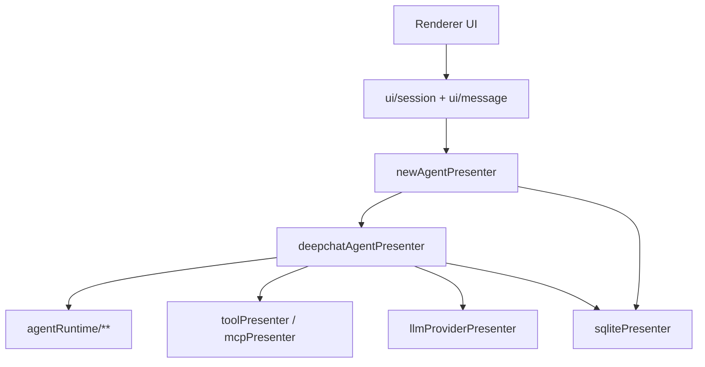

# Agent System

本文档只描述当前 live 的 agent/session 架构。

## Topology

## Responsibilities

### `newAgentPresenter`

负责 session domain：
- create/activate/deactivate/delete session
- webContents 绑定
- renderer IPC facade
- session model / permission mode / generation settings 更新
- runtime cleanup
- session export
- legacy import trigger

### `deepchatAgentPresenter`

负责 deepchat agent runtime：
- 初始化 session runtime
- 构建上下文
- 调用 LLM stream
- tool execution / pending interactions / retry / cancel
- compaction / trace / search result persistence

### `agentRuntime`

当前被复用的运行时模块：
- `acp/**`
- `loop/**`
- `message/systemEnvPromptBuilder.ts`
- `message/messageFormatter.ts`
- `tools/questionTool.ts`
- `sessionPaths.ts`

这里是现行 runtime 共享层，不再依赖旧 `agentPresenter/sessionPresenter`。

## Session Lifecycle

1. Renderer 创建或选择 session。
2. `newAgentPresenter` 读写 `new_sessions` 并绑定 `webContentsId`。
3. `deepchatAgentPresenter` 初始化 `deepchat_sessions` runtime state。
4. 发送消息时，`deepchat_messages` 持久化用户/助手消息。
5. 如果窗口关闭、tab 关闭或删除 session，`newAgentPresenter` 负责统一 cleanup。

## Persistence

`new_sessions`
- session identity
- tab/window binding related metadata
- `active_skills`

`deepchat_sessions`
- provider/model
- permission mode
- summary / compaction state
- generation settings

`deepchat_messages`
- normalized message blocks
- order sequence
- status

## Compatibility

仍保留的历史兼容只有一类：导入。

支持来源：
- legacy `chat.db`
- legacy-format `agent.db`
- new-format `agent.db`

落库目标统一是：
- `new_sessions`
- `deepchat_*`

## Non-Goals

当前 live 架构不再承诺：
- `agentPresenter` 运行时调用
- `sessionPresenter` 运行时调用
- 旧 `conversations/messages/message_attachments` 作为真源

历史实现见：
- `archive/agent-session-legacy-2026-03-12/`
