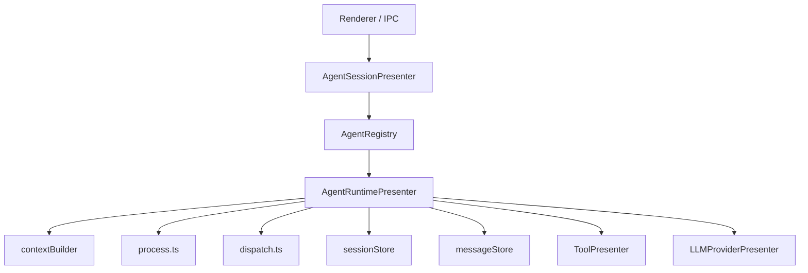

# Agent 系统架构详解

本文档描述 retirement 后仍然有效的 agent system。旧 `AgentPresenter` 细节已归档到
[../archives/legacy-agentpresenter-architecture.md](../archives/legacy-agentpresenter-architecture.md)。

## 当前运行时所有权



主原则：

- renderer 只面向 `agentSessionPresenter`
- `agentSessionPresenter` 只做 session orchestration，不执行聊天 loop
- `agentRuntimePresenter` 独占聊天 runtime

## 模块布局

### `agentSessionPresenter/`

```text
agentSessionPresenter/
├── index.ts
├── agentRegistry.ts
├── sessionManager.ts
├── messageManager.ts
└── legacyImportService.ts
```

职责：

- 注册和解析 agent implementation
- 创建、删除、激活、分叉会话
- 绑定窗口与 session
- 暴露 renderer IPC 方法
- 保留 legacy import 流程

### `agentRuntimePresenter/`

```text
agentRuntimePresenter/
├── index.ts
├── process.ts
├── dispatch.ts
├── contextBuilder.ts
├── sessionStore.ts
├── messageStore.ts
├── pendingInputStore.ts
├── pendingInputCoordinator.ts
├── compactionService.ts
├── echo.ts
└── toolOutputGuard.ts
```

职责：

- 初始化 session runtime 状态
- 处理 `processMessage()` / `respondToolInteraction()`
- 执行 stream loop 与 tool loop
- 持久化消息和运行时状态
- 做 context compaction、tool output guard、实时 echo

## 关键职责拆分

| 层 | 主文件 | 责任 |
| --- | --- | --- |
| Session orchestration | `src/main/presenter/agentSessionPresenter/index.ts` | session 生命周期与 IPC |
| Agent runtime | `src/main/presenter/agentRuntimePresenter/index.ts` | run state、取消、恢复、模型/权限切换 |
| Stream loop | `src/main/presenter/agentRuntimePresenter/process.ts` | 调用 provider、累计 blocks、驱动 tool loop |
| Tool dispatch | `src/main/presenter/agentRuntimePresenter/dispatch.ts` | 调用 `ToolPresenter`、暂停交互、生成 tool 结果 |
| Context build | `src/main/presenter/agentRuntimePresenter/contextBuilder.ts` | 历史裁剪、resume context、token budget |
| Persistence | `src/main/presenter/agentRuntimePresenter/messageStore.ts` | 消息持久化、分页读取、结构化内容重组与故障恢复 |

## 持久化热路径

`DeepChatMessageStore` 现在采用“头表 + 结构化子表”的主链路模型：

- `deepchat_messages` 作为消息头表
- `deepchat_user_messages` / `files` / `links` 存 user 热字段
- `deepchat_assistant_blocks` 存 assistant blocks
- `deepchat_search_documents` / `_fts` 存历史搜索索引

关键语义：

- streaming 期间只增量更新 `deepchat_assistant_blocks`
- 最终进入 `sent/error` 时才写回稳定的 `deepchat_messages.content`
- 读路径优先从结构化表重组 `ChatMessageRecord.content`，缺行时再回退旧 JSON

## 兼容边界

这轮 retirement 后，以下内容仍保留但不属于活跃 runtime：

- `LegacyChatImportService`
- legacy import hook / status
- 旧 `conversations/messages` 表
- `SessionPresenter` 的导出、thread list、旧数据查询能力

以下能力已经从活代码里退休：

- `AgentPresenter` runtime 主入口
- `startStreamCompletion()` 旧流式接口
- 通过 `presenter.agentPresenter` / `presenter.sessionPresenter` 暴露的 renderer 入口

## 调试入口

如果要追一条真实消息链路，推荐顺序：

1. `src/main/presenter/agentSessionPresenter/index.ts`
2. `src/main/presenter/agentRuntimePresenter/index.ts`
3. `src/main/presenter/agentRuntimePresenter/process.ts`
4. `src/main/presenter/agentRuntimePresenter/dispatch.ts`
5. `src/main/presenter/toolPresenter/index.ts`

## 历史说明

若你看到旧设计文档、旧 PR 或旧规格里仍提到以下概念，它们都已经退休：

- `AgentPresenter`
- `agentLoopHandler`
- `streamGenerationHandler`
- `permissionHandler`
- `startStreamCompletion`

需要对照旧实现时，只看归档文档，不再把历史源码快照当作活跃导航入口。
