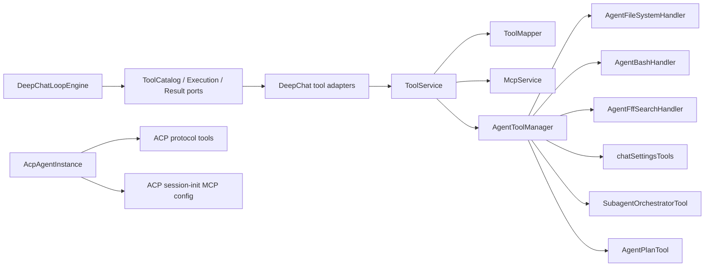
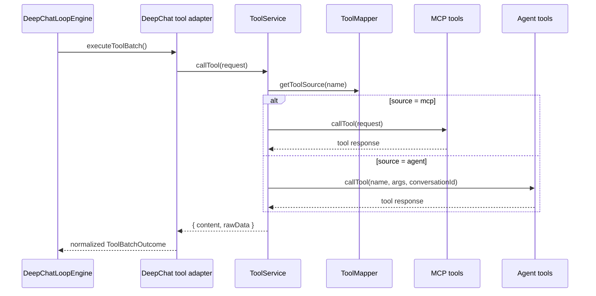

# 工具系统架构详解

本文档说明当前 Tool 调用流程。旧 Agent Tool 和 Tool Presenter 路径已经删除。

## 当前组件

| 组件 | 位置 | 职责 |
| --- | --- | --- |
| DeepChat tool ports | `src/main/agent/deepchat/loop/ports.ts` | LoopEngine 使用的 catalog/execution/result contracts |
| DeepChat tool adapters | `src/main/agent/deepchat/runtime/toolAdapters.ts` | 将 loop ports 接到 ToolService、permission、normalization/output guard |
| `ToolService` | `src/main/tool/index.ts` | 聚合工具定义、建立映射、路由调用 |
| `ToolMapper` | `src/main/tool/toolMapper.ts` | `toolName -> source` 映射 |
| `AgentToolManager` | `src/main/tool/agentTools/agentToolManager.ts` | 本地 agent tools 装配与执行 |
| `AgentFileSystemHandler` | `src/main/tool/agentTools/agentFileSystemHandler.ts` | 文件系统类工具 |
| `AgentBashHandler` | `src/main/tool/agentTools/agentBashHandler.ts` | 命令执行与后台 session |
| `AgentFffSearchHandler` | `src/main/tool/agentTools/agentFffSearchHandler.ts` | FFF-backed `glob` / `grep` code search |
| `chatSettingsTools` | `src/main/tool/agentTools/chatSettingsTools.ts` | chat/session settings 工具 |
| `SubagentOrchestratorTool` | `src/main/tool/agentTools/subagentOrchestratorTool.ts` | subagent orchestration |
| `AgentPlanTool` | `src/main/tool/agentTools/agentPlanTool.ts` | `agent-core/update_plan` |
| `AgentTapeToolHandler` | `src/main/tool/agentTools/agentTapeTools.ts` | tape read/merge/discard tools |
| `AgentImageGenerationTool` | `src/main/tool/agentTools/agentImageGenerationTool.ts` | image generation tool |
| `McpService` | `src/main/mcp/` | 外部 MCP servers 与 tools |
| `ACP helpers` | `src/main/agent/acp/` | ACP runtime、workdir、config、MCP 映射 |

## 路由关系


```mermaid
graph LR
    Loop["DeepChatLoopEngine"] --> Ports["ToolCatalog / Execution / Result ports"]
    Ports --> Adapters["DeepChat tool adapters"]
    Adapters --> ToolService["ToolService"]
    ToolService --> Mapper["ToolMapper"]
    ToolService --> Mcp["McpService"]
    ToolService --> AgentTools["AgentToolManager"]
    AgentTools --> Fs["AgentFileSystemHandler"]
    AgentTools --> Bash["AgentBashHandler"]
    AgentTools --> FFF["AgentFffSearchHandler"]
    AgentTools --> Settings["chatSettingsTools"]
    AgentTools --> Subagents["SubagentOrchestratorTool"]
    AgentTools --> Plan["AgentPlanTool"]
    Acp["AcpAgentInstance"] --> Protocol["ACP protocol tools"]
    Acp --> McpConfig["ACP session-init MCP config"]
```

## 获取工具定义

`ToolService.getAllToolDefinitions()` 会按顺序做三件事：

1. 从 `mcpService` 拉取 MCP tools。
2. 从 `AgentToolManager` 拉取本地 agent tools。
3. 用 `ToolMapper` 记录来源，并在重名时优先保留 MCP tool。
4. 过滤 disabled agent tools，并为每个 conversation 维护独立映射。

这意味着 `DeepChatLoopEngine` 不知道 tool 的真实来源，只接收 `MCPToolDefinition[]` snapshot 和窄
execution/result ports。Tool mapping、重名处理和调用路由仍由 `ToolService` 负责。

## 调用工具


```mermaid
sequenceDiagram
    participant L as DeepChatLoopEngine
    participant P as DeepChat tool adapter
    participant T as ToolService
    participant Map as ToolMapper
    participant M as MCP tools
    participant A as Agent tools

    L->>P: executeToolBatch()
    P->>T: callTool(request)
    T->>Map: getToolSource(name)

    alt source = mcp
        T->>M: callTool(request)
        M-->>T: tool response
    else source = agent
        T->>A: callTool(name, args, conversationId)
        A-->>T: tool response
    end

    T-->>P: { content, rawData }
    P-->>L: normalized ToolBatchOutcome
```

tool batch 会按现有 policy 执行 pre-check permission、question interception、post-call permission 与
post-success skill-draft confirmation。需要用户处理时返回 ordered typed interaction outcome；当前 run
settle，中间项保持 paused，最后一项处理后才创建 fresh resume run。side-effect tool 不为 output fitting
重跑。

## 权限与 runtime port

本地 agent tools 不再直接依赖旧 presenter runtime，而是通过明确的 port 注入：

- `src/main/tool/runtimePorts.ts`
- `AgentToolRuntimePort`

port 负责提供：

- conversation workdir 解析
- 已批准路径查询
- settings approval 消费
- Lifecycle / Turn / AgentAssignment / Projection session ports

## FFF Search

Agent code/file search uses `@ff-labs/fff-node` through `AgentFffSearchHandler`.

Current model-facing search tools:

| Tool | Backing API | Output |
| --- | --- | --- |
| `glob` | `FffSearchService.findFiles()` | JSON file hits with `path` and score |
| `grep` | `FffSearchService.grep()` | JSON line hits with `path`, `lineNumber`, snippet, and score |

Search policy:

- Agent prompts should prefer `glob -> grep -> read`.
- Shell search commands are outside the model-facing code search path.
- FFF unavailable errors stay tool errors.
- Tool metadata reports `source: "fff"` so downstream rendering/debug paths can identify search
  origin.

权限能力拆分：

- 文件访问：`filePermissionService`
- settings 变更：`settingsPermissionService`
- shell/command：`CommandPermissionService`

## ACP 相关 helper

ACP provider 仍然是活跃兼容能力，但 ACP helper 已经收拢到独立 domain owner：

```text
src/main/agent/acp/
├── catalog/                 # registry/catalog cache and migration
├── client/                  # connection/prompt/workspace client runtime
├── launch/                  # install/launch spec and setup terminal
└── runtime/                 # process/session/persistence/protocol mapping
```

`src/main/presenter/llmProviderPresenter/providers/acpProvider.ts` 仍是 DeepChat 选择 ACP provider
时的兼容 adapter；它仍在 DeepChat LoopEngine 外层收到 DeepChat tool/resource context，但 ACP provider
不会把该 `_tools` array 当作 direct ACP tool delivery。`kind=acp` 使用 `AcpAgentInstance` 和 ACP
session-init MCP config/protocol callbacks，不经过 DeepChat ToolService/LoopEngine。ACP process/session
实现不再由 provider 目录持有。

## 调试建议

排查工具问题时，优先顺序：

1. `src/main/agent/deepchat/loop/ports.ts` 与 `deepChatLoopEngine.ts`
2. `src/main/agent/deepchat/runtime/toolAdapters.ts` / `dispatch.ts`
3. `src/main/tool/index.ts`
4. `src/main/tool/toolMapper.ts`
5. `src/main/tool/agentTools/agentToolManager.ts`
6. 具体 handler 或 `src/main/mcp/toolManager.ts`

如果看到旧路径 `src/main/presenter/agentPresenter/acp/*`，那属于已经归档的历史实现。
