# 工具系统架构详解

本文档详细介绍工具系统的设计、工具路由机制、MCP 集成和 Agent 工具实现。

## 📋 核心组件概览

| 组件 | 文件位置 | 职责 |
|------|---------|------|
| **ToolPresenter** | `src/main/presenter/toolPresenter/index.ts` | 统一工具定义接口、工具调用路由 |
| **ToolMapper** | `src/main/presenter/toolPresenter/toolMapper.ts` | 工具名称→来源映射 |
| **McpPresenter** | `src/main/presenter/mcpPresenter/index.ts` | MCP 服务器管理、工具定义、工具调用 |
| **AgentToolManager** | `src/main/presenter/agentPresenter/acp/agentToolManager.ts` | Agent 工具管理 |
| **AgentFileSystemHandler** | `src/main/presenter/agentPresenter/acp/agentFileSystemHandler.ts` | 文件系统工具实现 |

## 🏗️ 架构关系

```mermaid
graph TB
    subgraph "工具路由层"
        ToolP[ToolPresenter]
        Mapper[ToolMapper]
    end

    subgraph "工具来源"
        McpP[McpPresenter]
        ServerMgr[MCP ServerManager]
        ToolMgr[MCP ToolManager]
        McpClient[MCP Clients]

        AgentToolMgr[AgentToolManager]
        FsHandler[AgentFileSystemHandler]
        YoBrowser[Yo Browser CDP]
    end

    subgraph "外部服务"
        MCPServers[外部 MCP 服务器]
        Files[本地文件系统]
        Web[网页浏览]
    end

    ToolP --> Mapper
    ToolP --> McpP
    ToolP --> AgentToolMgr

    McpP --> ServerMgr
    McpP --> ToolMgr
    ServerMgr --> McpClient
    McpClient --> MCPServers

    AgentToolMgr --> FsHandler
    AgentToolMgr --> YoBrowser

    FsHandler --> Files
    YoBrowser --> Web

    classDef router fill:#e3f2fd
    classDef mcp fill:#fff3e0
    classDef agent fill:#f3e5f5
    classDef external fill:#e8f5e9

    class ToolP,Mapper router
    class McpP,ServerMgr,ToolMgr,McpClient mcp
    class AgentToolMgr,FsHandler,YoBrowser agent
    class MCPServers,Files,Web external
```



## 🔀 ToolPresenter - 统一工具路由

### 核心接口

```typescript
export interface IToolPresenter {
  // 获取所有工具定义（统一 MCP 格式）
  getAllToolDefinitions(context: {
    enabledMcpTools?: string[]
    chatMode?: 'chat' | 'agent' | 'acp agent'
    supportsVision?: boolean
    agentWorkspacePath?: string | null
  }): Promise<MCPToolDefinition[]>

  // 调用工具（自动路由）
  callTool(request: MCPToolCall): Promise<{
    content: unknown
    rawData: MCPToolResponse
  }>
}
```

### 获取工具定义流程

```mermaid
sequenceDiagram
    participant AgentLoop as agentLoopHandler
    participant ToolP as ToolPresenter
    participant Mapper as ToolMapper
    participant McpP as McpPresenter
    participant AgentToolMgr as AgentToolManager

    AgentLoop->>ToolP: getAllToolDefinitions({chatMode, ...})

    Note over ToolP: 初始化 Mapper
    ToolP->>Mapper: clear()

    Note over ToolP,McpP: 1. 获取 MCP 工具
    ToolP->>McpP: getAllToolDefinitions(enabledMcpTools)
    McpP-->>ToolP: mcpDefs[]

    ToolP->>Mapper: registerTools(mcpDefs, 'mcp')

    opt chatMode != 'chat'
        Note over ToolP,AgentToolMgr: 2. 获取 Agent 工具
        ToolP->>AgentToolMgr: getAllToolDefinitions({chatMode, supportsVision, workspace})
        AgentToolMgr-->>ToolP: agentDefs[]

        Note over ToolP,Mapper: 过滤名称冲突（优先 MCP）
        ToolP->>Mapper: 过滤 agentDefs
        Mapper->>Mapper: hasTool(name)?
        Note over Mapper: 冲突则丢弃
        ToolP-->>ToolP: filteredAgentDefs[]

        ToolP->>Mapper: registerTools(filteredAgentDefs, 'agent')
    end

    ToolP-->>AgentLoop: [...mcpDefs, ...agentDefs]
```



**代码实现**：

```typescript
async getAllToolDefinitions(context: IToolContext): Promise<MCPToolDefinition[]> {
  const defs: MCPToolDefinition[] = []
  this.mapper.clear()

  const { chatMode, supportsVision, agentWorkspacePath } = context

  // 1. 获取 MCP 工具
  const mcpDefs = await this.options.mcpPresenter.getAllToolDefinitions(context.enabledMcpTools)
  defs.push(...mcpDefs)
  this.mapper.registerTools(mcpDefs, 'mcp')

  // 2. Agent 模式下获取 Agent 工具
  if (chatMode !== 'chat') {
    if (!this.agentToolManager) {
      this.agentToolManager = new AgentToolManager({
        yoBrowserPresenter: this.options.yoBrowserPresenter,
        agentWorkspacePath,
        commandPermissionHandler: this.options.commandPermissionHandler
      })
    }

    const agentDefs = await this.agentToolManager.getAllToolDefinitions({
      chatMode,
      supportsVision,
      agentWorkspacePath
    })

    // 3. 过滤名称冲突（优先 MCP）
    const filtered = agentDefs.filter(tool => {
      if (!this.mapper.hasTool(tool.function.name)) return true
      console.warn(`[ToolPresenter] 工具名冲突 '${tool.function.name}'，优先使用 MCP 工具`)
      return false
    })
    defs.push(...filtered)
    this.mapper.registerTools(filtered, 'agent')
  }

  return defs
}
```

**文件位置**：`src/main/presenter/toolPresenter/index.ts:49-99`

### 工具调用路由流程

```mermaid
sequenceDiagram
    participant AgentLoop as agentLoopHandler
    participant ToolP as ToolPresenter
    participant Mapper as ToolMapper
    participant McpP as McpPresenter
    participant AgentToolMgr as AgentToolManager
    participant FsHandler as AgentFileSystemHandler

    AgentLoop->>ToolP: callTool({id, function: {name, arguments}, server})

    ToolP->>Mapper: getToolSource(name)
    Mapper-->>ToolP: source ('mcp' or 'agent')

    alt source == 'mcp'
        ToolP->>McpP: callTool(request)
        McpP->>McpP: 查找 MCP Client
        McpP->>McpP: 执行 MCP 工具
        McpP-->>ToolP: toolResponse
    else source == 'agent'
        ToolP->>ToolP: JSON.parse(arguments)
        Note over ToolP: 失败则尝试 jsonrepair

        ToolP->>AgentToolMgr: callTool(name, args, conversationId)

        alt 文件系统工具
            AgentToolMgr->>FsHandler: read_file/write_file...
            FsHandler-->>AgentToolMgr: fileResult
        else Browser 工具
            AgentToolMgr->>AgentToolMgr: browser.navigate/scrape...
            AgentToolMgr-->>AgentToolMgr: browserResult
        end

        AgentToolMgr-->>ToolP: toolResponse
    end

    ToolP-->>AgentLoop: {content, rawData}
```



**代码实现**：

```typescript
async callTool(request: MCPToolCall): Promise<{ content: unknown; rawData: MCPToolResponse }> {
  const toolName = request.function.name
  const source = this.mapper.getToolSource(toolName)

  if (!source) {
    throw new Error(`工具 ${toolName} 未在任何来源中找到`)
  }

  if (source === 'agent') {
    // Agent 工具
    let args: Record<string, unknown> = {}
    const argsString = request.function.arguments || ''

    if (argsString.trim()) {
      try {
        args = JSON.parse(argsString) as Record<string, unknown>
      } catch (error) {
        console.warn('[ToolPresenter] 解析工具参数失败，尝试 jsonrepair:', error)
        try {
          args = JSON.parse(jsonrepair(argsString)) as Record<string, unknown>
        } catch (error) {
          console.warn('[ToolPresenter] 修复参数失败，使用空参数:', error)
          args = {}
        }
      }
    }

    const response = await this.agentToolManager.callTool(toolName, args, request.conversationId)
    const resolvedResponse = this.resolveAgentToolResponse(response)

    return {
      content: resolvedResponse.content,
      rawData: {
        toolCallId: request.id,
        content: resolvedResponse.rawData?.content ?? resolvedResponse.content,
        isError: resolvedResponse.rawData?.isError,
        toolResult: resolvedResponse.rawData?.toolResult
      }
    }
  }

  // MCP 工具（默认）
  return await this.options.mcpPresenter.callTool(request)
}
```

**文件位置**：`src/main/presenter/toolPresenter/index.ts:104-160`

## 🗺️ ToolMapper - 工具名称映射

### 核心功能

```typescript
class ToolMapper {
  private map = new Map<string, { source: string; originalName?: string }>()

  // 注册工具
  registerTools(tools: MCPToolDefinition[], source: 'mcp' | 'agent') {
    for (const tool of tools) {
      const name = tool.function.name
      this.map.set(name, { source, originalName: name })
    }
  }

  // 获取工具来源
  getToolSource(toolName: string): 'mcp' | 'agent' | null {
    return this.map.get(toolName)?.source ?? null
  }

  // 检查工具是否存在
  hasTool(toolName: string): boolean {
    return this.map.has(toolName)
  }

  // 清空映射
  clear() {
    this.map.clear()
  }
}
```

**路由规则**：
1. MCP 工具优先：名称冲突时优先 MCP
2. Agent 工具后注册：被过滤掉已存在的名字
3. 路由决策：在 callTool 时查询映射表

## 🌐 MCP 集成

### McpPresenter 架构

```mermaid
graph TB
    McpP[McpPresenter 主入口]

    subgraph "MCP 服务器管理"
        ServerMgr[ServerManager<br/>管理 MCP Client]
        McpClient[McClient<br/>单个 MCP 客户端]
    end

    subgraph "工具管理"
        ToolMgr[ToolManager<br/>工具定义缓存]
    end

    subgraph "权限管理"
        Config[MCP Config Helper]
        Permission[Permission Settings]
    end

    subgraph "MCP 标准"
        MCPServer[MCP Server]
        MCPTool[MCP Tool Definition]
    end

    McpP --> ServerMgr
    McpP --> ToolMgr
    McpP --> Config
    Config --> Permission

    ServerMgr --> McpClient
    McpClient --> MCPServer

    ToolMgr --> MCPTool

    classDef core fill:#e3f2fd
    classDef management fill:#fff3e0
    classDef permission fill:#f3e5f5

    class McpP core
    class ServerMgr,McpClient,ToolMgr management
    class Config,Permission permission
```



### 核心方法

```typescript
class McpPresenter implements IMCPPresenter {
  // === 服务器管理 ===

  // 获取所有 MCP 服务器配置
  getMcpServers(): Record<string, MCPServerConfig>

  // 获取运行中的 MCP 客户端
  getMcpClients(): McpClient[]

  // 启动 MCP 服务器
  async startServer(serverName: string): Promise<void>

  // 停止 MCP 服务器
  async stopServer(serverName: string): Promise<void>

  // 添加/更新/删除 MCP 服务器
  async addMcpServer(config: MCPServerConfig): Promise<void>
  async updateMcpServer(serverName: string, config: MCPServerConfig): Promise<void>
  async removeMcpServer(serverName: string): Promise<void>

  // === 工具管理 ===

  // 获取所有工具定义（统一 MCP 格式）
  async getAllToolDefinitions(enabledTools?: string[]): Promise<MCPToolDefinition[]>

  // 调用工具
  async callTool(request: MCPToolCall): Promise<MCPToolResponse>

  // === 工具格式转换 ===

  // MCP → OpenAI 格式
  mcpToolsToOpenAITools(tools: MCPToolDefinition[]): OpenAITool[]

  // OpenAI → MCP 格式
  openAIToolsToMcpTool(toolCall: OpenAIToolCall): MCPToolCall

  // MCP → Anthropic 格式
  mcpToolsToAnthropicTools(tools: MCPToolDefinition[]): AnthropicTool[]

  // Anthropic → MCP 格式
  anthropicToolUseToMcpTool(toolUse: AnthropicToolUse): MCPToolCall

  // MCP → Gemini 格式
  mcpToolsToGeminiTools(tools: MCPToolDefinition[]): GeminiTool[]

  // Gemini → MCP 格式
  geminiFunctionCallToMcpTool(funcCall: GeminiFunctionCall): MCPToolCall

  // === 权限管理 ===

  // 检查工具权限
  async checkToolPermission(
    serverName: string,
    toolName: string
  ): Promise<{ granted: boolean; permissionType?: string }>

  // 授予权限
  async grantPermission(
    serverName: string,
    permissionType: 'read' | 'write' | 'all',
    remember: boolean
  ): Promise<void>
}
```

### 工具定义收集

```typescript
async getAllToolDefinitions(enabledTools?: string[]): Promise<MCPToolDefinition[]> {
  // 1. 从缓存获取（如果可用）
  if (this.toolManager.cachedToolDefinitions) {
    return this.toolManager.filterEnabledTools(enabledTools)
  }

  // 2. 从所有运行中的 MCP Client 获取
  const runningClients = this.serverManager.getRunningClients()
  const allTools: MCPToolDefinition[] = []

  for (const client of runningClients) {
    try {
      const tools = await client.listTools()
      for (const tool of tools) {
        allTools.push({
          server: {
            name: client.serverName,
            id: client.serverName,
            icons: client.serverConfig.icons || '',
            description: client.serverConfig.description || ''
          },
          function: {
            name: tool.name,
            description: tool.description,
            parameters: tool.inputSchema
          }
        })
      }
    } catch (error) {
      console.error(`[MCP] 获取 ${client.serverName} 的工具定义失败:`, error)
    }
  }

  // 3. 缓存并返回
  this.toolManager.cachedToolDefinitions = allTools
  return this.toolManager.filterEnabledTools(enabledTools)
}
```

### 工具调用执行

```typescript
async callTool(request: MCPToolCall): Promise<MCPToolResponse> {
  const { id, function: fn, server } = request
  const { name, arguments: args } = fn

  // 1. 查找对应的 MCP Client
  const client = this.serverManager.getClient(server.name)
  if (!client) {
    throw new Error(`MCP 服务器 ${server.name} 未运行`)
  }

  // 2. 检查权限
  const { granted, permissionType } = await this.toolManager.checkToolPermission(
    server.name,
    name
  )
  if (!granted) {
    // 返回权限请求
    return {
      toolCallId: id,
      content: '',
      isError: false,
      requiresPermission: true,
      permissionRequest: {
        toolName: name,
        serverName: server.name,
        permissionType,
        description: this.getPermissionDescription(server, name)
      }
    }
  }

  // 3. 执行工具
  try {
    const result = await client.callTool(name, typeof args === 'string' ? JSON.parse(args) : args)

    return {
      toolCallId: id,
      content: result.content[0]?.text || '',
      isError: result.isError,
      toolResult: result
    }
  } catch (error) {
    return {
      toolCallId: id,
      content: `工具执行失败: ${error instanceof Error ? error.message : String(error)}`,
      isError: true
    }
  }
}
```

**文件位置**：`src/main/presenter/mcpPresenter/index.ts`

## 🤖 Agent 工具实现

### AgentToolManager

```typescript
class AgentToolManager {
  constructor(options: {
    yoBrowserPresenter: IYoBrowserPresenter
    agentWorkspacePath: string | null
    commandPermissionHandler?: CommandPermissionService
  })

  // 获取 Agent 工具定义
  async getAllToolDefinitions(context: {
    chatMode: 'chat' | 'agent' | 'acp agent'
    supportsVision?: boolean
    agentWorkspacePath?: string | null
  }): Promise<MCPToolDefinition[]>

  // 调用 Agent 工具
  async callTool(
    toolName: string,
    args: Record<string, unknown>,
    conversationId: string
  ): Promise<AgentToolCallResult | string>

  // 获取工具定义
  private getFilesystemTools(): MCPToolDefinition[]
  private getBrowserTools(supportsVision: boolean): MCPToolDefinition[]
}
```

### 文件系统工具

**文件位置**：`src/main/presenter/agentPresenter/acp/agentFileSystemHandler.ts:1-960`

#### 支持的工具

| 工具名 | 功能 | 权限类型 |
|--------|------|---------|
| `read_file` | 读取文件内容 | read |
| `write_file` | 写入文件（覆盖） | write |
| `list_directory` | 列出目录内容 | read |
| `create_directory` | 创建目录 | write |
| `delete_file` | 删除文件 | write |
| `move_files` | 移动/重命名文件 | write |
| `get_file_info` | 获取文件信息 | read |
| `edit_text` | 编辑文件内容（diff 方式） | write |
| `text_replace` | 替换文件中的文本 | write |
| `glob_search` | Glob 模式搜索 | read |
| `grep_search` | 正则表达式搜索 | read |
| `directory_tree` | 获取目录树 | read |

#### 路径安全机制

```typescript
class AgentFileSystemHandler {
  private allowedWorkspaces: Set<string> = new Set()

  // 注册允许的工作区
  registerWorkspace(workspacePath: string) {
    const resolvedPath = fs.realPathSync(workspacePath)
    this.allowedWorkspaces.add(resolvedPath)
  }

  // 验证路径是否在允许的工作区内
  private validatePath(path: string): void {
    const resolvedPath = fs.realPathSync(path)
    const isAllowed = Array.from(this.allowedWorkspaces).some(allowed =>
      resolvedPath.startsWith(allowed)
    )

    if (!isAllowed) {
      throw new Error(`路径 '${path}' 不在允许的工作区内`)
    }
  }

  // 读取文件
  async readFile(args: { path: string }): Promise<string> {
    this.validatePath(args.path)

    if (!fs.existsSync(args.path)) {
      throw new Error(`文件不存在: ${args.path}`)
    }

    return fs.promises.readFile(args.path, 'utf-8')
  }

  // 写入文件
  async writeFile(args: { path: string; content: string }): Promise<string> {
    this.validatePath(args.path)

    // 检查父目录是否存在
    const dir = path.dirname(args.path)
    if (!fs.existsSync(dir)) {
      await fs.promises.mkdir(dir, { recursive: true })
    }

    await fs.promises.writeFile(args.path, args.content, 'utf-8')
    return `已写入文件: ${args.path}`
  }
}
```

**安全特性**：
1. **白名单机制**：只允许访问已注册的工作区
2. **路径解析**：使用 `realPath` 解析符号链接
3. **边界检查**：防止 `../` 越界访问
4. **正则验证**：`grep_search` 和 `text_replace` 使用 `validateRegexPattern` 防 ReDoS

### YoBrowser CDP 工具

YoBrowser 提供基于 Chrome DevTools Protocol (CDP) 的最小工具集，在 agent 模式下直接可用。

**可用工具**：
- `yo_browser_tab_list` - 列出所有浏览器 tabs
- `yo_browser_tab_new` - 创建新 tab
- `yo_browser_tab_activate` - 激活指定 tab
- `yo_browser_tab_close` - 关闭 tab
- `yo_browser_cdp_send` - 发送 CDP 命令

**安全约束**：
- `local://` URL 禁止 CDP attach（在 `BrowserTab.ensureSession()` 中检查）
- 所有 CDP 命令通过 `webContents.debugger.sendCommand()` 执行

## 🔐 权限系统

### 权限类型

| 类型 | 适用场景 | 说明 |
|------|---------|------|
| `read` | 只读操作 | list_directory, read_file, get_file_info, 搜索工具 |
| `write` | 写入操作 | write_file, create_directory, delete_file, move_files, edit_text |
| `all` | 全部权限 | 授予读写权限 |
| `command` | 命令执行 | bash 命令（需要额外审批） |

### 权限状态机

```mermaid
stateDiagram-v2
    [*] --> IDLE: 初始化
    IDLE --> REQUESTING: 开始权限检查
    REQUESTING --> AWAITING_USER: 需要用户确认
    REQUESTING --> GRANTED: autoApprove 匹配
    AWAITING_USER --> GRANTED: 用户批准
    AWAITING_USER --> DENIED: 用户拒绝
    GRANTED --> COMPLETED: 工具执行完成
    DENIED --> COMPLETED: 返回错误响应
    COMPLETED --> [*]

    note right of REQUESTING
      检查 autoApprove 配置
      检查已授予权限层级
    end note

    note right of AWAITING_USER
      pendingPermissions 队列管理
      支持多个并发权限请求
    end note
```



### 权限层级与批量更新

```typescript
// 权限层级：all > write > read > command
const PERMISSION_LEVELS: Record<string, number> = {
  all: 3,
  write: 2,
  read: 1,
  command: 0  // command 只匹配 command（需要精确匹配）
}

function isPermissionSufficient(granted: string, required: string): boolean {
  if (granted === 'command' || required === 'command') {
    return granted === required
  }
  return (PERMISSION_LEVELS[granted] || 0) >= (PERMISSION_LEVELS[required] || 0)
}

// 批量更新条件
function canBatchUpdate(
  targetPermission: AssistantMessageBlock,
  grantedPermission: AssistantMessageBlock,
  grantedPermissionType: string
): boolean {
  if (targetPermission.status !== 'pending') return false
  if (targetPermission.action_type !== 'tool_call_permission') return false

  const targetServerName = targetPermission.extra?.serverName
  const grantedServerName = grantedPermission.extra?.serverName

  // 必须是相同的 server
  if (targetServerName !== grantedServerName) return false

  // CRITICAL: 必须是相同的 tool_call.id
  if (targetPermission.tool_call?.id !== grantedPermission.tool_call?.id) return false

  // 检查权限层级
  const targetPermissionType = targetPermission.extra?.permissionType || 'read'
  if (!isPermissionSufficient(grantedPermissionType, targetPermissionType)) return false

  return true
}
```

### MCP 服务器权限配置

```typescript
interface MCPServerConfig {
  ...
  autoApprove: ('all' | 'read' | 'write' | string[])[]  // 自动批准的权限
}
```

示例：
```json
{
  "name": "filesystem",
  "autoApprove": ["read"],  // 自动批准 read 权限
  // write 权限仍需用户确认
}
```

### 权限检查流程

```mermaid
sequenceDiagram
    participant AgentLoop as agentLoopHandler
    participant ToolProc as toolCallProcessor
    participant ToolP as ToolPresenter
    participant ToolMgr as ToolManager
    participant McpP as McpPresenter
    participant PermHandler as permissionHandler
    participant User as 用户

    Note over AgentLoop: 工具调用前
    AgentLoop->>ToolProc: process(toolCalls)

    Note over ToolProc: Step 1: 批量预检查权限
    ToolProc->>ToolProc: batchPreCheckPermissions()

    loop 遍历每个 toolCall
        ToolProc->>ToolP: callTool(request)
        ToolP->>McpP: callTool(request)
        McpP->>ToolMgr: checkToolPermission(serverName, toolName)
        ToolMgr->>ToolMgr: 检查 autoApprove 和已授予权限

        alt 需要权限请求
            ToolMgr-->>McpP: granted: false, permissionType
            McpP-->>ToolP: requiresPermission: true
            ToolP-->>ToolProc: permission required

            Note over ToolProc: 添加到 pendingPermissions
            ToolProc->>PermHandler: 发送 permission-required 事件
            PermHandler->>User: 显示权限请求 UI
        else 权限已授予
            ToolMgr-->>McpP: granted: true
            McpP->>McpP: 执行工具
            McpP-->>ToolP: toolResult
            ToolP-->>ToolProc: toolResult
        end
    end

    alt 有权限请求
        Note over ToolProc: 暂停执行，等待用户响应
        User->>PermHandler: 批准/拒绝权限
        PermHandler->>PermHandler: batch update 权限块
        PermHandler->>ToolProc: resumeToolExecution()
        Note over ToolProc: SYNCHRONOUS FLUSH
        ToolProc->>ToolProc: 执行已授权的工具
    end
```



### 工具输出保护机制

```typescript
// 1. 输出截断（防止上下文溢出）
const MAX_TOOL_OUTPUT_LENGTH = 4500

function truncateOutput(output: string): string {
  if (output.length <= MAX_TOOL_OUTPUT_LENGTH) return output
  return output.substring(0, MAX_TOOL_OUTPUT_LENGTH) +
    `\n\n... [截断：输出超过 ${MAX_TOOL_OUTPUT_LENGTH} 字符]`
}

// 2. 目录树深度限制（防止循环引用导致无限输出）
const DIRECTORY_TREE_MAX_DEPTH = 3

async function getDirectoryTree(dirPath: string, currentDepth = 0): Promise<TreeNode> {
  if (currentDepth >= DIRECTORY_TREE_MAX_DEPTH) {
    return { name: path.basename(dirPath), type: 'directory', truncated: true }
  }
  // ... 递归获取子目录
}

// 3. 大输出卸载到文件
const OFFLOAD_THRESHOLD = 10000

async function handleLargeOutput(output: string, toolName: string): Promise<ToolResult> {
  if (output.length > OFFLOAD_THRESHOLD) {
    const tempFile = await writeToTempFile(output)
    return {
      content: `输出已保存到文件: ${tempFile}\n\n预览（前 500 字符）:\n${output.substring(0, 500)}...`,
      offloaded: true,
      offloadedFile: tempFile
    }
  }
  return { content: output }
}

// 4. 流式输出刷新（确保 UI 状态同步）
// 在工具执行前同步刷新所有待处理的 UI 更新
await llmEventHandler.flushStreamUpdates(messageId)
```

## 📊 工具调用事件流

### 流中发送的工具事件

```typescript
// tool_call_start
{
  eventId: string,
  tool_call: 'start',
  tool_call_id: string,
  tool_call_name: string,
  tool_call_params: ''
}

// tool_call_update
{
  eventId: string,
  tool_call: 'update',
  tool_call_id: string,
  tool_call_name: string,
  tool_call_params: string  // 增量或完整参数
}

// tool_call_running
{
  eventId: string,
  tool_call: 'running',
  tool_call_id: string,
  tool_call_name: string,
  tool_call_params: string,
  tool_call_response: string
}

// tool_call_end
{
  eventId: string,
  tool_call: 'end',
  tool_call_id: string,
  tool_call_name: string,
  tool_call_params: string,
  tool_call_response: string,
  tool_call_response_raw: MCPToolResponse
}

// permission-required
{
  eventId: string,
  tool_call: 'permission-required',
  tool_call_id: string,
  tool_call_name: string,
  tool_call_params: string,
  tool_call_server_name: string,
  tool_call_server_icons: string,
  tool_call_server_description: string,
  tool_call_response: string,
  permission_request: {
    toolName: string,
    serverName: string,
    permissionType: 'read'|'write'|'all'|'command',
    description: string,
    rememberable: boolean
  }
}
```

## 📁 关键文件位置汇总

- **ToolPresenter**: `src/main/presenter/toolPresenter/index.ts:1-161`
- **ToolMapper**: `src/main/presenter/toolPresenter/toolMapper.ts`
- **McpPresenter**: `src/main/presenter/mcpPresenter/index.ts`
- **ServerManager**: `src/main/presenter/mcpPresenter/serverManager.ts`
- **ToolManager**: `src/main/presenter/mcpPresenter/toolManager.ts`
- **AgentToolManager**: `src/main/presenter/agentPresenter/acp/agentToolManager.ts:1-577`
- **AgentFileSystemHandler**: `src/main/presenter/agentPresenter/acp/agentFileSystemHandler.ts:1-960`
- **YoBrowserPresenter**: `src/main/presenter/yoBrowserPresenter/index.ts`

## 📚 相关阅读

- [整体架构概览](../ARCHITECTURE.md#工具路由层)
- [Agent 系统详解](./agent-system.md)
- [MCP 集成详解](./mcp-integration.md)
- [核心流程](../FLOWS.md#工具调用流程)
