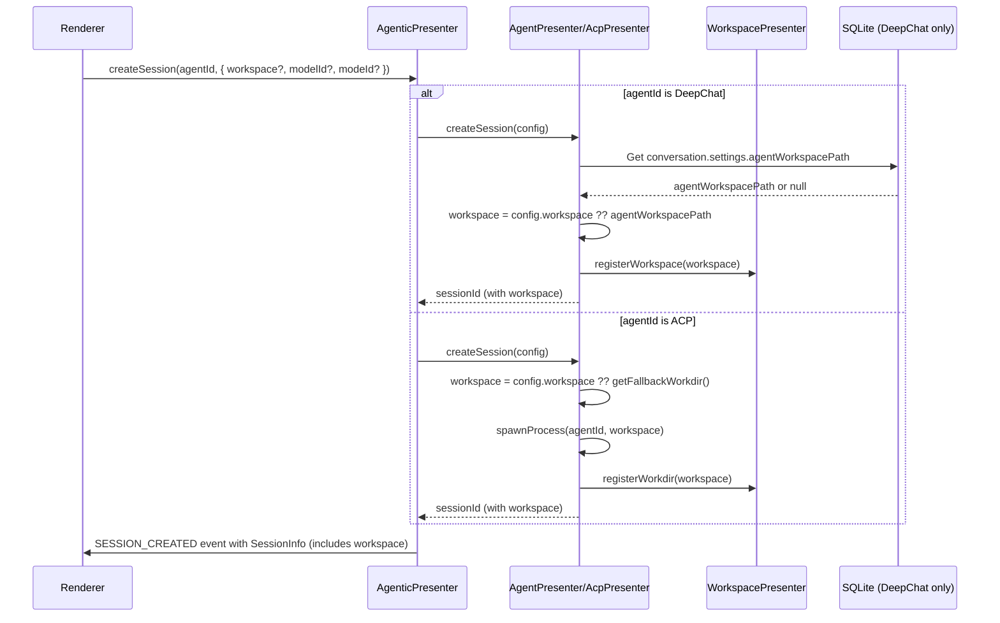

# Workspace Integration Deep Dive

**Status**: 🔴 HIGH PRIORITY Research
**Date**: 2026-01-25
**Related**: `renderer-analysis-research.md` - Proposition 1, Research Item 1

---

## Executive Summary

This document provides a comprehensive analysis of the workspace concept in DeepChat, comparing how DeepChat agents and ACP agents handle workspace/workdir, and proposing a unified design for the Agentic Unified Layer.

**Key Finding**: Workspace is fundamentally different between DeepChat and ACP:
- **DeepChat**: Optional, persistent, per-conversation setting stored in SQLite
- **ACP**: Required, in-memory, session-scoped, immutable after session creation

**Recommendation**: Use workspace as a session-scoped concept (unified with ACP workdir), with presenter layer handling persistence for DeepChat agents.

---

## Part I: Current State Analysis

### 1.1 DeepChat Workspace (`agentWorkspacePath`)

#### Storage Model
- **Location**: SQLite `conversations` table, `settings` column
- **Field**: `CONVERSATION_SETTINGS.agentWorkspacePath: string | null`
- **Scope**: Per conversation (conversation-scoped)
- **Persistence**: Yes - survives app restart

#### Lifecycle
```
1. User selects workspace via UI (ChatInput.vue)
   ↓
2. useAgentWorkspace composable calls:
   - conversationCore.updateConversationSettings(conversationId, { agentWorkspacePath })
   - workspacePresenter.registerWorkspace(path)
   ↓
3. Path stored in SQLite conversations.settings.agentWorkspacePath
   ↓
4. Loaded when conversation is activated
   ↓
5. Can be changed during conversation (with confirmation dialog)
```

#### Key Implementation Files
| File | Purpose |
|------|---------|
| `useAgentWorkspace.ts` | Renderer composable for workspace management |
| `conversationManager.ts:187` | Default `agentWorkspacePath: null` |
| `workspacePresenter/index.ts` | Security layer (path validation) |
| `agentPresenter/tools/fileSystemHandler.ts` | Uses workspace for file operations |

#### Code Reference - Storage
```typescript
// src/main/presenter/sessionPresenter/managers/conversationManager.ts:187
defaultSettings.agentWorkspacePath = null

// src/renderer/src/components/chat-input/composables/useAgentWorkspace.ts:93-96
await conversationCore.updateConversationSettings(options.conversationId.value, {
  agentWorkspacePath: selectedPath
})
```

#### Code Reference - Usage
```typescript
// src/renderer/src/components/chat-input/composables/useAgentWorkspace.ts:102-104
const workspacePresenter = usePresenter('workspacePresenter')
await workspacePresenter.registerWorkspace(selectedPath)
```

#### Mutability
- **Can change during conversation**: Yes
- **Requires confirmation**: Yes (via confirmation dialog)
- **Affects active session**: No - only affects future tool calls

### 1.2 ACP Workdir

#### Storage Model
- **Location**: In-memory only (`AcpProcessManager.sessionWorkdirs`)
- **Scope**: Per session (session-scoped)
- **Persistence**: No - lost on app restart
- **Cleanup**: `before-quit` event clears all sessions

#### Lifecycle
```
1. User selects workdir OR uses default (from ChatConfig or fallback)
   ↓
2. acpPresenter.createSession(agentId, { workdir })
   ↓
3. AcpSessionManager creates session with workdir
   - workdir is IMMUTABLE for the session
   - sessionKey = `${agentId}::${workdir}::${nanoid()}`
   ↓
4. AcpProcessManager spawns process with workdir as cwd
   - One process per (agentId, workdir) combination
   - Multiple sessions can share the same process
   ↓
5. WorkspacePresenter.registerWorkdir(workdir) for security
   ↓
6. Session closed → process released → workdir forgotten
```

#### Key Implementation Files
| File | Purpose |
|------|---------|
| `acpPresenter/managers/sessionManager.ts` | Session lifecycle, workdir immutable |
| `acpPresenter/managers/processManager.ts` | Process per workdir, warmup |
| `useAcpWorkdir.ts` | Renderer composable (now deprecated) |
| `useAcpRuntimeAdapter.ts` | Adapter (returns null for get/set workdir) |

#### Code Reference - Session Creation
```typescript
// src/main/presenter/acpPresenter/managers/sessionManager.ts:63-68
async createSession(
  agentId: string,
  workdir: string,  // Required parameter
  hooks: SessionHooks
): Promise<AcpSessionRecord>
```

#### Code Reference - Workdir Immutability
```typescript
// src/main/presenter/acpPresenter/managers/sessionManager.ts:4-9
/**
 * 核心原则：
 * 1. 零持久化：Session 状态只在内存中维护
 * 2. Workdir 不可变：Session 创建后 workdir 不可更改
 * 3. 生命周期管理：Session 与进程生命周期一致
 * 4. 不依赖 conversationId：Session 独立于 DeepChat Conversation
 */
```

#### Code Reference - Process per Workdir
```typescript
// src/main/presenter/acpPresenter/managers/processManager.ts:211-213
async getConnection(agent: AcpAgentConfig, workdir?: string): Promise<AcpProcessHandle> {
  return await this.warmupProcess(agent, workdir)
}

// Line 228-230
private getWarmupKey(agentId: string, workdir: string): string {
  return `${agentId}::${workdir}`  // Process scoped to agentId + workdir
}
```

#### Code Reference - Fallback Workdir
```typescript
// src/main/presenter/acpPresenter/managers/processManager.ts:142-151
private getFallbackWorkdir(): string {
  const tempDir = path.join(app.getPath('temp'), 'deepchat-acp', 'sessions')
  try {
    fs.mkdirSync(tempDir, { recursive: true })
  } catch (error) {
    console.warn('[ACP] Failed to create fallback workdir, defaulting to system temp:', error)
    return app.getPath('temp')
  }
  return tempDir
}
```

#### Mutability
- **Can change during session**: No (immutable)
- **To change workdir**: Must create new session
- **Process implications**: Different workdir = different process

### 1.3 WorkspacePresenter (Unified Security Layer)

#### Purpose
- Security boundary for all file operations
- Maintains `allowedPaths` set for both workspace and workdir
- Validates paths before allowing read/reveal/open operations

#### Code Reference
```typescript
// src/main/presenter/workspacePresenter/index.ts:20-51
private readonly allowedPaths = new Set<string>()

async registerWorkspace(workspacePath: string): Promise<void> {
  const normalized = path.resolve(workspacePath)
  this.allowedPaths.add(normalized)
}

async registerWorkdir(workdir: string): Promise<void> {
  await this.registerWorkspace(workdir)  // Same mechanism
}

// Line 58-93: Security check with symlink resolution
private isPathAllowed(targetPath: string): boolean {
  // Resolves symlinks to prevent bypass attacks
  const realTargetPath = fs.realpathSync(targetPath)
  // ... checks if realTargetPath is within allowedPaths
}
```

#### Operations Protected
- `readDirectory()` - List directory contents
- `expandDirectory()` - Lazy load subdirectory
- `revealFileInFolder()` - Show in file manager
- `openFile()` - Open with default app
- `searchFiles()` - Search workspace files

---

## Part II: Semantic Analysis

### 2.1 What IS a Workspace?

| Aspect | DeepChat Workspace | ACP Workdir |
|--------|-------------------|-------------|
| **Purpose** | Directory for file tool operations | Working directory + cwd for agent process |
| **Required** | No (optional) | Yes (required) |
| **Default** | `null` (user must select) | Fallback temp dir if not specified |
| **Scope** | Per conversation | Per session (process) |
| **Persistence** | SQLite (survives restart) | In-memory (lost on restart) |
| **Mutability** | Can change during conversation | Immutable per session |
| **Process relation** | One process, multiple conversations | One process per (agent, workdir) |
| **Security** | Registered with WorkspacePresenter | Registered with WorkspacePresenter |
| **File access** | Restricted to workspace tree | Restricted to workdir tree |

### 2.2 Key Differences Deep Dive

#### Difference 1: Storage Strategy
```
DeepChat:
  conversationId → SQLite → settings.agentWorkspacePath
  Persistent across app restarts
  Loaded when conversation is activated

ACP:
  sessionId → In-memory Map → workdir
  Lost on app restart (before-quit cleanup)
  No history of previous workdirs
```

#### Difference 2: Mutability
```
DeepChat:
  User can change agentWorkspacePath anytime
  Old path: /path/to/old → New path: /path/to/new
  Affects future tool calls only

ACP:
  Workdir is immutable for session lifetime
  To change: close session, create new session with new workdir
  Spawns new process with different cwd
```

#### Difference 3: Process Architecture
```
DeepChat:
  One AgentPresenter instance
  Multiple conversations with different workspaces
  Same process, different workspace paths passed to tools

ACP:
  One process per (agentId, workdir) pair
  Multiple sessions can share the same process
  Different workdir = different process
  ProcessManager.getWarmupKey(agentId, workdir)
```

---

## Part III: User Scenarios

### Scenario 1: User Switches Workspace During Active Session

**DeepChat**:
```
1. User clicks workspace selector in ChatInput
2. Selects new directory
3. Confirmation dialog: "Change workspace? This will affect future file operations."
4. User confirms
5. agentWorkspacePath updated in SQLite
6. Future tool calls use new workspace
7. Session continues uninterrupted
```

**ACP**:
```
1. User tries to change workdir
2. Not supported - workdir is immutable
3. Must close current session
4. Create new session with desired workdir
5. New process spawned with new cwd
6. Previous session's context is lost
```

### Scenario 2: Multiple Conversations with Different Workspaces

**DeepChat**:
```
Conversation A: agentWorkspacePath = "/project-a"
Conversation B: agentWorkspacePath = "/project-b"
Both can be active simultaneously
Same AgentPresenter instance serves both
Tools use conversation-specific workspace
```

**ACP**:
```
Session A: workdir = "/project-a" → Process 1
Session B: workdir = "/project-b" → Process 2
Different processes for different workdirs
Each session has isolated workdir context
```

### Scenario 3: Loading Historical Session

**DeepChat**:
```
1. User clicks conversation in sidebar
2. conversationId → SQLite → settings.agentWorkspacePath
3. Workspace loaded and registered with WorkspacePresenter
4. User sees workspace selector showing loaded path
5. Can continue using stored workspace
```

**ACP**:
```
1. User loads conversation (has sessionId)
2. AcpPresenter.loadSession(sessionId, workdir)
3. SessionManager tries to load session from agent
4. If load fails, creates NEW session with specified workdir
5. Original workdir is lost (not stored anywhere)
```

### Scenario 4: No Workspace Selected

**DeepChat**:
```
agentWorkspacePath = null
File tools will:
  - Prompt user to select workspace, OR
  - Fail gracefully with "No workspace selected"
User can set workspace later
```

**ACP**:
```
workdir not specified → uses fallback temp dir
Fallback: app.getPath('temp')/deepchat-acp/sessions
Agent process runs in temp directory
File operations constrained to temp dir
User should select proper workdir for actual work
```

---

## Part IV: Proposed Unified Design

### 4.1 Design Decision: Session-Scoped Workspace

**Rationale**:
1. **ACP Constraint**: ACP requires workdir at session creation, immutable afterward
2. **Consistency**: Both agent types use session-scoped workspace
3. **Simplicity**: Single model for workspace lifecycle
4. **Process Model**: Aligns with ACP's process-per-workdir architecture

### 4.2 Data Model

```typescript
// Unified Session Config
interface SessionConfig {
  // Workspace is now part of session config
  workspace?: string  // Unified term for workspace/workdir

  // For DeepChat: if not specified, use conversation.settings.agentWorkspacePath
  // For ACP: if not specified, use fallback temp dir

  // Other config...
  modelId?: string
  modeId?: string
}

// Session Info includes workspace
interface SessionInfo {
  sessionId: string
  agentId: string
  workspace?: string  // Unified field

  // For DeepChat: workspace === agentWorkspacePath
  // For ACP: workspace === workdir

  // ... other fields
}
```

### 4.3 Workspace Handling by Agent Type

#### DeepChat Agent Workspace Handling
```
Presenter Layer (AgenticPresenter → AgentPresenter):

1. createSession(agentId, config)
   - If config.workspace undefined:
     - Get from DeepChat conversation.settings.agentWorkspacePath
     - Or use null (workspace optional for DeepChat)

2. Store workspace in session context
   - sessionContext.workspace = config.workspace

3. Pass workspace to file tools
   - fileSystemHandler.read(sessionContext.workspace, ...)

4. Register with WorkspacePresenter
   - workspacePresenter.registerWorkspace(sessionContext.workspace)

5. Persistence:
   - Workspace already stored in conversation.settings
   - No additional storage needed
```

#### ACP Agent Workspace Handling
```
Presenter Layer (AgenticPresenter → AcpPresenter):

1. createSession(agentId, config)
   - If config.workspace undefined:
     - Use fallback temp dir
     - Or prompt user (future enhancement)

2. Pass workspace to AcpSessionManager.createSession
   - Immutable for session lifetime

3. AcpProcessManager spawns process with workspace as cwd
   - Process scoped to (agentId, workspace)

4. Register with WorkspacePresenter
   - workspacePresenter.registerWorkdir(workspace)

5. Persistence:
   - In-memory only (ACP constraint)
   - Lost on app restart
```

### 4.4 Unified Session Creation Flow



### 4.5 Terminology Mapping

| Concept | DeepChat Term | ACP Term | Unified Term |
|---------|---------------|----------|--------------|
| Directory path | `workspace` or `agentWorkspacePath` | `workdir` | `workspace` |
| Scope | Conversation | Session | Session |
| Storage | SQLite | In-memory | Agent-specific |
| Mutability | Mutable | Immutable | Agent-specific |
| Required | No | Yes | Agent-specific |

---

## Part V: Implementation Considerations

### 5.1 Breaking Changes

#### Renderer Layer
```typescript
// BEFORE
useAgentWorkspace({ conversationId, activeModel })

// AFTER (proposed)
// Workspace comes from SessionInfo, not separate composable
const sessionInfo = await agenticPresenter.getSession(sessionId)
const workspace = sessionInfo.workspace
```

#### Session Creation
```typescript
// BEFORE (DeepChat)
const conversationId = await sessionPresenter.createConversation(title, settings)
// workspace set later via updateConversationSettings

// BEFORE (ACP)
const sessionId = await acpPresenter.createSession(agentId, workdir)

// AFTER (unified)
const sessionId = await agenticPresenter.createSession(agentId, {
  workspace: path,  // Now part of session config
  modelId,
  modeId
})
```

### 5.2 Migration Strategy

#### Phase 1: Presenter Layer (No Breaking Changes)
1. Add `workspace` parameter to `SessionConfig`
2. `AgentPresenter.createSession()` accepts workspace
3. Handle workspace internally (no renderer changes yet)
4. Keep existing `agentWorkspacePath` in SQLite

#### Phase 2: Unified Event Emission
1. `SessionInfo` includes `workspace` field
2. `SESSION_CREATED` event includes workspace
3. Renderer can read workspace from SessionInfo

#### Phase 3: Renderer Migration
1. Replace `useAgentWorkspace` with SessionInfo-based approach
2. Remove agent-type branching in workspace selection
3. Update UI to use unified `workspace` term

#### Phase 4: Cleanup
1. Deprecate `agentWorkspacePath` in conversation settings
2. Migrate existing data to session-scoped storage
3. Remove legacy code paths

### 5.3 Open Questions

| Question | Options | Recommendation |
|----------|---------|----------------|
| **How to handle workspace persistence for ACP?** | A) Store workdir in SQLite linked to sessionId<br>B) Keep in-memory, user re-selects on reload | B - Keep ACP in-memory (protocol constraint) |
| **Should workspace be required for all agents?** | A) Required (like ACP)<br>B) Optional (like DeepChat) | B - Keep optional for DeepChat |
| **How to handle workspace change for DeepChat?** | A) Allow in-place change<br>B) Require new session | A - Maintain existing UX for DeepChat |
| **Where to store workspace preference?** | A) Session metadata<br>B) Conversation settings<br>C) Global config | B - Keep in conversation.settings for DeepChat |
| **How to display workspace in UI?** | A) In SessionInfo header<br>B) In chat config panel<br>C) Both | C - Show in both locations |

---

## Part VI: Security Considerations

### 6.1 Path Validation (Current)

Both DeepChat and ACP use `WorkspacePresenter.isPathAllowed()`:
- Resolves symlinks using `fs.realpathSync()`
- Normalizes paths to prevent bypass attacks
- Checks if path is within registered allowedPaths

**This is already unified and working correctly.**

### 6.2 Security Model (Unified)

```typescript
// When workspace is set (either agent type):
await workspacePresenter.registerWorkspace(workspace)

// All file operations go through validation:
if (!workspacePresenter.isPathAllowed(targetPath)) {
  console.warn('Blocked unauthorized path access')
  return
}
```

### 6.3 Fallback Handling

**ACP Fallback** (current):
```typescript
// If no workdir specified, use temp dir
const fallbackWorkdir = path.join(app.getPath('temp'), 'deepchat-acp', 'sessions')
```

**DeepChat Fallback** (proposed):
```typescript
// If no workspace specified, tools handle gracefully
// Either prompt user or fail with clear message
```

---

## Part VII: Recommendations

### 7.1 Architectural Recommendation

**Adopt session-scoped workspace as the unified model:**

1. **Workspace is part of `SessionConfig`**
   - Specified at session creation
   - Returned in `SessionInfo`

2. **Agent-type specific handling:**
   - DeepChat: Optional, use conversation.settings as fallback
   - ACP: Required, use fallback temp dir if not specified

3. **No breaking changes to storage:**
   - DeepChat keeps `agentWorkspacePath` in SQLite
   - ACP keeps in-memory only
   - Presenter layer abstracts the difference

4. **Unified security:**
   - Both register with `WorkspacePresenter`
   - Existing `isPathAllowed()` validation continues to work

### 7.2 Implementation Priority

1. **Phase 1**: Add `workspace` to `SessionConfig` and `SessionInfo`
2. **Phase 2**: Update `AgenticPresenter.createSession()` to handle workspace
3. **Phase 3**: Implement workspace handling in `AgentPresenter` and `AcpPresenter`
4. **Phase 4**: Update renderer to use workspace from `SessionInfo`
5. **Phase 5**: Deprecate separate `useAgentWorkspace` composable

### 7.3 Testing Requirements

- [ ] DeepChat session with workspace
- [ ] DeepChat session without workspace
- [ ] DeepChat workspace change during session
- [ ] ACP session with specified workdir
- [ ] ACP session with fallback workdir
- [ ] Multiple sessions with different workspaces
- [ ] Security validation (path traversal attempts)
- [ ] Workspace persistence across restarts (DeepChat only)
- [ ] Workspace lost on restart (ACP expected)

---

## Part VIII: Appendix - Code References

### A. DeepChat Workspace Files

| File | Lines | Description |
|------|-------|-------------|
| `useAgentWorkspace.ts` | 1-207 | Renderer composable for DeepChat workspace |
| `conversationManager.ts` | 187 | Default `agentWorkspacePath: null` |
| `workspacePresenter/index.ts` | 27-52 | `registerWorkspace()` method |
| `fileSystemHandler.ts` | - | Uses workspace for file operations |

### B. ACP Workdir Files

| File | Lines | Description |
|------|-------|-------------|
| `sessionManager.ts` | 1-9 | Core principles: workdir immutable |
| `sessionManager.ts` | 63-68 | `createSession(agentId, workdir, hooks)` |
| `processManager.ts` | 211-213 | `getConnection(agent, workdir)` |
| `processManager.ts` | 228-230 | `getWarmupKey(agentId, workdir)` |
| `processManager.ts` | 142-151 | `getFallbackWorkdir()` |
| `useAcpWorkdir.ts` | 1-217 | Renderer composable (deprecated) |

### C. Unified Security Files

| File | Lines | Description |
|------|-------|-------------|
| `workspacePresenter/index.ts` | 58-93 | `isPathAllowed()` with symlink resolution |
| `workspacePresenter/index.ts` | 20-51 | `allowedPaths` Set management |
| `fsHandler.ts` | - | ACP file system handler with workspace root |

---

## Document Metadata

**Author**: Architecture Research
**Status**: 🔴 HIGH PRIORITY - Requires review and approval
**Next Steps**:
1. Review and validate findings
2. Decide on open questions (Section 5.3)
3. Create detailed implementation plan
4. Update `renderer-analysis-research.md` with completion status
5. Proceed to Research Item 2 (Event Payload Specification)

**Related Documents**:
- `renderer-analysis-research.md` - Parent research document
- `agentic-unified-presenter.md` - Presenter layer achievements
- `renderer-investigation.md` - Current renderer architecture
