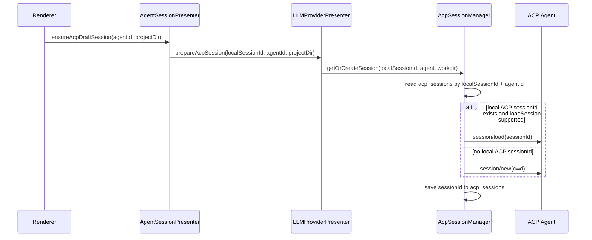
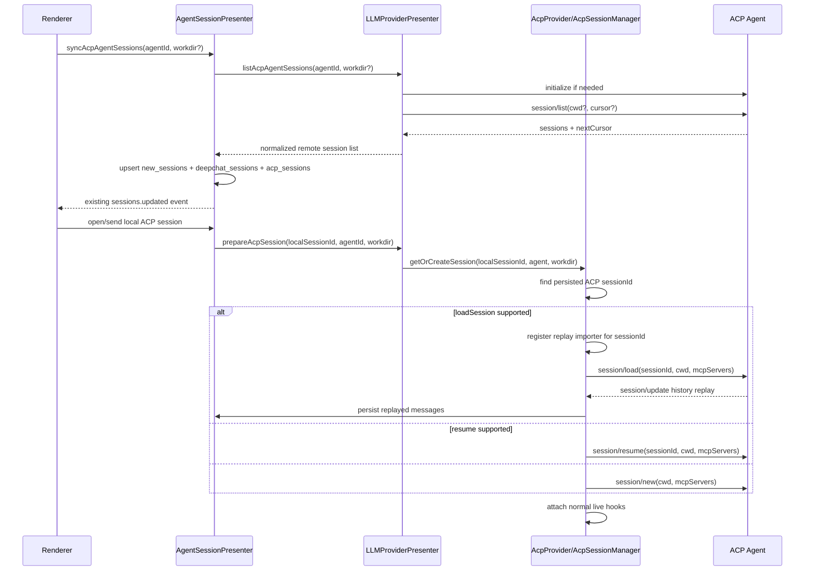

# ACP Session Sync Plan

## Design Summary

DeepChat should keep local session identity and ACP agent identity separate:

- Local identity: `new_sessions.id` / DeepChat conversation id.
- Remote identity: ACP `sessionId`.
- Stable bridge: `acp_sessions(conversation_id, agent_id, session_id, workdir, status, metadata)`.

The implementation should add a demand-driven sync path that imports ACP `session/list` metadata
into local sessions, then reuse the stored ACP `sessionId` when opening or sending messages.

## Current Flow



Missing pieces:

- No call to ACP `session/list`.
- No lookup by `(agentId, acpSessionId)` for idempotent import.
- `clearSession()` clears the persisted `sessionId`, so runtime cleanup can erase reuse state.
- `session/load` replay is not imported into DeepChat messages.
- `session_info_update` is ignored.

## Target Flow



## Architecture Decisions

### 1. Add ACP Session Capabilities

Extend `AcpProcessHandle` with parsed capability flags:

- `supportsLoadSession`
- `supportsListSessions`
- `supportsResumeSession`
- `supportsCloseSession`

`parseLoadSessionCapability` already exists. Add parsing for
`agentCapabilities.sessionCapabilities.list/resume/close`. Use SDK methods
`connection.listSessions(...)` and `connection.unstable_resumeSession(...)` only when advertised.

### 2. Keep Mapping Ownership Local

`AgentSessionPresenter` should own the local import/upsert flow because it already owns
`new_sessions`, session-list events, and `deepchat_sessions` state.

`AcpProvider` / `LLMProviderPresenter` should expose a read-only capability:

```ts
listAcpAgentSessions(input: {
  agentId: string
  workdir?: string | null
}): Promise<AcpRemoteSessionInfo[]>
```

It should:

- resolve aliases through `resolveAcpAgentAlias`,
- warm or start the ACP connection,
- verify `supportsListSessions`,
- call `connection.listSessions({ cwd, cursor })` until pagination completes,
- return normalized metadata without mutating local session tables.

### 3. Add Idempotent Import Helpers

Add persistence helpers for ACP session identity:

- `getAcpSessionByRemoteId(agentId, acpSessionId)`
- `upsertAcpSessionMapping(conversationId, agentId, acpSessionId, workdir, metadata?)`
- `releaseAcpRuntimeSession(conversationId, agentId)` that sets `status='idle'` without clearing
  `session_id`
- `deleteAcpSessionMapping(conversationId, agentId)` for local session deletion

Revisit `session_id TEXT UNIQUE`. Prefer a scoped uniqueness model:

- unique `(agent_id, session_id)` when `session_id` is not null,
- keep `(conversation_id, agent_id)` unique.

If changing the unique index is risky in the first pass, preserve the existing unique constraint
but still scope all lookups by agent id in code.

### 4. Sync Local Session Rows

`AgentSessionPresenter.syncAcpAgentSessions` should:

1. Validate ACP is enabled and the agent exists.
2. Call `llmProviderPresenter.listAcpAgentSessions`.
3. For each remote session:
   - normalize `cwd` into `projectDir`,
   - normalize title to remote title or `New Chat`,
   - parse `updatedAt` to milliseconds or use sync time,
   - find existing mapping by `(agentId, acpSessionId)`,
   - update existing local session metadata when found,
   - otherwise create a local `new_sessions` row with `isDraft=false`,
   - ensure `deepchat_sessions` has provider/model state for ACP,
   - upsert the `acp_sessions` mapping.
4. Emit one session-list update payload containing changed local ids.

Do not delete local rows just because a filtered `session/list` call omitted them.

### 5. Handle DeepChat-Only And Stale Remote Sessions

DeepChat can have an ACP local session whose agent-side `sessionId` is absent because another
client deleted agent history, the agent was reset, sync was filtered by `cwd`, auth failed, or the
agent's `session/list` is incomplete. Local history must remain durable.

Rules:

- `session/list` absence is observational, not destructive. Filtered list absence means
  "unknown"; unfiltered list absence can update mapping metadata to `remoteStatus: 'not_listed'`
  with a `checkedAt` timestamp, but must not clear `session_id`.
- `session/load` / `session/resume` rejection is stronger evidence. If the ACP error clearly
  means "session not found" or equivalent, mark the mapping `remoteStatus: 'missing'`, record
  `missingSessionId`, `missingAt`, and `lastLoadError` in metadata, and preserve all local
  messages.
- Do not immediately overwrite the mapping with a new ACP id on open. Create a new ACP session
  only when the user sends/continues, so simply browsing old local history does not mutate remote
  state.
- When `session/new` succeeds for a stale mapping, set `session_id` to the new ACP id and append
  the missing id to metadata such as `previousAcpSessionIds`.
- The new ACP session can only continue from DeepChat's local message context; agent-private
  state that existed only in the old remote session cannot be recovered. The UI should surface
  this as a quiet warning/status when practical.

### 6. Separate Runtime Release From Mapping Deletion

Replace current "clear means forget ACP id" behavior with two paths:

- Runtime release: remove listeners, cancel active prompt if needed, unbind process, set status to
  `idle`, preserve `session_id`.
- Mapping deletion: used when the local DeepChat session is deleted, removes the `acp_sessions`
  row.

App quit, provider refresh, workdir-change cleanup, and process shutdown should use runtime
release. Local session deletion should use mapping deletion.

### 7. Keep Delete Semantics Capability-Gated

Zed avoids full bidirectional delete sync. It treats runtime close, local archive, and remote
delete as different operations:

- `close_session` releases an active ACP runtime session and sends `CloseSessionRequest` only when
  the last local handle is gone. This is not history deletion.
- Imported external sessions can be archived locally, which changes Zed's sidebar visibility
  without requiring agent-side deletion.
- ACP remote delete is opt-in: the default session-list abstraction returns "delete_session not
  supported"; the ACP implementation only sends `DeleteSessionRequest` when the agent advertises
  delete capability and Zed's ACP beta flag is enabled.

DeepChat should follow the same separation:

- Do not expose "delete from agent" unless a future ACP capability parser confirms remote delete
  support. The first implementation can skip remote delete entirely.
- For synced remote-backed sessions, expose local-only removal/hiding. This should purge the
  locally copied chat artifacts but keep a minimal hidden conversation plus ACP mapping, so
  `(agentId, acpSessionId)` continues to act as a tombstone.
- The hidden marker can live in a new session visibility field, ACP mapping metadata, or a small
  dedicated tombstone table. The important invariant is that normal session-list queries exclude
  it, while sync import can still find the remote id and decide not to recreate it.
- During `session/list` import, skip remote sessions with an active local tombstone unless the user
  explicitly chooses to show hidden sessions or re-import them.
- If the user deletes a local ACP session whose remote session is already confirmed missing, no
  remote action is needed.
- If remote delete is added later, make it a separate, confirmed action. On success, remove the
  local session/mapping and clear any tombstone for that remote id.

Local purge should remove message rows, assistant blocks, search documents, offload files, runtime
caches, and permission/tool approval state for the hidden conversation. It should preserve only the
minimum metadata needed for visibility filtering, diagnostics, and re-import suppression.

This keeps sync simple: `session/list` discovers/imports visible remote sessions; local hiding is a
DeepChat preference backed by a durable remote-id tombstone; remote deletion only happens when the
agent can actually do it.

### 8. Reuse Existing Sessions With Load/Resume

`AcpSessionManager.initializeSession` should choose:

1. `session/load` if a persisted ACP id exists and `supportsLoadSession`.
2. `session/resume` if a persisted ACP id exists, load is not supported, and
   `supportsResumeSession`.
3. `session/new` otherwise.

For `session/load`, register a replay collector before issuing the RPC. Only attach normal live
hooks after the load completes. This avoids treating replayed history as the response to the next
prompt.

For `session/resume`, there is no history replay. Attach normal live hooks after the response is
ready.

### 9. Import Load Replay Into Messages

Add an `AcpSessionReplayImporter` focused on history import, separate from live stream mapping.
It should consume `session/update` notifications during `session/load` and persist them through
`DeepChatMessageStore` or equivalent helper methods that preserve:

- `deepchat_messages`,
- `deepchat_user_messages`,
- `deepchat_assistant_blocks`,
- search documents,
- usage stats where possible,
- tape facts where appropriate.

Message grouping rules:

- Prefer ACP `messageId` when present.
- Group contiguous `user_message_chunk` notifications into a user message.
- Group contiguous `agent_message_chunk`, `agent_thought_chunk`, `tool_call`, `tool_call_update`,
  and `plan` notifications into assistant blocks.
- Store provenance in message metadata: ACP session id, ACP message id when available, import
  source, and imported timestamp.
- Make replay idempotent. If message ids are present, use a dedicated mapping table or metadata
  lookup. If message ids are absent, avoid reimporting when the local session already has messages
  unless the user explicitly requests a rebuild.

The first implementation can import text, reasoning, plan, and tool status blocks. Richer assets
and usage attribution can be incremental as long as unsupported blocks degrade to readable text.

### 10. Handle Session Info Updates

Extend `AcpContentMapper` or add a parallel notification parser to surface:

```ts
{
  title?: string | null
  updatedAt?: string | null
  meta?: Record<string, unknown> | null
}
```

`AcpProvider.handleSessionUpdate` should forward this to a session metadata update port. The
update should:

- ignore invalid timestamps,
- ignore null or blank title values for the non-null local title field,
- refresh the session search document when title changes,
- emit `sessions.updated` / typed session-list events for renderer refresh.

### 11. Debug And Inspector Support

The ACP inspector should gain debug actions for:

- `listSessions`
- `resumeSession`

This is useful for manual validation and matches the existing `newSession` / `loadSession`
debug actions.

## Compatibility

- Agents without `session/list` continue to behave as today.
- Agents without `loadSession` but with `session/resume` can reconnect to known sessions but will
  not import old history.
- Agents without both load and resume keep using `session/new`.
- Existing `acp_sessions` rows remain valid.
- Existing local ACP sessions should not be duplicated during sync; aliases resolve before lookup.
- DeepChat-only ACP sessions remain visible and usable. If the agent no longer has the remote
  `sessionId`, DeepChat keeps local history and can rebind to a new ACP session on the next send.

## Test Strategy

- Unit test capability parsing for list/resume/close.
- Unit test ACP `session/list` pagination and unsupported capability behavior.
- Unit test idempotent import:
  - new remote session creates local rows,
  - repeat sync updates metadata only,
  - filtered missing remote session does not delete local rows.
- Unit test runtime release preserves `acp_sessions.session_id`.
- Unit test local-only removal of a remote-backed session writes a tombstone and prevents
  automatic re-import on the next sync.
- Unit test remote delete actions are hidden/disabled and never called when the ACP agent does not
  advertise delete support.
- Unit test `initializeSession` chooses load, resume, or new correctly.
- Unit test confirmed remote-missing errors mark mappings stale without deleting local messages.
- Unit test continuing a stale session creates a new ACP session and preserves the old id in
  metadata.
- Unit test replay importer with:
  - user + assistant text,
  - reasoning and plan blocks,
  - tool calls,
  - duplicate replay with ACP message ids.
- Unit test `session_info_update` updates title/time and emits session list update.
- Renderer/store test that session-list update refreshes synced ACP sessions.
- Manual validation with:
  - `acpx --agent "dim acp" sessions list --filter-cwd <repo>`,
  - opening a synced DimCode session in DeepChat,
  - sending a follow-up and confirming the same ACP `sessionId` is reused.

## Risks And Mitigations

- Duplicate local sessions: mitigate with `(agentId, acpSessionId)` lookup before create.
- Replay history shown as live response: mitigate with load-specific replay importer and delayed
  live hook attachment.
- Bad remote timestamps: parse strictly and fall back to sync time.
- Optional ACP message ids: use best-effort idempotency and avoid destructive rebuilds by default.
- Session list flood: keep sync scoped and demand-driven.
- Accidental remote deletion: do not delete agent history in this feature.
- Local delete surprise re-import: record local hide/tombstone entries for remote-backed sessions.
- Local history loss from stale remote state: never delete local sessions/messages based on
  `session/list` absence or `session/load` failure.
- Silent semantic drift after rebind: surface that a missing remote session was replaced by a new
  ACP session backed only by DeepChat's local context.
