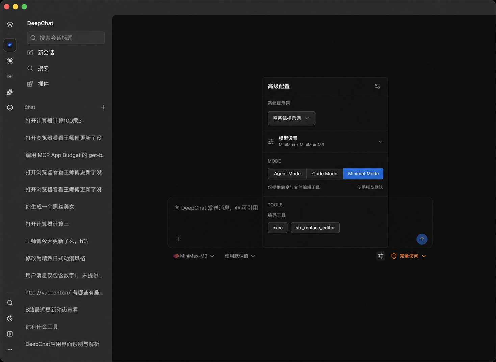

# 实验性工具模式

状态：已提案；调研与架构设计已完成；尚未开始实施。

## 最终决策

DeepChat 只增加一个会话级 **Tool Mode** 控件，并提供三个互斥模式：

```ts
type ToolMode = 'agent' | 'code' | 'minimal'
```

- **Agent Mode**：保持 DeepChat 当前 Agent 工具行为。
- **Code Mode**：保留 Agent Mode 的能力目录，但模型只通过代码入口调用这些能力。
- **Minimal Mode**：只提供命令工具和一个编辑工具。

UI 不再提供 Tool set、Calling mode、Protocol、Transport、Runtime 或 Provider presentation
等组合项。它们是实现细节，不是用户配置。

Tool Mode 放在输入框现有「高级配置」面板中，位于「模型设置」与 `TOOLS` 之间。用户点击模式
后，下方工具区域立即投影为该模式实际使用的工具。输入框 footer 不增加常驻 chip，也不新增
独立设置页或 Agent 模型覆盖表。

当前 `useChatMode()` 中的 `agent | acp agent` 选择负责切换 DeepChat Agent 与 ACP Agent
后端，不属于本功能。新 `ToolMode` 只在 DeepChat Agent 上生效，不能扩展或复用现有
`ChatMode` 类型；ACP Agent 的工具协议仍由对应 ACP runtime 管理。

## 目标

1. 给用户一个能直接理解、能记忆的三选一模式控件。
2. 严格保持 Codex、DeepSeek harness 的模型可见名称、描述、输入和结果协议。
3. GPT-5.6 系列和明确登记的 DeepSeek 工具模型在没有用户覆盖时进入 Code Mode；其他模型
   保持 Agent Mode。
4. Minimal Mode 真正只暴露两项编码能力，不夹带 MCP、skills、plan、question 或其他 Agent
   工具。
5. Code Mode 使用一个内部 `run_code` 通道，并用 `utilityProcess.fork()` 隔离每个 code cell
   的生命周期。
6. 命令工具在所有模式下都保持名称 `exec`；所选 Shell 只进入工具描述、系统环境提示和执行
   参数。

## 非目标

- 不提供 Tool set 与 Calling mode 两个维度。
- 不提供 `Auto` 作为第四个用户可选模式。
- 不提供 `transport`、`protocol` 或 Provider adapter 的用户配置。
- 不增加输入框 footer 模式 chip。
- 不增加 Agent 设置中的默认值和逐模型覆盖编辑器。
- 不让 Minimal Mode 保留 MCP 或其他 Agent 工具。
- 不把 `node:vm` 或 UtilityProcess 描述为抵御恶意代码的安全沙箱。
- 不新建第二套工具 registry、Shell handler、persistent PTY 或通用插件 runtime。

## 调研依据与固定版本

本设计按上游真实行为实现，不能只复用相似名称。

| 来源 | 固定版本 | 约束 |
| --- | --- | --- |
| OpenAI Codex | [`cbe85e117b1db59cdbe8175c59793c3cf2a4a7b8`](https://github.com/openai/codex/tree/cbe85e117b1db59cdbe8175c59793c3cf2a4a7b8) | GPT-5.6 Sol、Terra、Luna 使用 Code Mode；顶层是 `exec`/`wait`；嵌套工具位于 JavaScript `tools` 对象；`apply_patch` 是 freeform V4A 工具。 |
| Codex Code Mode 协议 | 同上 | `description.rs` 定义 raw JavaScript、helpers、工具名称规范化和每次全新的 V8 环境。生产描述必须从固定源码复制。 |
| DeepSeek harness | `47f943859bef60e4160492346772ded9b24f765a` | `code` presentation 只向模型发送 `run_code` 和生成 SDK，但内部目录保持完整；`minimal` preset 是独立的双工具 Agent，只包含持久 `bash` 与 `str_replace_editor`。 |
| Electron UtilityProcess | 本仓库 Electron `41.10.4` | `utilityProcess.fork()` 提供 Chromium 管理的 Node 子进程、MessagePort IPC、生命周期事件与显式 `kill()`。 |
| DeepChat 高级配置 | 当前仓库 | `McpIndicator.vue` 已拥有高级配置 Popover、Agent 工具分组与 disabled-tool 持久化；`ChatStatusBar.vue` 提供生成参数和权限控件。 |
| DeepChat 工具执行 | 当前仓库 | `AgentToolManager`、`ToolService`、LoopRun dispatch、permission、`ToolOutputGuard` 和 journal 是唯一执行路径。 |
| DeepChat Shell | 当前仓库 | `commandShell.ts`、`CommandShellService`、`AgentBashHandler` 和 `CommandShellSettingsSection.vue` 已提供 per-turn Shell 快照及 Windows Shell 基础能力。 |

DeepSeek harness 的 `code` preset 与 `minimal` preset 是两个不同 Agent 组合，这正是三个互斥
模式的依据：Code Mode 改变工具呈现，Minimal Mode 改变能力目录。DeepChat 在 UI 上把它们
提升为与 Agent Mode 同级的会话模式，但不会把两者组合成第四种状态。

## 三种模式的规范语义

| 模式 | 执行目录 | 模型可见入口 | 高级配置中的工具区域 |
| --- | --- | --- | --- |
| Agent Mode | 当前已启用的 Agent、MCP 与插件工具 | 当前原生 function tools | 保持现有分组、开关和工具按钮 |
| Code Mode | 与 Agent Mode 相同的已启用目录 | Codex `exec`/`wait` 或 function-tool `run_code` | 显示代码入口，并把现有分组标记为「Code 可调用工具」 |
| Minimal Mode | 仅 `exec` 与一个兼容编辑工具 | 两个 direct tools | 只显示两个固定工具；隐藏其他分组和 MCP 列表 |

### Agent Mode

Agent Mode 是兼容基线：

- 工具目录、disabled-tool 行为、Provider function-tool mapping、权限、回放和 UI 保持现状；
- 命令工具仍名为 `exec`；
- 本功能唯一允许的可见差异是 `exec` 描述增加本次实际 Shell 信息。

### Code Mode

Code Mode 不裁剪能力目录。它把 Agent Mode 中当前启用的工具生成成 JavaScript/TypeScript
SDK，使模型能在一个 code cell 中编排多次调用：

- 对 Codex-compatible GPT-5.6 路由，顶层严格暴露 Codex `exec` 与 `wait`，输入为 raw
  JavaScript module；
- 对 DeepSeek 和普通 function-tool 路由，顶层严格暴露 harness `run_code`，参数为
  `{ code: string, description: string }`；
- 两种 Provider frontend 都归一化到同一个内部 `run_code` request、runtime 和结果通道；
- code cell 内的命令方法始终为 `tools.exec(...)`；
- SDK 中只包含当前启用且通过名称冲突校验的工具；disabled tools 不进入声明，也不可通过
  opaque binding 调用；
- 每个嵌套调用仍经过原有 permission、dispatch、取消、输出防护、journal 与 128 次调用
  预算，UtilityProcess 不能直接调用 handler。

Codex 顶层 `exec` 表示「执行 JavaScript code cell」，`tools.exec` 表示「执行 Shell 命令」。
它们位于不同命名空间，内部类型必须分别命名，不能只用字符串判断身份。

### Minimal Mode

Minimal Mode 是严格双工具模式。启用后：

- 不暴露 MCP、插件、skills、question、plan、memory、browser、image、cron、delegation 或
  DeepChat settings 工具；
- 不保留 Agent Mode 的工具分组开关；
- 只保留命令和文件编辑两项能力；
- 模式切走后，原有 disabled-tool 配置仍保留，返回 Agent/Code Mode 时恢复，不做迁移。

编辑工具按当前 Provider 契约选择，不能混用名称或描述：

| Provider 契约 | Minimal Mode 工具 |
| --- | --- |
| Codex-compatible | `exec`、freeform `apply_patch` |
| DeepSeek harness / 普通 function-tool | `exec`、`str_replace_editor` |

`apply_patch` 使用固定版本 Codex V4A 语法和精确描述；`str_replace_editor` 保留 harness 的
`view | create | str_replace | insert` schema、绝对路径要求和唯一 literal match 语义。
两者可以复用 DeepChat 现有的 workspace canonicalization、symlink protection 和权限
primitive，但外部契约不得改写。

Minimal Mode 不自动进入 Code Mode。Code Mode 也不会自动把目录裁剪成双工具。

## 模式解析与记忆

用户界面始终只显示三种最终模式。模型自动选择通过 nullable override 实现，不增加
`Auto` 选项：

```ts
type ToolMode = 'agent' | 'code' | 'minimal'
type ToolModeOverride = ToolMode | null

type ResolvedToolMode = {
  mode: ToolMode
  source: 'session' | 'model-catalog' | 'fallback'
}
```

解析优先级只有三层：

1. 当前会话的非空 `toolModeOverride`；
2. 精确模型目录中的 `defaultToolMode: 'code'`；
3. 回退到 `agent`。

模型目录建议：

- 精确登记的 GPT-5.6 Sol、Terra、Luna 等 GPT-5.6 Codex-compatible 路由建议 `code`；
- 精确登记且支持工具调用的 DeepSeek 模型建议 `code`；
- 其他模型不写建议，回退为 Agent Mode；
- Minimal Mode 首期只由用户明确选择，不根据模型名自动推断。

禁止用模型显示名、子串、正则、endpoint URL 或 OpenAI-compatible 标志推断。聚合 Provider
与自定义 Provider 必须通过现有 `ResolvedCapabilityIdentity` 精确解析；身份缺失或歧义时
回退 Agent Mode。

用户点击任一模式后，该值成为会话 override，并像权限模式一样写入 session。重启应用、
重新打开会话或切换模型时仍保持。面板提供低强调的「使用模型默认」操作，用于把 override
清回 `null`；它不是第四个模式。

首次消息前，draft store 保存 nullable override，并在创建会话时复制。新建对话默认是
`null`，因此按所选模型解析，不继承上一段无关会话的显式模式。

## 持久化

`new_sessions` 只增加一个 nullable 字段：

```sql
tool_mode_override TEXT NULL
  CHECK (tool_mode_override IS NULL OR tool_mode_override IN ('agent', 'code', 'minimal'))
```

不增加第二列、settings table 或 Agent `config_json` 字段。Session create/read/update、draft
提升、导入导出和运行状态都携带该值。更新 route 接受 `ToolMode | null`，在一次事务中保存并
返回最新的 `ResolvedToolMode`。

已开始的 LoopRun 持有不可变 mode snapshot。运行中切换控件禁用；本次回复结束后才允许更新，
因此不需要中途迁移 Provider schema、code cell 或工具目录。

## 工具目录与 Provider 展示

现有 `MCPToolDefinition[]` 同时承担可执行定义与 Provider function schema。Code Mode 需要
freeform wrapper 和只供 SDK 调用的目录，因此只在 Provider 边界拆分这两个职责，不新增
registry：

```ts
type ExecutableToolBinding = {
  id: string
  name: string
  definition: MCPToolDefinition
}

type ProviderToolSpec =
  | { type: 'function'; definition: MCPToolDefinition }
  | { type: 'freeform'; name: string; description: string }

type ResolvedToolModePlan = {
  mode: ToolMode
  source: 'session' | 'model-catalog' | 'fallback'
  commandShell: ResolvedCommandShell
  executionCatalog: readonly ExecutableToolBinding[]
  providerPresentation: readonly ProviderToolSpec[]
}
```

```text
session override + model capability + enabled tools + resolved shell
                              |
                              v
                   resolveToolModePlan()
                     /               \
                    v                 v
           executionCatalog     providerPresentation
                    |                 |
                    +------ dispatch -+
                              |
            permission -> handler -> output guard -> journal
```

`resolveToolModePlan()` 在 Provider I/O 前运行一次，结果冻结在 LoopRun：

- Agent Mode：Provider presentation 直接从当前执行目录生成；
- Code Mode：执行目录保持完整，Provider presentation 只包含相应 code wrapper；
- Minimal Mode：先建立严格双工具目录，再生成 direct presentation；
- 所有模式都使用同一个 `ResolvedCommandShell` 生成 `exec` 描述、系统提示与执行参数；
- SDK 方法通过 opaque binding ID 回到执行目录，不能接受模型提供的内部 ID；
- 规范化后的工具名冲突在 Provider 请求前失败。

## `run_code` 统一契约

DeepChat 内部只有一个 `run_code` runtime。Provider 差异只存在于入口 adapter：

### Codex frontend

- 顶层工具名、描述和 raw-input 语义严格复制固定版本的 `exec`；
- `wait` 只恢复仍处于 yielded 状态的同一 cell；
- source 是异步 JavaScript module，不是 JSON 或 `{ code: string }`；
- 全局只暴露固定的 `tools`、`text`、`image`、`audio`、`generatedImage`、`store`、`load`、
  `notify`、timers、`ALL_TOOLS` 和 `yield_control`；
- 不暴露 Node.js、Electron、文件系统、网络、子进程、import 或 console。

### Function-tool frontend

- 顶层工具固定为 `run_code`；
- 参数固定为 `{ code: string, description: string }`；
- source 使用 harness 的 erasable TypeScript async-function-body 语义；
- 生成 `ToolArgsMap`、`ToolOutputMap` 与 typed methods；
- 结果 envelope、错误和 console/return 规则严格复制固定 harness 契约。

工具名、schema、描述、SDK 声明布局和结果 envelope 都是模型适配契约，必须用带源码 commit
的 fixture test 锁定，不能为了统一 UI 而重新命名。

## UtilityProcess 运行时

Code Mode 首期使用 `utilityProcess.fork()`，每个外层 code cell 一个子进程，不使用进程池、
常驻 daemon 或 Rust helper。

### 信任边界

- 模型代码绝不在 renderer 或 Electron main context 执行；
- utility host 使用 `node:vm` 创建全新 context，但文档和 UI 不称其为安全沙箱；
- host 只接收版本化、带 cell ID 的结构化 IPC；
- 嵌套工具只能把请求发回主进程，主进程重新执行正常权限与 dispatch；
- Code Mode 首期要求 `full_access`。权限不是子进程沙箱能力，而是避免用户误以为普通审批
  模式能约束任意组合程序；
- spawn 使用环境变量 allowlist、`stdio: 'ignore'`、禁止 unsigned library、inspector、
  worker、subprocess、native addon、WASI，并设置 V8 old-space 上限；实际可用 flag 必须以
  Electron `41.10.4` canary 为准，缺失时 fail closed。

### 生命周期

```text
starting -> ready -> running <-> yielded -> stopping -> exited
                         \-> failed -----/
                         \-> cancelled --/
```

- fork 后必须在 5 秒内收到带协议版本的 `READY`；`spawn` 事件不等于 ready；
- 每个 LoopRun 最多一个活跃外层 cell，串行 cell 复用同一 manager 但使用新进程；
- runnable heartbeat 每秒一次，连续丢失三次即终止；等待嵌套工具时明确进入
  `external-wait`，但 heartbeat 仍用于检测 V8 阻塞；
- 同步 VM slice 上限 2 秒；yield lease 为 60 秒，有效 `wait` 可续期；
- source 上限 256 KiB，组合输出上限 1 MiB，并发嵌套调用上限 8；
- V8 old space 初始限制 64 MiB；父进程只在 cell 活跃时采样 RSS，soft ceiling 为
  `max(256 MiB, startup RSS + 128 MiB)`，hard ceiling 为 512 MiB；
- 成功、异常、取消、超时、崩溃、权限变化、会话关闭或应用退出都进入同一个幂等
  `finally`：abort 嵌套调用，清 timer/listener/port/pending map/active map，发送 `STOP`，
  最多等待 500 ms，随后 `kill()` 并等待 `exit`；
- 失败 cell 永不自动重放，避免重复 Shell、文件、浏览器或 MCP 副作用；
- active map 为空时不得保留 heartbeat 或 RSS interval。

`RunCodeRuntimeManager.shutdown()` 必须在 MCP、plugin、tool、background execution、Provider
和数据库 owner 销毁前完成，因为活跃 cell 仍可能引用这些执行端口。

Codex `store`/`load` 的跨 cell 状态由主进程按 session 持有内存 snapshot，只在自然 Result
事件提交 write set。取消、终止、启动失败或 kill 不提交。状态不写数据库或 Provider
transcript，并在会话关闭或应用退出时清除。

## `exec` 与命令 Shell

命令工具在 Agent 开关、Provider schema、Code SDK、权限、handler、journal 和回放中始终名为
`exec`。Shell 选择不投影成 `bash`、`zsh`、`powershell` 等工具名。

每次 LoopRun 先调用 `CommandShellService.resolveForTurn()`，再从同一个不可变
`ResolvedCommandShell` 生成：

1. `exec` 基础描述后的 Shell 事实；
2. 系统环境提示；
3. `AgentBashHandler` 的 executable 与 args。

共享 formatter 至少包含 display name、dialect、path style、cwd 语义和 executable
basename。完整 executable path 只在本地设置 UI 展示，不进入 Provider transcript 或
telemetry。

Shell 选择扩展为：

- macOS/Linux：Auto、Bash、Zsh、Fish；Auto 沿用已验证登录 Shell；
- Windows：Auto、Windows PowerShell、PowerShell 7、Command Prompt、Git Bash、WSL；
- Windows Auto 保持当前保守选择，不自动切到 Git Bash 或 WSL；
- 显式选择不可用项时 fail closed，不静默回退。

WSL 首期只使用默认 distribution，不增加 distribution selector。被动探测只运行
`wsl.exe --list --quiet`，不启动 VM；用户显式选择后才验证默认 distribution、内部 Shell
和 workspace cwd。不能解析本地化的 `--status` 文本，也不能手写 `C:\...` 到 `/mnt/...`
转换。取消时只终止 nonce 绑定的 Linux process group 与对应 host process，禁止
`wsl.exe --terminate` 影响用户其他任务。

Shell 配置继续由现有通用设置 owner 管理，不放进 Tool Mode 面板。模式面板只展示 `exec`
名称；需要查看或更改 Shell 时仍进入「通用设置 / Agent 命令 Shell」。

## 高级配置交互

### 单一目标布局

```text
+-------------------------------------------+
| 高级配置                              ⚙   |
+-------------------------------------------+
| 系统提示词                                |
| [空系统提示词                         v]  |
+-------------------------------------------+
| 模型设置                                  |
| MiniMax / MiniMax-M3                  v   |
+-------------------------------------------+
| MODE                                      |
| [ Agent Mode ][ Code Mode ][Minimal Mode] |
|                              ^ selected   |
| 只提供命令与文件编辑工具                  |
|                         使用模型默认      |
+-------------------------------------------+
| TOOLS                                     |
| 编码工具                                  |
| [ exec ] [ apply_patch ]                   |
+-------------------------------------------+
```

交互规则：

- 使用现有高级配置入口和 Popover，不增加 footer 控件；
- MODE 使用三项单选语义，不使用三个可同时打开的 switch；
- 点击后先更新本地 projection，再持久化；失败时回滚并显示现有风格的行内错误；
- Agent Mode 显示当前现有工具分组和开关；
- Code Mode 显示实际 Provider code 入口，并把当前 enabled tools 列在「Code 可调用工具」下；
  这些开关继续写入原有 disabled-tool 配置；
- Minimal Mode 只显示两个固定工具，不显示 MCP、插件或其他分组；
- Code/Minimal Mode 不兼容时保留模式值并阻止发送，不静默切回 Agent Mode；
- 活跃回复、权限弹窗或 code cell 存在时禁用三项选择，并显示「本次回复结束后可切换」；
- 「使用模型默认」只清除 override，不成为第四个选项；
- 技术性的 `run_code`、UtilityProcess、Provider frontend 与 Shell executable 不在常规面板中
  展示，错误详情需要时再按具体失败原因出现。

### 工具区域投影

| 当前模式 | 用户看到的变化 |
| --- | --- |
| Agent Mode | 原有文件系统、核心工具、技能工具、MCP 与插件分组 |
| Code Mode | code 入口 +「Code 可调用工具」分组；工具开关控制生成 SDK |
| Minimal Mode | 仅 `exec` 与当前 Provider 对应的编辑工具 |

### 视觉参考




视觉稿只约束信息层级和交互位置。实现继续使用 DeepChat 现有 component、spacing、typography、
color token、focus behavior 和平台 material。

## 失败状态

| 失败 | 行为 |
| --- | --- |
| Code Mode 的 Provider frontend 不可用 | Code Mode 选项显示原因；若已保存则阻止发送，不降级 |
| UtilityProcess probe 或协议版本失败 | 阻止 Code Mode 发送，提供重试/重启动作 |
| 权限不是 `full_access` | 保留 Code Mode；阻止发送并定位到权限选择器 |
| code cell 超时、崩溃或内存超限 | 外层调用失败并完成清理；不自动重放 |
| Minimal 编辑工具契约不可用 | Minimal Mode 不可发送；列出缺失工具名 |
| 工具名规范化冲突 | 在 Provider I/O 前阻止 Code Mode，并列出冲突来源 |
| 模型身份未知或歧义 | 无 override 时解析为 Agent Mode |
| 显式 Shell 不可用 | 阻止下一次含 `exec` 的回复，并链接命令 Shell 设置 |
| WSL probe 或 scoped cleanup canary 失败 | WSL 标为不可用，不回退或终止整个 distribution |

## 无障碍与本地化

- MODE 使用带组名的 radio 语义，支持 Tab 与方向键；
- 当前模式、模型默认来源、不可用原因和工具变化不能只依赖颜色表达；
- 选择后焦点留在对应模式，关闭 Popover 后回到高级配置按钮；
- 工具开关保留现有 accessible label 与 pending 状态；
- 所有用户可见文案使用 `vue-i18n`；`Agent Mode`、`Code Mode`、`Minimal Mode` 可本地化，
  `exec`、`run_code`、`apply_patch`、`str_replace_editor` 不翻译。

## 验收标准

1. 高级配置只有 Agent Mode、Code Mode、Minimal Mode 三项互斥选择，没有 Tool set、Calling、
   Auto、Protocol、Transport 或 Runtime 用户配置。
2. 当前 `ChatMode = agent | acp agent` 保持不变；ACP Agent 不读取 ToolMode。
3. 无 session override 时，精确目录识别的 GPT-5.6 与支持工具的 DeepSeek 模型解析为 Code
   Mode，其他模型解析为 Agent Mode；不使用模型名子串。
4. 用户选择写入单个 nullable session 字段，重启后保持；「使用模型默认」清回 `null`。
5. Agent Mode 除 `exec` Shell 描述外保持当前 Provider request、prompt、工具、权限与回放行为。
6. Code Mode 保留当前 enabled execution catalog，但 Provider 只看到精确 Codex
   `exec`/`wait` 或 harness `run_code`；两者进入唯一内部 `run_code` 通道。
7. Minimal Mode 的模型可见和可执行目录都严格只有 `exec` 与一个兼容编辑工具，MCP 与其他
   Agent 工具不可通过名称或内部 binding 绕过。
8. 高级配置的工具区域在模式切换后立即同步，切回 Agent/Code Mode 时恢复已有 disabled-tool
   选择。
9. `exec` 在三种模式和生成 SDK 中保持名称稳定；Shell 事实、系统提示和执行参数来自同一次
   `ResolvedCommandShell` 快照。
10. `apply_patch`、`str_replace_editor`、Code wrapper 描述、schema、SDK 和结果 envelope 与固定
    上游 fixture 一致。
11. 每个嵌套调用复用 permission、dispatch、取消、output guard、journal 与 128 次预算。
12. 每个 code cell 使用独立 UtilityProcess；所有终态后 process、listener、timer、port、
    pending request 和 active registry 均归零，应用退出不残留进程。
13. macOS/Linux Shell 至少支持 Auto、Bash、Zsh、Fish；Windows 至少支持 Auto、Windows
    PowerShell、PowerShell 7、Command Prompt、Git Bash、WSL，并满足 fail-closed 与 scoped
    cleanup 约束。
