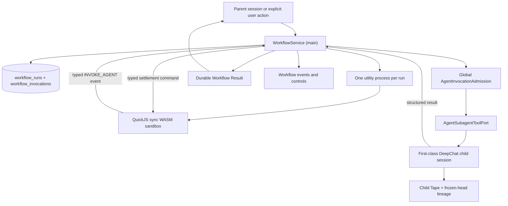

# Workflow Runtime Specification

## Status

Active. The architecture has been reviewed against the current DeepChat agent, Tape, session,
permission, utility-process, and database paths. Implementation is in progress on
`feat/workflow-runtime`.

Last reviewed: 2026-08-04.

The user-facing session policy, live-delegation relationship, and composer behavior are now owned
by `docs/architecture/proactive-multi-agent-orchestration/`. That architecture supersedes the
historical mutually exclusive `adaptive | workflow` mode without replacing this runtime's durable
execution, approval, replay, recovery, or saved-asset contracts.

## Background

DeepChat already has first-class child sessions, child-to-parent Tape lineage, permission and
question lifting, typed route/event contracts, utility-process examples, and durable SQLite
migrations. It does not yet have a durable programmable runtime that can coordinate many child
agents, pass structured results between them, enforce bounded shared admission, and resume
orchestration after an application restart.

The target feature combines:

- Claude Code's JavaScript workflow surface and agent-oriented data flow;
- Codex's bounded multi-agent scheduling and recoverable agent identity;
- DeepChat's first-class sessions, permission model, provider diversity, and Tape evidence.

The workflow script is pure orchestration. It has no filesystem, network, shell, Electron, Node.js,
or database access. All external effects happen through child agents and therefore remain inside
DeepChat's existing session, tool, and permission boundaries.

## Reviewed Corrections To The Initial Proposal

The implementation deliberately changes the following details from the initial research proposal
and the first implementation pass.

### Use synchronous QuickJS with deferred promises

The runtime uses `quickjs-emscripten-core` with
`@jitl/quickjs-wasmfile-release-sync`. It does not use an Asyncify build. An Asyncify module can
suspend for only one asynchronous call at a time, which is incompatible with concurrent
`Promise.all` agent calls.

Every host settlement of a guest promise must schedule a serialized
`executePendingJobs()` drain. Settling a deferred promise without scheduling that drain is a
runtime invariant violation because the guest can deadlock.

### Use a stable logical call path, not hash occurrence, as replay identity

`(input_hash, occurrence_index)` is not a safe universal replay identity. Two identical calls in
different concurrent branches can be initiated in different orders after a restart. Matching by
occurrence can then attach a cached child result to the wrong logical branch.

Every invocation therefore has a stable `callPath`:

- raw `agent()` calls require an explicit non-empty `key`;
- `parallel()` prefixes each child key with its own stable key;
- `pipeline()` prefixes each invocation with the pipeline key, stable item key, stage key, and
  per-stage local key.

`callPath + inputHash` determines whether a terminal result is reusable. `seq` remains a monotonic
audit and UI order; it is not replay identity. A `callPath` may be emitted only once per execution
epoch; duplicates fail before a child session is created.

### Use write-ahead effect evidence plus Tape, not Tape alone

Current Tape tool facts are derived only from completed `success` or `error` tool blocks and are
appended after a model round is persisted. Their presence proves an observed call, but their
absence does not prove that no external effect happened before a crash.

Before a workflow child executes any tool, the shared DeepChat tool invocation path must
monotonically persist the invocation's effect classification:

- trusted read-only tool metadata records `read`;
- a write tool records `write`;
- missing, heuristic-only, or untrusted metadata records `unknown`;
- a failure to persist this write-ahead state prevents tool execution.

Detailed completed tool facts remain in the child Tape. Recovery uses the write-ahead aggregate as
the safety gate and Tape as supporting evidence. `write` and `unknown` interrupted invocations are
never retried without an explicit user action.

### Persist the exact executed source snapshot

A named workflow file is an editable authoring source, not a durable execution record. A file can
be changed, deleted, or checked out to another revision between application launches.

`workflow_runs` therefore stores the exact bounded script source and its hash for each run. Saved
workflow files remain user-readable and shareable, but resume always replays the immutable source
snapshot that started the run.

### Adopt DimAgent's projections, not its trust boundary

The locally installed DimAgent workflow implementation validates three useful product concepts:

- derive a bounded static outline from source before launch;
- combine that outline with live runtime progress instead of showing only an opaque spinner;
- expose saved workflows as explicit user-owned capabilities with an activity surface.

DeepChat adopts those concepts without copying DimAgent's `vm`/`worker_threads` execution model,
trusted module imports, or a second mutable runtime graph. QuickJS in a dedicated utility process
remains the execution boundary. The static outline is an advisory source-derived projection, while
the dynamic graph is derived from the durable invocation journal and typed progress events.

The outline contains at most 256 source-ordered `phase`, `agent`, `parallel`, `pipeline`, and
`mapLimit` nodes. It exposes only bounded literal keys, labels, and static group dimensions; it
never includes prompts, input, source snippets, or results. `exact` means every reference to a
root workflow helper is directly visible to the supported static scanner and its structural
metadata is literal. Aliases, scoped callback APIs such as `api.agent`, computed access, dynamic
keys, and truncation produce `partial`. Confidence describes source-skeleton coverage, not whether
a conditional or loop will execute at runtime. Approval and detail routes independently derive the
same outline from the immutable source; runs do not persist a second graph.

### Correct the post-implementation audit

The first implementation review incorrectly recorded that no critical or high findings remained.
A later cross-module audit found material issues in guest intrinsic hardening, default deadlines,
startup recovery, child-session crash-window correlation, shared-admission compatibility, model
tool exposure, retry confirmation, and renderer refresh/draft behavior. Those findings reopen the
feature before merge and are tracked in `tasks.md`.

## Goals

1. Execute a bounded JavaScript workflow in a QuickJS WASM sandbox hosted by one Electron utility
   process per run.
2. Expose `agent()`, `parallel()`, `pipeline()`, `mapLimit()`, `phase()`, and `log()` without
   exposing ambient host capabilities.
3. Create child work through the existing `AgentSubagentToolPort` and session assignment policy.
4. Support provider-independent structured child output for the DeepChat loop backend.
5. Persist runs and invocations so completed work can be replayed and interrupted work can be
   recovered after utility-process or application failure.
6. Apply one cancellation-aware global child-agent admission gate to workflows and the existing
   subagent orchestrator.
7. Preserve child sessions as first-class sessions that users can inspect and continue after a run.
8. Deliver a durable result to the parent session without automatically starting another model
   turn.
9. Make cancellation, timeout, provider failure, process exit, and recovery explicit and
   diagnosable.
10. Show an advisory static outline before launch and incrementally project durable invocation
    changes without repeatedly transferring the complete run detail.

## Non-goals

- V1 does not provide exactly-once semantics for filesystem, shell, MCP, remote, or other external
  effects.
- V1 does not run direct `kind=acp` children. `kind=deepchat + providerId=acp` remains eligible
  because it runs through `DeepChatLoopEngine`.
- V1 does not migrate the existing `subagent_orchestrator` run map into workflow persistence.
- V1 does not retire the existing orchestrator. The two features share infrastructure and have
  distinct product roles.
- V1 does not expose Node.js modules, Electron APIs, filesystem APIs, networking, shell, native
  timers, `SharedArrayBuffer`, or dynamic host imports to guest code.
- V1 does not trigger workflows from cron, remote delivery, child output, imported messages, or
  untrusted model content.
- V1 does not implement automatic Git worktree isolation for parallel writers.
- V1 does not promise bit-for-bit deterministic child model output. Deterministic replay means that
  already committed terminal invocation results are reused only for the same logical call and
  input.
- V1 does not promise that arbitrary user-written promise scheduling produces the same control
  path after a partial failure. The supported helpers return results in declared key order and
  stable call paths prevent unsafe cache binding even when completion timing changes.

## User Stories

- As a user, I can explicitly launch a workflow that coordinates multiple agents and inspect its
  phases, child sessions, token use, duration, and terminal result.
- As a user, I can cancel a run and know that queued admission requests, guest execution, and active
  child sessions converge to a terminal state.
- As a user, I can reopen DeepChat after a crash, see an interrupted workflow, and safely resume
  completed/read-only work or explicitly approve retrying uncertain writes.
- As a workflow author, I can use ordinary bounded JavaScript control flow and structured agent
  results instead of learning a DeepChat-specific graph language.
- As a workflow author, I can preview the statically visible workflow skeleton and use a bounded
  concurrency helper without hand-writing an unsafe promise pool.
- As a reviewer, I can trace every invocation from a stable logical path to its child session,
  structured result, effect-risk state, and Tape lineage.
- As a parent-session user, I receive a visible workflow result without an unexpected autonomous
  model turn and can explicitly ask the parent agent to synthesize it.

## Architecture

The utility process owns only guest evaluation and guest promise state. Electron main owns durable
state, admission, session creation, child execution, permissions, effect evidence, and all
user-visible events.

## Runtime API

### Versioning

Every run records `runtimeApiVersion`. Utility-process commands and events carry
`protocolVersion`. Persisted domain events and renderer projections have explicit schema versions
and adapters. A Zod schema is the source of truth for each current wire boundary; the raw
main/utility union is not treated as an eternal database schema.

Resume fails closed with an actionable compatibility error when the stored runtime API cannot be
executed by the current application. A future migration may translate old source or records, but
V1 never silently reinterprets them.

### `agent(prompt, options)`

`agent()` returns a controlled awaitable thenable and accepts:

- `key`: required stable key within its current scope;
- `label`: optional bounded display label;
- `phase`: optional phase key;
- `agentId`: optional target DeepChat agent, restricted to the launch allowlist;
- `schema`: optional bounded JSON Schema for structured output;
- `timeoutMs`: optional host-enforced invocation deadline;
- `maxOutputBytes`: optional result cap no larger than the host maximum.

If `schema` is absent, the result uses the default `{ text: string }` envelope. A supplied schema is
validated before a child is created and may not use remote references, executable formats, or
unbounded recursive structures.

The launch request declares `allowedAgentIds`; omission allows only the parent agent. This is a
runtime capability boundary, not merely approval-card text. Dynamic script input cannot select an
agent outside the declared set.

For ordinary DeepChat providers, the host injects an invocation-scoped structured-output tool. The tool
validates its arguments against the requested schema. ACP-as-LLM subagent sessions remain
DeepChat-owned sessions, but the current compatibility adapter deliberately exposes no DeepChat
local tools and `AcpProvider` does not forward local tool definitions. Those children therefore use
an explicit exact-JSON terminal-response contract instead of pretending tool injection is
available. Both paths receive bounded correction feedback in the same child session up to the
configured attempt limit. Free text, prose-wrapped JSON, and fenced JSON are not silently coerced
into structured data.

The temporary tool is scoped to the workflow invocation turn and is removed on success, failure,
timeout, cancellation, or recovery. Continuing the child session after the workflow uses its
ordinary tool catalog and does not require another structured result.

### `parallel(key, tasks)`

`parallel()` starts keyed thunks without a barrier between task starts, waits for all of them, and
returns results in declared task order. Each task must have a unique stable key. Rejection follows
`Promise.all` semantics and does not implicitly cancel siblings; explicit workflow cancellation
does.

### `pipeline(key, items, stages)`

`pipeline()` processes each item through its stages without a cross-item stage barrier. Input items
must have a stable key; array index is allowed only when the persisted input array itself is the
authoritative stable order. Stages require stable keys.

An item's next stage can begin as soon as that item's prior stage finishes. The invocation
`callPath` is derived from pipeline key, item key, stage key, and the local agent key, so completion
order cannot change replay identity.

### `mapLimit(key, items, limit, mapper)`

`mapLimit()` processes keyed items with at most `limit` mapper calls active in the guest at once
and returns results in declared item order. It exists to express large fan-out without allocating
one deferred promise for every item at the same instant.

Every item must have a stable key. The helper prefixes nested invocation call paths with the
`mapLimit` key and item key. The host validates `limit` against the run's pending-invocation cap;
the helper does not raise the process-wide child admission limit.

### `phase(key, options)` and `log(value)`

`phase()` updates a bounded idempotent progress projection. `log()` emits bounded structured
diagnostics. Neither API writes directly to the parent conversation. Excess log volume is
truncated with an explicit marker rather than allowed to consume unbounded memory or IPC traffic.

### Removed or deterministic globals

The guest has no timers. `Promise.race` and `Promise.any` are unavailable because their observable
winner depends on host completion timing. `Promise.all` and `Promise.allSettled` are supported.

`Date`, `performance`, cryptographic randomness, and `Math.random` are unavailable in V1. A future
journaled time or seeded-random API requires a separate versioned contract.

Source validation rejects direct `Promise` construction, direct `.then()`, `.catch()`, and
`.finally()` scheduling, dynamic `eval`/`Function` code, and mutation of injected runtime globals.
This is a correctness guardrail for model-generated scripts, not a security boundary and not a
proof that every possible JavaScript program is timing-independent. Async functions still expose
the VM's native promise intrinsics indirectly, so the utility host freezes the relevant intrinsic
constructors and prototypes before user source runs and retains host-owned handles for promise and
JSON conversion operations. The returned thenable intentionally exposes no direct `.catch()` or
`.finally()` surface. Workflow authors must use `await`, `Promise.all`,
`Promise.allSettled`, `parallel`, `pipeline`, and `mapLimit` without branching on relative host
completion timing. The sandbox and stable call-path rules still preserve safety when a script
violates that authoring contract: it fails or creates a new keyed attempt rather than reusing
another logical call's result.

## Utility-Process Protocol And Sandbox

Commands and events are closed Zod discriminated unions. The minimum protocol includes:

- commands: `START`, `SETTLE_INVOCATION`, `CANCEL`, `SHUTDOWN`;
- events: `READY`, `INVOKE_AGENT`, `PHASE`, `LOG`, `COMPLETE`, `FAILED`.

Every message contains the run identifier and protocol version. Invocation settlement also
contains a request identifier and stable call path. Unknown fields may be tolerated only where the
versioned schema explicitly allows forward compatibility; unknown command variants fail closed.

The process receives a minimal environment and no database credentials, provider credentials, or
unrelated DeepChat environment variables. It accepts exactly one run. A second `START` is a
protocol error.

The host configures:

- maximum script bytes and input bytes;
- QuickJS heap and stack limits;
- an interrupt deadline for CPU-bound guest code;
- maximum pending invocation promises;
- maximum total invocations per run;
- maximum IPC message and result sizes;
- maximum logs and phase updates;
- wall-clock run and invocation deadlines.

Deadlines are never omitted. V1 defaults each invocation to 30 minutes and each explicit workflow
execution epoch to two hours. A launch may request shorter or longer bounded values, but it cannot
disable either host deadline. Invocation time starts after the global child permit is acquired, so
queueing behind unrelated work does not consume execution time.

Guest handles are disposed on every terminal path. The process is killed after a bounded graceful
shutdown interval. The `READY` deadline includes process creation: an unresolved spawn, a process
that never becomes ready, or a forced kill that never emits `exit` all settle the main-owned
lifecycle within a bound. A process handle created after timeout or termination is killed instead
of being adopted. A process exit is an expected failure boundary, not an uncaught main-process
exception.

## Deferred Promise Driver Invariant

`agent()` creates a `QuickJSDeferredPromise` in the sync VM. Main settles it through a typed
command. After every resolve or reject, including cancellation and timeout, the utility host must
enqueue exactly one serialized pending-job drain and continue draining until QuickJS reports no
pending jobs or a bounded error occurs.

Host settlements may arrive concurrently, but QuickJS handle mutation and
`executePendingJobs()` are serialized inside the utility process. No host callback may re-enter the
VM while a drain is active. Settlement conversion, resolve/reject, handle disposal, and the
pending-job drain form one failure-safe operation: a conversion or disposal error cannot skip the
required drain or leave the root promise waiting forever.

`agent()` returns a frozen controlled thenable rather than exposing the native deferred promise.
The first `await`, `Promise.all`, or `Promise.allSettled` observation is recorded by the host. The
root cannot emit `COMPLETE` while any invocation is unobserved or still pending. Native promise
constructors remain unreachable from agent thenables and async-function promise prototypes, so
workflow source cannot recover unsupported scheduling primitives through reflection.

## Durable Data Model

### `workflow_runs`

The run row contains at least:

- `run_id` primary key;
- parent session and parent message identifiers;
- optional named-workflow path for provenance;
- immutable main-resolved workspace path and effective capability-scope hash;
- immutable bounded `script_source` and `script_hash`;
- bounded input, result, error, phase, usage, and budget JSON;
- `runtime_api_version`;
- status;
- created, started, updated, and completed timestamps;
- a monotonic next invocation sequence;
- cancellation/interruption reason;
- durable parent-result delivery state.

Run status is a closed set:

`queued | running | waiting_interaction | cancelling | succeeded | failed | cancelled | interrupted`

No automatic transition can move a quiescent or terminal run back to `running`. `succeeded` and
`cancelled` are final. `failed` and `interrupted` are durable quiescent states that may transition
to `queued` only through explicit retry or resume. That queued intent is durable across an
application restart; `started_at` distinguishes a queued first launch from a queued re-entry.
Admission moves the run to `running`, creates a new execution epoch for re-entry, and replays the
immutable source without erasing prior invocation attempts.

### `workflow_invocations`

The invocation row contains at least:

- immutable invocation identifier;
- run identifier and monotonic `seq`;
- stable `call_path`;
- retry `attempt`;
- `input_hash` and bounded request snapshot;
- child session identifier;
- status and timeout deadline;
- structured result or typed error;
- monotonic `effect_state`;
- bounded effect evidence summary;
- usage and timing;
- created, started, updated, and completed timestamps.

Invocation status is a closed set:

`queued | admitted | running | waiting_interaction | succeeded | failed | timed_out | cancelled | interrupted`

For an active run, `waiting_interaction` is transactionally derived from whether at least one
invocation is waiting. Other concurrent branches may continue creating invocations while the run
is in that state. The run returns to `running` only after the last waiting invocation resumes or
becomes terminal.

The database enforces uniqueness for `(run_id, seq)` and `(run_id, call_path, attempt)`. Foreign
keys are declared, and workflow-scoped integrity triggers preserve the same parent/run lifecycle
when a SQLite connection has foreign-key enforcement disabled. Status, terminal-state, immutable
snapshot, JSON-type, and byte-size constraints fail closed. JSON columns are parsed at repository
boundaries and never trusted as typed data merely because they came from SQLite.

## Replay And Recovery

Resume evaluates the exact stored script from the beginning. When the guest requests an invocation:

1. build and validate the stable `callPath`;
2. canonicalize the request and compute `inputHash`;
3. find the latest attempt for the same `callPath`;
4. reuse a terminal successful result only when the input hash, runtime API, structured schema, and
   relevant execution policy match;
5. otherwise create a new attempt or stop for explicit confirmation according to effect state.

JSON `null` is a valid successful invocation result and is replayed and projected as such. An
explicit retry may target only the latest attempt for a call path; retrying a superseded historical
attempt fails instead of acknowledging a no-op invalidation.

An upstream result change normally changes downstream request hashes, causing downstream work to
be recomputed without a global suffix invalidation rule. Explicit “rerun from here” still records
an invalidation boundary for calls whose downstream request happens to remain byte-identical.

At application startup, one transaction converts stale `running`, `admitted`, and
`waiting_interaction` runs and invocations to `interrupted`. When a utility process exits, one
transaction performs the same convergence for that run before emitting renderer state.

Recovery policy:

- terminal successful invocation with a matching replay identity: reuse;
- interrupted invocation with proven `none` or trusted `read` effect state: eligible for automatic
  retry;
- interrupted invocation with `write` or `unknown` effect state: require explicit user retry;
- timed-out invocation: replay the recorded timeout by default; explicit retry creates a new
  attempt;
- failed structured-output validation: reuse the typed failure by default; explicit retry creates
  a new attempt.

No recovery path claims that an external write happened exactly once.

Each logical invocation owns a stable child lineage slot derived from the run and call path. Each
attempt additionally owns a correlation slot derived from that lineage and attempt. Exact-attempt
lookup remains the first choice, while lineage lookup may reattach only an unattached orphan from
the session-persistence crash window. A deliberate retry creates a fresh attempt and never reuses
a terminal child. This closes the crash window between session creation and writing
`child_session_id` without confusing retries with recovery.

A child result is not reusable until the workflow-scoped frozen-head Tape link has an idempotent
durable receipt. Link failure remains retryable infrastructure state; it is not converted into a
successful invocation merely because the child emitted output.

## Side-Effect Classification

`effect_state` is a conservative monotonic lattice:

`none < read < unknown < write`

Updates may jump directly to any more conservative state. `unknown` may transition only to
`write`, never back to `read`. A trusted write classification always dominates.

Trusted read-only evidence can come only from an explicit repository-reviewed tool execution
contract. A permission allowlist or plugin policy is not effect metadata. Tool-name heuristics,
arbitrary MCP descriptions, missing metadata, shell commands, and unrecognized tools are
`unknown` or `write`; they are never used to justify automatic retry. Current arbitrary MCP tool
definitions are conservatively classified as `write`.

The workflow invocation identifier is propagated through the child DeepChat loop to the common
tool dispatch boundary. That boundary persists effect state before calling the tool. This hook is
required for workflow children and optional/no-op for ordinary sessions. Direct ACP execution is
outside V1 because it does not pass this boundary.

Tape remains the detailed post-execution record. Recovery UI shows both the write-ahead aggregate
and any available Tape calls so the user can decide whether to retry.

## Global Admission And Budgets

One process-wide `AgentInvocationAdmission` instance gates child-agent execution from both
workflows and `subagent_orchestrator`. The process-wide pool defaults to six active children for
compatibility with the orchestrator's existing five-way fan-out. Owner policies retain a workflow
maximum of four and an orchestrator maximum of five. This is a DeepChat child limit and must not be
described as identical to Codex's slot accounting, which includes the caller.

A separate workflow-run admission gate defaults to four active utility processes and a bounded
persisted queue for both first launches and explicit resume requests. A queued run does not spawn a
process. This prevents many workflows that are waiting for child permits from bypassing memory and
process limits, while preserving an accepted resume request across restart.

Admission is:

- cancellation-aware through `AbortSignal`;
- leak-free when a waiter is cancelled;
- released exactly once in `finally`;
- bounded in queued waiters;
- fair across owners so one large workflow cannot permanently starve another workflow or
  orchestrator run;
- acquired once for an orchestrator's sequential task chain instead of between every step;
- isolated per parallel task so one admission failure cannot relabel successful siblings.

An orchestrator's overall deadline starts when its first permit is acquired. Workflow invocation
deadlines start at admission. Waiting for user permission may continue to hold the child permit;
per-owner caps and global headroom prevent one interaction-heavy owner from occupying the entire
pool. Releasing and reacquiring across an in-flight model/tool continuation is deferred because it
would require a deeper engine-level pause contract.

Provider rate limits remain a separate downstream concern. The admission gate protects process
memory, UI pressure, child-session count, and aggregate provider load; it does not replace provider
QPS controls.

Each workflow also enforces:

- a lifetime maximum invocation-attempt count across resume and explicit retry;
- a maximum pending invocation count, with admitted children still bounded by the smaller
  process-wide child cap;
- an optional host-owned wall-clock deadline for each explicit execution epoch.

Durable token usage is an observability fact, not an admission or cancellation primitive. A user
who explicitly approves a Workflow is opting into potentially higher aggregate model usage in
exchange for completing the approved topology. DeepChat therefore does not stop scheduling later
branches because earlier branches consumed an estimated token total. This avoids making runnable
topology depend on completion order, queue timing, or provider-specific usage reporting. Structural
limits, shared admission, explicit cancellation, and the wall-clock deadline remain hard host-owned
protections. Provider quota and rate-limit failures remain downstream typed outcomes.

V1 does not expose a cost budget. DeepChat-owned provider sessions do not yet publish one
normalized, provider-independent monetary-cost fact at the common child runtime boundary. The ACP
usage notification has an optional cost field, but direct ACP children are outside the V1 workflow
boundary and the DeepChat-loop compatibility path does not project that field into message usage.
Treating missing cost as zero would make the budget unsafe, so cost enforcement remains deferred
until that accounting contract exists.

## Timeout And Cancellation

`timeoutMs` is enforced in main, not by a guest timer. It is armed only after admission. A
first-run timeout is an observed host outcome, not a deterministic physical event. Once journaled,
it is a deterministic replay result until the user explicitly retries.

On timeout:

1. persist the timeout decision;
2. abort admission or cancel the active child;
3. settle the guest promise with a typed `WorkflowTimeoutError`;
4. drain QuickJS pending jobs;
5. persist the resulting run transition.

Cancellation is idempotent. It aborts queued permits, asks active child sessions to cancel, rejects
all unresolved guest promises, drains pending jobs, and terminates the utility process after a
grace period. Late child completions may enrich audit evidence but cannot change a terminal
cancelled invocation into success.

## Structured Output Boundary

Structured output is implemented only for DeepChat-owned child sessions. Ordinary providers use
the invocation-scoped result tool. `kind=deepchat + providerId=acp` uses the exact-JSON
terminal-response adapter described above because its compatibility runtime does not expose local
DeepChat tools. Direct `kind=acp` is rejected before session creation.

The schema and result have explicit byte, nesting, property-count, and array-length limits. Remote
`$ref`, prototype-sensitive keys, and schemas that cannot be represented by the tool contract are
rejected. Result validation happens in main before it is sent to QuickJS or persisted as success.

The result is serialized as plain JSON. No guest object handle, prototype, function, symbol,
BigInt, or cyclic object crosses IPC.

## Permissions

Launching a workflow is an explicit action in V1. Approval is bound to the exact script and input
hashes, main-resolved parent workspace, declared `allowedAgentIds`, effective limits, execution
deadline, and capability summary. The renderer cannot self-assert the workspace shown by the
approval. The summary describes write-capable scope, not a claim that static inspection can predict
which tools a model will call. Editing the source or input, changing scope, or expanding the
allowlist
invalidates a remembered launch approval.

The parent session stores an `explicit | proactive` orchestration policy. Policy controls when the
model may initiate multi-Agent work; it does not make Workflow and live delegation mutually
exclusive. Their availability is resolved independently from the current DeepChat Agent and session
capabilities. Built-ins use DeepChat-specific names (`deepchat_workflow` and `deepchat_subagents`),
so generic names such as `workflow` remain available to MCP servers without precedence tricks or a
global reserved-name ban. Saved Workflow and manual side-panel launches remain available under
either policy.

The approved workspace, provider/model identity, and bounded generation settings are persisted in
the immutable run execution snapshot. Each child uses the launch-time generation settings by
default. Changing reasoning effort, thinking budget, or another session generation setting while a
run is active affects later parent turns and future runs only; it neither mutates nor invalidates an
active run.

The continuously revalidated security scope is stored and hashed separately from that execution
snapshot. Main compares the security scope before starting or resuming a run, before dispatching
each invocation, and again after the child obtains its global admission permit. A workspace,
permission, target-agent policy, or other security-sensitive mismatch fails the whole run closed
before child creation. The child uses the persisted workspace rather than reading a newer parent
workspace opportunistically.

Child sessions use the existing assignment policy:

- same-agent children inherit the current permitted session configuration;
- cross-agent children apply the target agent's security policy;
- MCP grants are not broadened or silently copied;
- child permission and question interactions continue to lift to the parent surface.

The workflow runtime cannot auto-approve a child interaction. A waiting interaction is durable run
state and consumes no additional admission permit beyond the already active child.

A remembered workflow launch approval never grants a child tool permission. Child tool approvals
remain governed by the existing session and exact-tool permission paths.

## Parent Result Delivery

Completion creates one durable Workflow Result associated with the parent session. Delivery is
idempotent and uses `triggerTurn: false` semantics:

- the persisted delivery identity is also the first-class assistant notice identity, so a crash
  between transcript insertion and the delivery-state update replays without duplication;
- the notice contains a bounded 16 KiB preview while the complete result remains in
  `workflow_runs`;
- it never queues input or starts a parent model turn on completion;
- workflow result notices remain visible and searchable but are excluded from model history,
  compaction, and memory ingestion by default;
- the user can explicitly choose “Ask parent agent to synthesize”;
- explicit synthesis accepts at most 256 KiB of result JSON and uses the existing pending-input
  path, which starts immediately when the parent is idle and queues while another turn is active;
- synthesized result text is framed as untrusted data and adds a system-level prompt-injection
  guard for the current and historical turn;
- repeated startup reconciliation cannot duplicate the result.

Child sessions remain navigable and continuable after workflow completion. DeepChat does not
promise that an external workflow worker itself is a resumable conversation.

## Trigger Policy

Workflow is an execution strategy, not a session mode. The parent Session stores
`orchestrationPolicy: explicit | proactive` as defined by the proactive multi-Agent architecture.
Both policies keep Workflow capability independent from reasoning settings and from the live
Subagent executor.

`explicit` permits Workflow preparation only after an explicit user, project, or Skill request.
`proactive` permits the parent to choose Workflow when large fan-out, programmatic data flow,
durable recovery, or reuse makes it preferable to live delegation. Neither policy requires a
Workflow for simple work.

Changing policy or generation settings never cancels or mutates an already launched run. Cron
delivery, remote input, child output, tool output, imported content, and quoted instructions cannot
change the stored policy. A direct human Workflow request may prepare a run under either policy.

## UI Contract

The composer status bar exposes one compact execution control with two independent sections:

- the trigger label always shows the current reasoning level, or `Model default` when the model has
  no adjustable reasoning level;
- proactive collaboration is shown by a fixed-width branch icon and semantic accent, not by
  concatenating `Workflow` into the trigger label;
- the popover contains reasoning choices followed by a separate proactive-collaboration switch and
  description;
- icon, text alternative, tooltip, and accent communicate the active state without relying on
  color alone;
- workflow capability comes from one typed main-owned result with an unavailable reason; the
  renderer does not duplicate launch-scope policy checks.

`/workflow` opens the Workflow surface without changing session policy. `/workflow <name>` prepares
the named saved Workflow without changing policy. The built-in command wins the bare-name
collision; an existing saved `workflow.js` remains reachable through the namespaced form. Existing
`/name` saved-workflow commands otherwise remain compatible. Ordinary users provide natural
language; generated JavaScript is internal execution IR and appears only in an advanced source
view.

Model selection is limited to search and model choice. Reasoning level lives in the execution
control. Low-frequency per-session generation overrides remain available in a separate advanced
session-settings surface; moving them out of the model picker must not remove or reset persisted
session values.

A model-generated `prepare_launch` result is rendered as a native approval card. The card shows the
advisory outline, authoritative source hash, target agents, invocation limit, budget, capability
scope, and effect warning. Its primary action launches the exact `approvalId` directly from the UI;
it does not require another natural-language confirmation turn. Editing means supplying feedback
and preparing a new approval in V1, not editing an inferred graph. Source remains collapsed under
an advanced disclosure.

The workflow surface shows:

- an advisory source outline with `exact` or `partial` confidence before launch;
- the full approved source hash, target agents, invocation limits, budget, and concrete capability
  summary before launch;
- run status, phase, duration, usage, and budget;
- invocation tree ordered by phase and audit sequence;
- labels, stable paths, child-session links, timeout, and effect-risk state;
- queued/admitted/running/waiting/terminal states;
- cancel, resume, retry, retry-from-here, and parent-synthesis actions when legal;
- explicit warnings before retrying `write` or `unknown` interrupted invocations.

Renderer state is a projection of main-owned durable facts. The renderer never infers terminal
state from missing events. Initial selection uses one bounded detail snapshot. Subsequent
invocation changes arrive as bounded typed deltas and are merged by identity; phase and run-summary
events do not trigger an `inspect` round trip for every update. Hidden or collapsed panels do not
poll detail.

Unsaved saved-workflow drafts live in a bounded in-memory store keyed by parent session/workspace,
so side-panel collapse, browser-tab navigation, and session switching do not silently destroy
source or arguments. Drafts are not written to persistent browser storage. Expired launch
approvals are removed from the visible state and never leave a stale runnable card.

## Security And Resource Invariants

- The utility process is a containment boundary, not a claim that a WASM engine has no
  vulnerabilities.
- Guest code receives no ambient authority.
- Main validates every command and event even when it originated from DeepChat's own utility
  process.
- No provider, database, OAuth, MCP, or plugin credential is passed to the utility environment.
- Script, input, log, phase, schema, prompt, and result sizes are bounded before persistence and
  IPC.
- Prototype-pollution keys and non-plain JSON values are rejected.
- Guest CPU loops are interrupted; guest memory and stack are capped.
- Invocation queues and child creation are capped before allocating a session.
- Active utility processes and queued workflow runs are capped before process creation.
- Unknown tool effect metadata fails closed for automatic recovery.
- Guest promise and JSON intrinsics used by the host cannot be replaced by workflow source.
- Guest completion fails closed when an agent thenable was never observed or remains pending.
- Startup recovery isolates malformed rows and pumps only the number of queued runs that the
  in-memory admission queue can accept.

## Compatibility

- Existing chats and orchestrator behavior remain available.
- Historical unreleased `adaptive | workflow` session values migrate to `explicit | proactive`.
- Workflow and live delegation are no longer mutually exclusive executor catalogs.
- Existing session rows, Tape rows, and subagent lineage remain readable.
- Database migration is additive and idempotent.
- Workflow events and routes use new typed contracts; existing renderer APIs are not widened with
  untyped IPC.
- Packaging explicitly resolves and verifies the QuickJS WASM asset in development, unpacked ASAR,
  and packaged application layouts.
- Unsupported stored runtime API versions remain inspectable and exportable even when they cannot
  be resumed.
- Existing orchestrator five-way parallel and sequential-chain behavior remains within its local
  limit while sharing the process-wide safety pool.

## Success Criteria

- A guest `Promise.all` with multiple deferred `agent()` calls runs concurrently under the sync
  QuickJS driver and always drains pending jobs.
- Guest mutation attempts cannot poison host promise resolution or JSON settlement conversion.
- Bare unobserved `agent()` calls and root completion with pending children fail instead of
  reporting success.
- Utility creation, readiness, and forced-kill settlement remain bounded even when process events
  never arrive.
- Duplicate or unstable invocation keys fail before child creation.
- An `agentId` outside the launch allowlist fails before admission or child creation.
- A pipeline can complete items out of order and resume without swapping cached results.
- Unsupported timing-sensitive promise scheduling fails source validation; stable call paths keep
  replay identity safe even if a script still observes timing indirectly.
- A utility-process crash atomically interrupts its run and all in-flight invocations.
- Recovery reattaches a child created in the session-persistence crash window instead of creating a
  duplicate.
- A deliberate retry receives a fresh child even though it shares the logical lineage slot.
- Application startup reconciles stale running state without duplicating parent results.
- Application startup distinguishes and restores queued first launches and queued resume intents.
- One malformed queued row cannot prevent composition startup; queued recovery respects both
  durable backlog and in-memory admission capacity.
- Cancelled admission waiters never consume a later permit.
- Workflow and orchestrator child work share the configured global active limit.
- Existing orchestrator five-way fan-out remains compatible, and an admission failure in one task
  does not overwrite sibling outcomes.
- Completed matching invocations replay without a provider call.
- Successful JSON `null` results replay and project as present results.
- Run-level waiting state follows the complete set of concurrently waiting child invocations.
- Superseded historical attempts cannot be selected for retry.
- A completed child is not replayable until its frozen-head Tape link is durably acknowledged.
- Interrupted trusted read-only work can be retried automatically; interrupted write/unknown work
  requires explicit confirmation.
- Structured output accepts valid JSON and rejects invalid, oversized, cyclic, or unsupported
  values before guest settlement.
- A continued child session does not retain the workflow invocation's temporary structured-output
  tool.
- Direct ACP children are rejected while DeepChat-loop ACP compatibility children remain eligible.
- Packaged builds can load the QuickJS sync WASM asset from their final ASAR layout.
- Workflow completion is delivered exactly once to the parent without automatically triggering a
  model turn.
- Runtime invocation deltas update a selected run without one full-detail IPC read per event.
- Collapsing or navigating away from saved-workflow authoring preserves the in-memory dirty draft.
- Static outlines never claim to include dynamically hidden agent calls, and runtime state remains
  journal-derived.
- Focused tests cover protocol validation, guest limits, replay, recovery, effect gating,
  admission, cancellation, timeout, structured output, persistence, parent delivery, and
  packaging.
- `pnpm run format`, `pnpm run i18n`, `pnpm run lint`, `pnpm run typecheck`, relevant Vitest
  suites, and a production build pass before final handoff.
