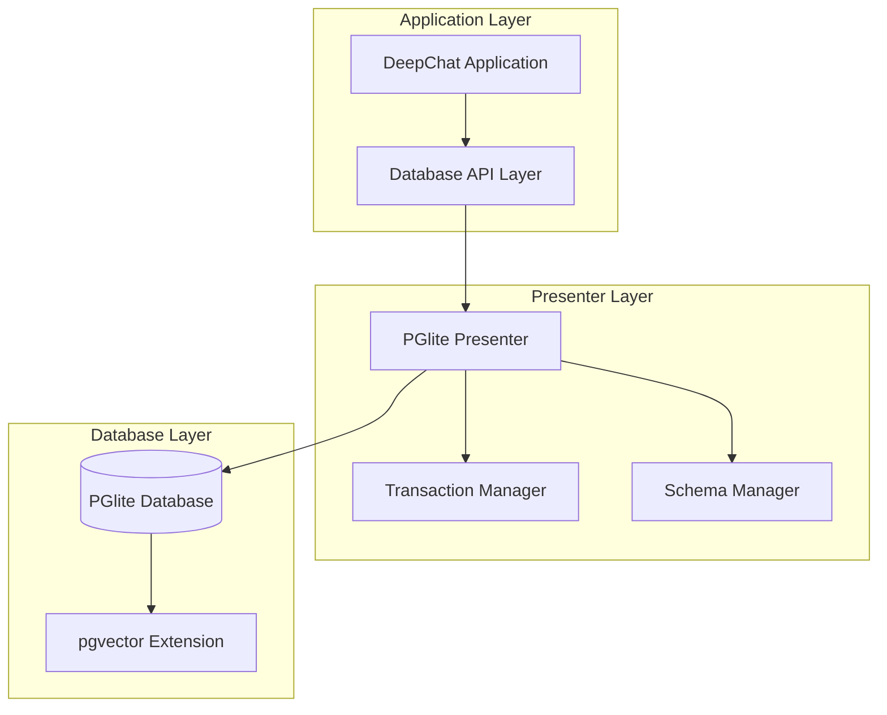

# PGlite Architecture Developer Guide

## Overview

This guide provides comprehensive technical documentation for developers working with DeepChat's new PGlite-based architecture. It covers the unified database design, API interfaces, migration system, and best practices for development and maintenance.

## Architecture Overview

### Unified Database Design

PGlite consolidates the previous dual-database architecture into a single PostgreSQL-compatible database with vector capabilities:



### Core Components

#### 1. PGlite Presenter

The unified presenter implements both conversational and vector database interfaces:

```typescript
// src/main/database/pglite/PGlitePresenter.ts
export class PGlitePresenter implements IPGlitePresenter {
  private db: PGlite
  private transactionManager: TransactionManager
  private schemaManager: SchemaManager
  
  constructor(config: PGliteConfig) {
    this.db = new PGlite(config.dbPath, {
      extensions: {
        vector: config.vectorExtension
      }
    })
    this.transactionManager = new TransactionManager(this.db)
    this.schemaManager = new SchemaManager(this.db)
  }

  // Unified interface implementation
  async initialize(): Promise<void> {
    await this.db.waitReady()
    await this.schemaManager.ensureSchema()
    await this.createIndexes()
  }

  // Conversation operations (from ISQLitePresenter)
  async createConversation(conversation: CONVERSATION): Promise<void> {
    const query = `
      INSERT INTO conversations (conv_id, title, created_at, updated_at, is_pinned, settings)
      VALUES ($1, $2, $3, $4, $5, $6)
    `
    await this.db.query(query, [
      conversation.conv_id,
      conversation.title,
      conversation.created_at,
      conversation.updated_at,
      conversation.is_pinned ? 1 : 0,
      JSON.stringify(conversation.settings || {})
    ])
  }

  // Vector operations (from IVectorDatabasePresenter)
  async similarityQuery(
    embedding: number[],
    limit: number,
    threshold?: number
  ): Promise<VectorSearchResult[]> {
    const query = `
      SELECT 
        kv.id,
        kv.file_id,
        kv.chunk_id,
        kc.content,
        kf.name as file_name,
        1 - (kv.embedding <=> $1::vector) as similarity
      FROM knowledge_vectors kv
      JOIN knowledge_chunks kc ON kv.chunk_id = kc.id
      JOIN knowledge_files kf ON kv.file_id = kf.id
      WHERE ($2::float IS NULL OR 1 - (kv.embedding <=> $1::vector) >= $2)
      ORDER BY kv.embedding <=> $1::vector
      LIMIT $3
    `
    
    const result = await this.db.query(query, [
      `[${embedding.join(',')}]`,
      threshold,
      limit
    ])
    
    return result.rows.map(row => ({
      id: row.id,
      fileId: row.file_id,
      chunkId: row.chunk_id,
      content: row.content,
      fileName: row.file_name,
      similarity: row.similarity
    }))
  }
}
```

#### 2. Transaction Management

Robust transaction handling for data consistency:

```typescript
// src/main/database/pglite/TransactionManager.ts
export class TransactionManager {
  private db: PGlite
  private activeTransactions = new Map<string, Transaction>()

  constructor(db: PGlite) {
    this.db = db
  }

  async beginTransaction(id?: string): Promise<string> {
    const transactionId = id || generateUUID()
    
    try {
      await this.db.query('BEGIN')
      this.activeTransactions.set(transactionId, {
        id: transactionId,
        startTime: Date.now(),
        operations: []
      })
      
      return transactionId
    } catch (error) {
      throw new TransactionError('Failed to begin transaction', error)
    }
  }

  async commitTransaction(transactionId: string): Promise<void> {
    const transaction = this.activeTransactions.get(transactionId)
    if (!transaction) {
      throw new TransactionError('Transaction not found')
    }

    try {
      await this.db.query('COMMIT')
      this.activeTransactions.delete(transactionId)
    } catch (error) {
      await this.rollbackTransaction(transactionId)
      throw new TransactionError('Failed to commit transaction', error)
    }
  }

  async rollbackTransaction(transactionId: string): Promise<void> {
    try {
      await this.db.query('ROLLBACK')
      this.activeTransactions.delete(transactionId)
    } catch (error) {
      throw new TransactionError('Failed to rollback transaction', error)
    }
  }

  async withTransaction<T>(
    operation: (tx: TransactionManager) => Promise<T>
  ): Promise<T> {
    const transactionId = await this.beginTransaction()
    
    try {
      const result = await operation(this)
      await this.commitTransaction(transactionId)
      return result
    } catch (error) {
      await this.rollbackTransaction(transactionId)
      throw error
    }
  }
}
```

#### 3. Schema Management

Handles database schema creation, versioning, and migrations:

```typescript
// src/main/database/pglite/SchemaManager.ts
export class SchemaManager {
  private db: PGlite
  private currentVersion = 1

  constructor(db: PGlite) {
    this.db = db
  }

  async ensureSchema(): Promise<void> {
    await this.createSchemaVersionTable()
    const currentVersion = await this.getCurrentVersion()
    
    if (currentVersion === 0) {
      await this.createInitialSchema()
    } else if (currentVersion < this.currentVersion) {
      await this.migrateSchema(currentVersion, this.currentVersion)
    }
  }

  private async createInitialSchema(): Promise<void> {
    const schema = `
      -- Enable pgvector extension
      CREATE EXTENSION IF NOT EXISTS vector;

      -- Conversations table
      CREATE TABLE conversations (
        id SERIAL PRIMARY KEY,
        conv_id TEXT UNIQUE NOT NULL,
        title TEXT NOT NULL,
        created_at BIGINT NOT NULL,
        updated_at BIGINT NOT NULL,
        is_pinned INTEGER DEFAULT 0,
        is_new INTEGER DEFAULT 1,
        settings JSONB DEFAULT '{}'::jsonb
      );

      -- Messages table
      CREATE TABLE messages (
        id SERIAL PRIMARY KEY,
        msg_id TEXT UNIQUE NOT NULL,
        conversation_id TEXT NOT NULL REFERENCES conversations(conv_id) ON DELETE CASCADE,
        parent_id TEXT DEFAULT '',
        role TEXT NOT NULL CHECK(role IN ('user', 'assistant', 'system', 'function')),
        content TEXT NOT NULL,
        created_at BIGINT NOT NULL,
        order_seq INTEGER NOT NULL DEFAULT 0,
        token_count INTEGER DEFAULT 0,
        status TEXT DEFAULT 'sent' CHECK(status IN ('sent', 'pending', 'error')),
        metadata JSONB DEFAULT '{}'::jsonb,
        is_context_edge INTEGER DEFAULT 0,
        is_variant INTEGER DEFAULT 0
      );

      -- Message attachments table
      CREATE TABLE message_attachments (
        id SERIAL PRIMARY KEY,
        message_id TEXT NOT NULL,
        attachment_type TEXT NOT NULL,
        attachment_data TEXT NOT NULL,
        created_at BIGINT DEFAULT EXTRACT(epoch FROM NOW()) * 1000
      );

      -- Knowledge files table
      CREATE TABLE knowledge_files (
        id TEXT PRIMARY KEY,
        name TEXT NOT NULL,
        path TEXT NOT NULL,
        mime_type TEXT,
        status TEXT NOT NULL,
        uploaded_at BIGINT NOT NULL,
        metadata JSONB DEFAULT '{}'::jsonb
      );

      -- Knowledge chunks table
      CREATE TABLE knowledge_chunks (
        id TEXT PRIMARY KEY,
        file_id TEXT NOT NULL REFERENCES knowledge_files(id) ON DELETE CASCADE,
        chunk_index INTEGER NOT NULL,
        content TEXT NOT NULL,
        status TEXT NOT NULL,
        error TEXT DEFAULT ''
      );

      -- Vector embeddings table
      CREATE TABLE knowledge_vectors (
        id TEXT PRIMARY KEY,
        file_id TEXT NOT NULL REFERENCES knowledge_files(id) ON DELETE CASCADE,
        chunk_id TEXT NOT NULL REFERENCES knowledge_chunks(id) ON DELETE CASCADE,
        embedding vector(1536),
        created_at BIGINT DEFAULT EXTRACT(epoch FROM NOW()) * 1000
      );

      -- Create indexes
      ${this.getIndexCreationSQL()}
    `

    await this.db.query(schema)
    await this.setSchemaVersion(1)
  }

  private getIndexCreationSQL(): string {
    return `
      -- Conversation indexes
      CREATE INDEX idx_conversations_updated ON conversations(updated_at DESC);
      CREATE INDEX idx_conversations_pinned ON conversations(is_pinned);
      CREATE INDEX idx_conversations_conv_id ON conversations(conv_id);

      -- Message indexes
      CREATE INDEX idx_messages_conversation ON messages(conversation_id, order_seq);
      CREATE INDEX idx_messages_timeline ON messages(created_at DESC);
      CREATE INDEX idx_messages_context_edge ON messages(is_context_edge);
      CREATE INDEX idx_messages_parent ON messages(parent_id);

      -- Knowledge indexes
      CREATE INDEX idx_knowledge_files_status ON knowledge_files(status);
      CREATE INDEX idx_knowledge_files_path ON knowledge_files(path);
      CREATE INDEX idx_knowledge_chunks_file ON knowledge_chunks(file_id);
      CREATE INDEX idx_knowledge_chunks_status ON knowledge_chunks(status);

      -- Vector indexes
      CREATE INDEX idx_knowledge_vectors_embedding ON knowledge_vectors 
      USING ivfflat (embedding vector_cosine_ops) WITH (lists = 100);
      CREATE INDEX idx_knowledge_vectors_file ON knowledge_vectors(file_id);
      CREATE INDEX idx_knowledge_vectors_chunk ON knowledge_vectors(chunk_id);
    `
  }
}
```

## Migration System Architecture

### Migration Manager

Orchestrates the entire migration process:

```typescript
// src/main/database/migration/MigrationManager.ts
export class MigrationManager {
  private sqlitePresenter: SQLitePresenter
  private duckdbPresenter: DuckDBPresenter
  private pglitePresenter: PGlitePresenter
  private dataMigrator: DataMigrator
  private backupManager: BackupManager

  constructor(config: MigrationConfig) {
    this.sqlitePresenter = new SQLitePresenter(config.sqlitePath)
    this.duckdbPresenter = new DuckDBPresenter(config.duckdbPath)
    this.pglitePresenter = new PGlitePresenter(config.pgliteConfig)
    this.dataMigrator = new DataMigrator()
    this.backupManager = new BackupManager(config.backupPath)
  }

  async executeMigration(options: MigrationOptions): Promise<MigrationResult> {
    const migrationId = generateUUID()
    const startTime = Date.now()

    try {
      // Phase 1: Validation and preparation
      await this.validateMigrationRequirements()
      await this.createBackups()
      
      // Phase 2: Initialize target database
      await this.pglitePresenter.initialize()
      
      // Phase 3: Migrate conversational data
      await this.dataMigrator.migrateConversationalData(
        this.sqlitePresenter,
        this.pglitePresenter,
        options
      )
      
      // Phase 4: Migrate vector data
      await this.dataMigrator.migrateVectorData(
        this.duckdbPresenter,
        this.pglitePresenter,
        options
      )
      
      // Phase 5: Validation and cleanup
      const validationResult = await this.validateMigration()
      
      return {
        migrationId,
        success: true,
        duration: Date.now() - startTime,
        validationResult,
        migratedCounts: await this.getMigratedCounts()
      }
    } catch (error) {
      return {
        migrationId,
        success: false,
        duration: Date.now() - startTime,
        error: error.message,
        rollbackRequired: true
      }
    }
  }
}
```

### Data Migrator

Handles the actual data transfer between databases:

```typescript
// src/main/database/migration/DataMigrator.ts
export class DataMigrator {
  async migrateConversationalData(
    source: SQLitePresenter,
    target: PGlitePresenter,
    options: MigrationOptions
  ): Promise<void> {
    const batchSize = options.batchSize || 1000

    // Migrate conversations
    await this.migrateTable(
      'conversations',
      source,
      target,
      batchSize,
      this.transformConversation,
      options.progressCallback
    )

    // Migrate messages
    await this.migrateTable(
      'messages',
      source,
      target,
      batchSize,
      this.transformMessage,
      options.progressCallback
    )

    // Migrate message attachments
    await this.migrateTable(
      'message_attachments',
      source,
      target,
      batchSize,
      this.transformAttachment,
      options.progressCallback
    )
  }

  private async migrateTable<T>(
    tableName: string,
    source: any,
    target: PGlitePresenter,
    batchSize: number,
    transformer: (row: any) => T,
    progressCallback?: (progress: MigrationProgress) => void
  ): Promise<void> {
    const totalRows = await source.getRowCount(tableName)
    let processedRows = 0

    for (let offset = 0; offset < totalRows; offset += batchSize) {
      const rows = await source.getRows(tableName, batchSize, offset)
      const transformedRows = rows.map(transformer)
      
      await target.insertBatch(tableName, transformedRows)
      
      processedRows += rows.length
      
      if (progressCallback) {
        progressCallback({
          table: tableName,
          processed: processedRows,
          total: totalRows,
          percentage: (processedRows / totalRows) * 100
        })
      }
    }
  }

  private transformConversation(row: any): any {
    return {
      conv_id: row.conv_id,
      title: row.title,
      created_at: row.created_at,
      updated_at: row.updated_at,
      is_pinned: row.is_pinned,
      is_new: row.is_new,
      settings: typeof row.settings === 'string' 
        ? JSON.parse(row.settings) 
        : row.settings
    }
  }

  private transformMessage(row: any): any {
    return {
      msg_id: row.msg_id,
      conversation_id: row.conversation_id,
      parent_id: row.parent_id || '',
      role: row.role,
      content: row.content,
      created_at: row.created_at,
      order_seq: row.order_seq,
      token_count: row.token_count || 0,
      status: row.status || 'sent',
      metadata: typeof row.metadata === 'string' 
        ? JSON.parse(row.metadata) 
        : row.metadata || {},
      is_context_edge: row.is_context_edge || 0,
      is_variant: row.is_variant || 0
    }
  }
}
```

## API Reference

### Core Interfaces

#### IPGlitePresenter

```typescript
interface IPGlitePresenter extends ISQLitePresenter, IVectorDatabasePresenter {
  // Database lifecycle
  initialize(config: PGliteConfig): Promise<void>
  close(): Promise<void>
  isReady(): boolean

  // Transaction management
  beginTransaction(): Promise<string>
  commitTransaction(transactionId: string): Promise<void>
  rollbackTransaction(transactionId: string): Promise<void>
  withTransaction<T>(operation: (tx: TransactionManager) => Promise<T>): Promise<T>

  // Schema management
  getCurrentSchemaVersion(): Promise<number>
  migrateSchema(targetVersion: number): Promise<void>
  validateSchema(): Promise<ValidationResult>

  // Health and diagnostics
  validateIntegrity(): Promise<ValidationResult>
  getStatistics(): Promise<DatabaseStatistics>
  optimize(): Promise<void>
}
```

#### Configuration Types

```typescript
interface PGliteConfig {
  dbPath: string
  extensions: {
    vector?: {
      enabled: boolean
      dimensions?: number
    }
  }
  performance: {
    sharedBuffers?: string
    workMem?: string
    maintenanceWorkMem?: string
  }
  logging: {
    level: 'error' | 'warn' | 'info' | 'debug'
    destination?: string
  }
}

interface MigrationOptions {
  batchSize: number
  validateData: boolean
  createBackups: boolean
  parallelTables: number
  memoryLimit: string
  progressCallback?: (progress: MigrationProgress) => void
  errorCallback?: (error: MigrationError) => void
}
```

## Performance Optimization

### Query Optimization

```typescript
// Optimized conversation queries
export class ConversationQueries {
  static getRecentConversations(limit: number = 50): string {
    return `
      SELECT 
        conv_id,
        title,
        updated_at,
        is_pinned,
        (SELECT COUNT(*) FROM messages WHERE conversation_id = c.conv_id) as message_count
      FROM conversations c
      ORDER BY 
        is_pinned DESC,
        updated_at DESC
      LIMIT $1
    `
  }

  static getConversationWithMessages(convId: string): string {
    return `
      WITH conversation_data AS (
        SELECT * FROM conversations WHERE conv_id = $1
      ),
      message_data AS (
        SELECT * FROM messages 
        WHERE conversation_id = $1 
        ORDER BY order_seq ASC
      )
      SELECT 
        json_build_object(
          'conversation', row_to_json(cd.*),
          'messages', json_agg(row_to_json(md.*) ORDER BY md.order_seq)
        ) as result
      FROM conversation_data cd
      LEFT JOIN message_data md ON true
      GROUP BY cd.conv_id
    `
  }
}

// Optimized vector queries
export class VectorQueries {
  static similaritySearch(dimensions: number): string {
    return `
      SELECT 
        kv.id,
        kv.file_id,
        kv.chunk_id,
        kc.content,
        kf.name as file_name,
        kf.path as file_path,
        1 - (kv.embedding <=> $1::vector) as similarity
      FROM knowledge_vectors kv
      JOIN knowledge_chunks kc ON kv.chunk_id = kc.id
      JOIN knowledge_files kf ON kv.file_id = kf.id
      WHERE kf.status = 'processed'
        AND kc.status = 'processed'
        AND ($2::float IS NULL OR 1 - (kv.embedding <=> $1::vector) >= $2)
      ORDER BY kv.embedding <=> $1::vector
      LIMIT $3
    `
  }

  static batchInsertVectors(): string {
    return `
      INSERT INTO knowledge_vectors (id, file_id, chunk_id, embedding, created_at)
      SELECT * FROM unnest($1::text[], $2::text[], $3::text[], $4::vector[], $5::bigint[])
      ON CONFLICT (id) DO UPDATE SET
        embedding = EXCLUDED.embedding,
        created_at = EXCLUDED.created_at
    `
  }
}
```

### Index Management

```typescript
export class IndexManager {
  private db: PGlite

  async createOptimalIndexes(): Promise<void> {
    const indexes = [
      // Conversation indexes
      'CREATE INDEX CONCURRENTLY IF NOT EXISTS idx_conversations_timeline ON conversations(updated_at DESC, is_pinned DESC)',
      'CREATE INDEX CONCURRENTLY IF NOT EXISTS idx_conversations_search ON conversations USING gin(to_tsvector(\'english\', title))',
      
      // Message indexes
      'CREATE INDEX CONCURRENTLY IF NOT EXISTS idx_messages_conversation_timeline ON messages(conversation_id, created_at DESC)',
      'CREATE INDEX CONCURRENTLY IF NOT EXISTS idx_messages_content_search ON messages USING gin(to_tsvector(\'english\', content))',
      
      // Vector indexes with different distance metrics
      'CREATE INDEX CONCURRENTLY IF NOT EXISTS idx_vectors_cosine ON knowledge_vectors USING ivfflat (embedding vector_cosine_ops) WITH (lists = 100)',
      'CREATE INDEX CONCURRENTLY IF NOT EXISTS idx_vectors_l2 ON knowledge_vectors USING ivfflat (embedding vector_l2_ops) WITH (lists = 100)',
      'CREATE INDEX CONCURRENTLY IF NOT EXISTS idx_vectors_ip ON knowledge_vectors USING ivfflat (embedding vector_ip_ops) WITH (lists = 100)'
    ]

    for (const indexSQL of indexes) {
      try {
        await this.db.query(indexSQL)
      } catch (error) {
        console.warn(`Failed to create index: ${error.message}`)
      }
    }
  }

  async analyzeAndOptimize(): Promise<void> {
    // Update table statistics
    await this.db.query('ANALYZE')
    
    // Reindex if needed
    const needsReindex = await this.checkIndexHealth()
    if (needsReindex.length > 0) {
      for (const index of needsReindex) {
        await this.db.query(`REINDEX INDEX CONCURRENTLY ${index}`)
      }
    }
  }
}
```

## Testing Framework

### Unit Testing

```typescript
// test/database/PGlitePresenter.test.ts
describe('PGlitePresenter', () => {
  let presenter: PGlitePresenter
  let testDb: string

  beforeEach(async () => {
    testDb = path.join(os.tmpdir(), `test-${Date.now()}.db`)
    presenter = new PGlitePresenter({
      dbPath: testDb,
      extensions: { vector: { enabled: true, dimensions: 1536 } }
    })
    await presenter.initialize()
  })

  afterEach(async () => {
    await presenter.close()
    await fs.unlink(testDb).catch(() => {})
  })

  describe('Conversation Operations', () => {
    it('should create and retrieve conversations', async () => {
      const conversation: CONVERSATION = {
        conv_id: 'test-conv-1',
        title: 'Test Conversation',
        created_at: Date.now(),
        updated_at: Date.now(),
        is_pinned: false,
        is_new: true,
        settings: { theme: 'dark' }
      }

      await presenter.createConversation(conversation)
      const retrieved = await presenter.getConversation('test-conv-1')

      expect(retrieved).toMatchObject(conversation)
    })

    it('should handle transaction rollback', async () => {
      const conversation: CONVERSATION = {
        conv_id: 'test-conv-2',
        title: 'Test Conversation 2',
        created_at: Date.now(),
        updated_at: Date.now()
      }

      await expect(
        presenter.withTransaction(async (tx) => {
          await presenter.createConversation(conversation)
          throw new Error('Test error')
        })
      ).rejects.toThrow('Test error')

      const retrieved = await presenter.getConversation('test-conv-2')
      expect(retrieved).toBeNull()
    })
  })

  describe('Vector Operations', () => {
    it('should perform similarity search', async () => {
      // Insert test vectors
      const vectors = [
        { id: 'v1', fileId: 'f1', chunkId: 'c1', embedding: [1, 0, 0] },
        { id: 'v2', fileId: 'f1', chunkId: 'c2', embedding: [0, 1, 0] },
        { id: 'v3', fileId: 'f1', chunkId: 'c3', embedding: [0, 0, 1] }
      ]

      for (const vector of vectors) {
        await presenter.insertVector(vector)
      }

      const results = await presenter.similarityQuery([1, 0, 0], 2)
      
      expect(results).toHaveLength(2)
      expect(results[0].id).toBe('v1')
      expect(results[0].similarity).toBeCloseTo(1.0)
    })
  })
})
```

### Integration Testing

```typescript
// test/migration/MigrationManager.test.ts
describe('MigrationManager', () => {
  let migrationManager: MigrationManager
  let testDataPath: string

  beforeEach(async () => {
    testDataPath = await createTestDatabases()
    migrationManager = new MigrationManager({
      sqlitePath: path.join(testDataPath, 'conversations.db'),
      duckdbPath: path.join(testDataPath, 'vectors.db'),
      pgliteConfig: {
        dbPath: path.join(testDataPath, 'unified.db'),
        extensions: { vector: { enabled: true } }
      }
    })
  })

  it('should migrate all data successfully', async () => {
    const result = await migrationManager.executeMigration({
      batchSize: 100,
      validateData: true,
      createBackups: true
    })

    expect(result.success).toBe(true)
    expect(result.migratedCounts.conversations).toBeGreaterThan(0)
    expect(result.migratedCounts.messages).toBeGreaterThan(0)
    expect(result.migratedCounts.vectors).toBeGreaterThan(0)
  })

  it('should handle migration failures gracefully', async () => {
    // Simulate disk space error
    jest.spyOn(fs, 'writeFile').mockRejectedValue(new Error('ENOSPC'))

    const result = await migrationManager.executeMigration({
      batchSize: 100,
      validateData: true,
      createBackups: true
    })

    expect(result.success).toBe(false)
    expect(result.rollbackRequired).toBe(true)
  })
})
```

## Deployment and Distribution

### Build Configuration

```javascript
// electron-builder configuration for PGlite
module.exports = {
  // ... existing config
  files: [
    "dist/**/*",
    "node_modules/@electric-sql/pglite/**/*",
    "!node_modules/@electric-sql/pglite/dist/postgres.debug.wasm"
  ],
  extraResources: [
    {
      from: "node_modules/@electric-sql/pglite/dist/postgres.wasm",
      to: "postgres.wasm"
    }
  ],
  asarUnpack: [
    "node_modules/@electric-sql/pglite/**/*"
  ]
}
```

### Runtime Configuration

```typescript
// src/main/database/DatabaseFactory.ts
export class DatabaseFactory {
  static async createPresenter(config: DatabaseConfig): Promise<IPGlitePresenter> {
    const pgliteConfig: PGliteConfig = {
      dbPath: config.dbPath,
      extensions: {
        vector: {
          enabled: true,
          dimensions: config.vectorDimensions || 1536
        }
      },
      performance: {
        sharedBuffers: config.memoryLimit || '256MB',
        workMem: '64MB',
        maintenanceWorkMem: '256MB'
      }
    }

    const presenter = new PGlitePresenter(pgliteConfig)
    await presenter.initialize()
    
    return presenter
  }
}
```

## Best Practices

### Error Handling

```typescript
export class DatabaseError extends Error {
  constructor(
    message: string,
    public code: string,
    public details?: any
  ) {
    super(message)
    this.name = 'DatabaseError'
  }
}

export class TransactionError extends DatabaseError {
  constructor(message: string, cause?: Error) {
    super(message, 'TRANSACTION_ERROR', { cause })
  }
}

export class MigrationError extends DatabaseError {
  constructor(
    message: string,
    public phase: string,
    public recoverable: boolean = true
  ) {
    super(message, 'MIGRATION_ERROR', { phase, recoverable })
  }
}
```

### Logging and Monitoring

```typescript
export class DatabaseLogger {
  private logger: Logger

  logQuery(query: string, params: any[], duration: number): void {
    this.logger.debug('Database Query', {
      query: this.sanitizeQuery(query),
      paramCount: params.length,
      duration,
      timestamp: Date.now()
    })
  }

  logMigrationProgress(progress: MigrationProgress): void {
    this.logger.info('Migration Progress', {
      table: progress.table,
      percentage: progress.percentage,
      processed: progress.processed,
      total: progress.total
    })
  }

  logError(error: Error, context: any): void {
    this.logger.error('Database Error', {
      message: error.message,
      stack: error.stack,
      context,
      timestamp: Date.now()
    })
  }
}
```

### Memory Management

```typescript
export class MemoryManager {
  private maxMemoryUsage: number
  private currentUsage: number = 0

  constructor(maxMemoryMB: number = 512) {
    this.maxMemoryUsage = maxMemoryMB * 1024 * 1024
  }

  async withMemoryLimit<T>(
    operation: () => Promise<T>,
    estimatedUsage: number
  ): Promise<T> {
    if (this.currentUsage + estimatedUsage > this.maxMemoryUsage) {
      await this.freeMemory()
    }

    this.currentUsage += estimatedUsage
    
    try {
      const result = await operation()
      return result
    } finally {
      this.currentUsage -= estimatedUsage
    }
  }

  private async freeMemory(): Promise<void> {
    // Force garbage collection if available
    if (global.gc) {
      global.gc()
    }
    
    // Wait for memory to be freed
    await new Promise(resolve => setTimeout(resolve, 100))
  }
}
```

## Troubleshooting

### Common Development Issues

1. **WASM Loading Errors**
   - Ensure postgres.wasm is properly bundled
   - Check file permissions and paths
   - Verify WASM support in target environment

2. **Vector Extension Issues**
   - Confirm pgvector extension is loaded
   - Check vector dimensions match data
   - Verify index creation for vector columns

3. **Migration Performance**
   - Adjust batch sizes for available memory
   - Monitor disk I/O during large migrations
   - Use streaming for very large datasets

4. **Transaction Deadlocks**
   - Implement proper transaction ordering
   - Use shorter transaction scopes
   - Add retry logic with exponential backoff

### Debugging Tools

```typescript
export class DatabaseDebugger {
  static async analyzeQuery(db: PGlite, query: string): Promise<QueryPlan> {
    const result = await db.query(`EXPLAIN ANALYZE ${query}`)
    return this.parseQueryPlan(result.rows)
  }

  static async getTableStatistics(db: PGlite, tableName: string): Promise<TableStats> {
    const result = await db.query(`
      SELECT 
        schemaname,
        tablename,
        attname,
        n_distinct,
        correlation
      FROM pg_stats 
      WHERE tablename = $1
    `, [tableName])
    
    return this.parseTableStats(result.rows)
  }

  static async validateDataIntegrity(db: PGlite): Promise<IntegrityReport> {
    const checks = [
      this.checkForeignKeyConstraints(db),
      this.checkDataConsistency(db),
      this.checkIndexHealth(db)
    ]
    
    const results = await Promise.all(checks)
    return this.generateIntegrityReport(results)
  }
}
```

This comprehensive developer guide provides the technical foundation for working with DeepChat's new PGlite architecture, covering everything from basic usage to advanced optimization and troubleshooting techniques.