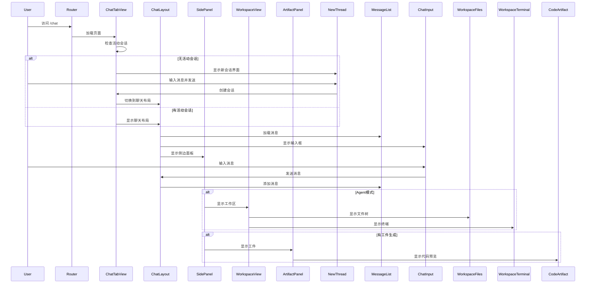
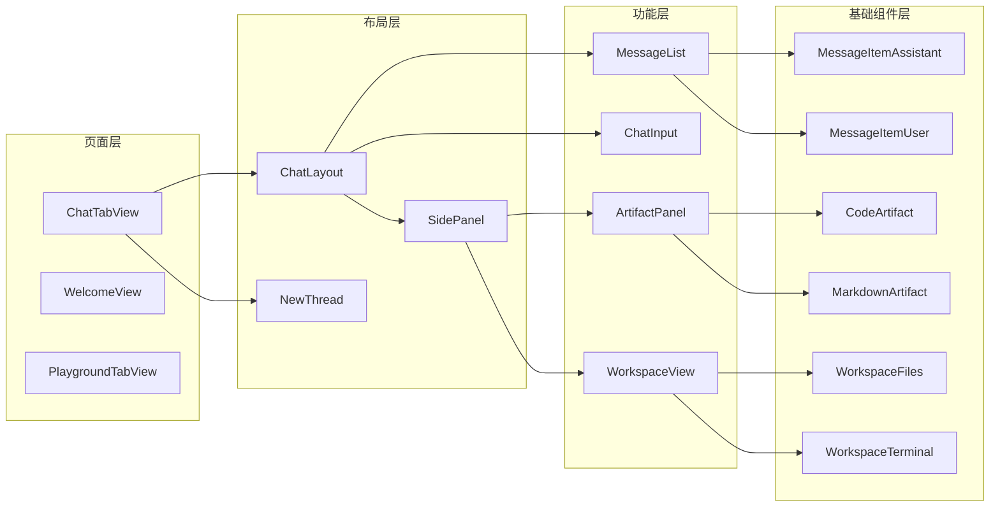

# Renderer 页面结构文档

本文档详细描述了 `src/renderer/src/` 目录中的页面结构和组件层次关系。

## 🏗️ 整体页面结构

```mermaid
graph TB
    subgraph "Router - 路由层"
        Router[Vue Router]
        Router --> ChatTabView["/chat<br/>ChatTabView.vue"]
        Router --> NewConversation["/new<br/>ChatTabView.vue"]
        Router --> Conversation["/conversation/:id<br/>ChatTabView.vue"]
        Router --> Welcome["/welcome<br/>WelcomeView.vue"]
        Router --> Playground["/playground<br/>PlaygroundTabView.vue<br/>(开发环境)"]
    end

    subgraph "ChatTabView - 主聊天页面"
        ChatTabView --> NewThread["NewThread.vue<br/>(无活动会话时)"]
        ChatTabView --> ChatLayout["ChatLayout.vue<br/>(有活动会话时)"]
    end

    subgraph "ChatLayout - 聊天布局"
        ChatLayout --> MessageList["MessageList.vue<br/>消息列表"]
        ChatLayout --> ChatInput["ChatInput.vue<br/>输入框"]
        ChatLayout --> SidePanel["SidePanel.vue<br/>侧边面板"]
    end

    subgraph "MessageList - 消息列表"
        MessageList --> MessageItemAssistant["MessageItemAssistant.vue<br/>AI消息"]
        MessageList --> MessageItemUser["MessageItemUser.vue<br/>用户消息"]
        MessageList --> MessageItemPlaceholder["MessageItemPlaceholder.vue<br/>占位符"]
        MessageList --> MessageActionButtons["MessageActionButtons.vue<br/>操作按钮"]
        MessageList --> MessageMinimap["MessageMinimap.vue<br/>消息导航"]
        MessageList --> TraceDialog["TraceDialog.vue<br/>追踪对话框"]
    end

    subgraph "SidePanel - 侧边面板"
        SidePanel --> WorkspaceView["WorkspaceView.vue<br/>工作区"]
        SidePanel --> ArtifactPanel["ArtifactPanel.vue<br/>工件面板"]
    end

    subgraph "WorkspaceView - 工作区"
        WorkspaceView --> WorkspaceFiles["WorkspaceFiles.vue<br/>文件树"]
        WorkspaceView --> WorkspaceBrowserTabs["WorkspaceBrowserTabs.vue<br/>浏览器标签"]
        WorkspaceView --> WorkspacePlan["WorkspacePlan.vue<br/>执行计划"]
        WorkspaceView --> WorkspaceTerminal["WorkspaceTerminal.vue<br/>终端"]
    end

    subgraph "ArtifactPanel - 工件面板"
        ArtifactPanel --> CodeArtifact["CodeArtifact.vue<br/>代码预览"]
        ArtifactPanel --> MarkdownArtifact["MarkdownArtifact.vue<br/>Markdown预览"]
        ArtifactPanel --> HTMLArtifact["HTMLArtifact.vue<br/>HTML预览"]
        ArtifactPanel --> SvgArtifact["SvgArtifact.vue<br/>SVG预览"]
        ArtifactPanel --> MermaidArtifact["MermaidArtifact.vue<br/>Mermaid图表"]
        ArtifactPanel --> ReactArtifact["ReactArtifact.vue<br/>React组件"]
    end

    subgraph "ChatInput - 输入框"
        ChatInput --> FileItem["FileItem.vue<br/>文件附件"]
        ChatInput --> ModelChooser["ModelChooser.vue<br/>模型选择器"]
        ChatInput --> ChatConfig["ChatConfig.vue<br/>聊天配置"]
        ChatInput --> McpToolsList["McpToolsList.vue<br/>MCP工具"]
        ChatInput --> SkillsIndicator["SkillsIndicator.vue<br/>技能指示器"]
    end

    subgraph "WelcomeView - 欢迎向导"
        WelcomeView --> ModelConfigItem["ModelConfigItem.vue<br/>模型配置"]
        WelcomeView --> ModelCheckDialog["ModelCheckDialog.vue<br/>模型检查"]
    end

    subgraph "PlaygroundTabView - 组件测试"
        PlaygroundTabView --> DemoSection["DemoSection.vue<br/>演示区域"]
        DemoSection --> Demos["各种组件演示<br/>Accordion, Button, Card, Dialog等"]
    end

    subgraph "SettingsTabView - 设置页面"
        SettingsTabView --> SettingsRouter["RouterView<br/>设置路由"]
        SettingsRouter --> ProviderSettings["ProviderModelManager.vue<br/>提供商设置"]
        SettingsRouter --> ModelSettings["ModelConfigDialog.vue<br/>模型设置"]
        SettingsRouter --> SkillsSettings["SkillsSettings.vue<br/>技能设置"]
        SettingsRouter --> McpSettings["McpSettings.vue<br/>MCP设置"]
        SettingsRouter --> AcpSettings["AcpSettings.vue<br/>ACP设置"]
    end

    style Router fill:#e1f5ff
    style ChatTabView fill:#fff4e6
    style ChatLayout fill:#f0f9ff
    style SidePanel fill:#f5f0ff
    style WorkspaceView fill:#e8f5e9
    style ArtifactPanel fill:#fce4ec
```



## 📁 目录结构

```
src/renderer/src/
├── views/                          # 路由页面
│   ├── ChatTabView.vue            # 主聊天页面
│   ├── WelcomeView.vue            # 欢迎向导
│   ├── SettingsTabView.vue        # 设置页面
│   ├── PlaygroundTabView.vue      # 组件测试
│   └── playground/                # 演示组件
│       ├── DemoSection.vue
│       └── demos/
│           ├── AccordionDemo.vue
│           ├── ButtonGroupDemo.vue
│           ├── CardDemo.vue
│           ├── DialogDemo.vue
│           ├── EmptyDemo.vue
│           ├── FieldDemo.vue
│           ├── FormDemo.vue
│           ├── InputGroupDemo.vue
│           ├── ItemDemo.vue
│           ├── KbdDemo.vue
│           ├── MessageListDemo.vue
│           ├── PopoverDemo.vue
│           ├── SelectDemo.vue
│           ├── SpinnerDemo.vue
│           ├── TabsDemo.vue
│           └── ThinkContentDemo.vue
│
├── components/                     # 组件
│   ├── ChatLayout.vue             # 聊天主布局
│   ├── SidePanel.vue              # 侧边面板
│   ├── NewThread.vue              # 新会话
│   ├── ThreadsView.vue            # 会话列表
│   ├── ThreadItem.vue             # 会话项
│   ├── TitleView.vue              # 标题视图
│   ├── ChatAppBar.vue             # 聊天应用栏
│   ├── ChatConfig.vue             # 聊天配置
│   ├── McpToolsList.vue           # MCP工具列表
│   ├── ModelSelect.vue            # 模型选择
│   ├── ModelChooser.vue           # 模型选择器
│   ├── FileItem.vue               # 文件项
│   ├── SearchResultsDrawer.vue    # 搜索结果抽屉
│   ├── ScrollablePopover.vue      # 可滚动弹出框
│   ├── MessageNavigationSidebar.vue # 消息导航侧边栏
│   │
│   ├── chat-input/                # 输入框组件
│   │   ├── ChatInput.vue
│   │   ├── SkillsIndicator.vue
│   │   ├── components/
│   │   │   └── ToolbarButton.vue
│   │   └── composables/           # 输入框逻辑
│   │       ├── useAcpCommands.ts
│   │       ├── useAcpMode.ts
│   │       ├── useAcpSessionModel.ts
│   │       ├── useAcpWorkdir.ts
│   │       ├── useAgentWorkspace.ts
│   │       ├── useChatMode.ts
│   │       ├── useContextLength.ts
│   │       ├── useDragAndDrop.ts
│   │       ├── useInputHistory.ts
│   │       ├── useInputSettings.ts
│   │       ├── useMentionData.ts
│   │       ├── usePromptInputConfig.ts
│   │       ├── usePromptInputEditor.ts
│   │       ├── usePromptInputFiles.ts
│   │       ├── useRateLimitStatus.ts
│   │       ├── useSendButtonState.ts
│   │       ├── useSkillsData.ts
│   │       ├── useSlashMentionData.ts
│   │       └── useWorkspaceMention.ts
│   │
│   ├── message/                   # 消息组件
│   │   ├── MessageList.vue
│   │   ├── MessageItemAssistant.vue
│   │   ├── MessageItemUser.vue
│   │   ├── MessageItemPlaceholder.vue
│   │   ├── MessageActionButtons.vue
│   │   ├── MessageContent.vue
│   │   ├── MessageMinimap.vue
│   │   ├── MessageToolbar.vue
│   │   ├── MessageInfo.vue
│   │   ├── MessageTextContent.vue
│   │   ├── SelectedTextContextMenu.vue
│   │   ├── ReferencePreview.vue
│   │   └── blocks/                # 消息块
│   │       ├── MessageBlockThink.vue
│   │       ├── MessageBlockToolCall.vue
│   │       ├── MessageBlockSearch.vue
│   │       ├── MessageBlockPlan.vue
│   │       ├── MessageBlockPermissionRequest.vue
│   │       ├── MessageBlockMcpUi.vue
│   │       ├── MessageBlockImage.vue
│   │       ├── MessageBlockError.vue
│   │       ├── MessageBlockContent.vue
│   │       └── MessageBlockAction.vue
│   │
│   ├── workspace/                 # 工作区组件
│   │   ├── WorkspaceView.vue
│   │   ├── WorkspaceFiles.vue
│   │   ├── WorkspaceFileNode.vue
│   │   ├── WorkspaceBrowserTabs.vue
│   │   ├── WorkspacePlan.vue
│   │   └── WorkspaceTerminal.vue
│   │
│   ├── artifacts/                 # 工件组件
│   │   ├── ArtifactPanel.vue
│   │   ├── ArtifactPreview.vue
│   │   ├── ArtifactBlock.vue
│   │   ├── ArtifactThinking.vue
│   │   ├── ToolCallPreview.vue
│   │   ├── CodeArtifact.vue
│   │   ├── MarkdownArtifact.vue
│   │   ├── HTMLArtifact.vue
│   │   ├── SvgArtifact.vue
│   │   ├── MermaidArtifact.vue
│   │   └── ReactArtifact.vue
│   │
│   ├── sidebar/                   # 侧边栏组件
│   │   ├── IconSidebar.vue
│   │   ├── VerticalSidebar.vue
│   │   ├── IconItem.vue
│   │   └── ConversationTab.vue
│   │
│   ├── mcp-config/                # MCP配置组件
│   │   ├── mcpServerForm.vue
│   │   ├── AgentMcpSelector.vue
│   │   ├── components/
│   │   │   ├── McpServerCard.vue
│   │   │   ├── McpServers.vue
│   │   │   ├── McpToolPanel.vue
│   │   │   ├── McpJsonViewer.vue
│   │   │   ├── McpResourceViewer.vue
│   │   │   ├── McpPromptPanel.vue
│   │   │   └── McpTabHeader.vue
│   │
│   ├── trace/                     # 追踪组件
│   │   └── TraceDialog.vue
│   │
│   ├── think-content/             # 思考内容组件
│   │   └── ThinkContent.vue
│   │
│   ├── markdown/                  # Markdown渲染
│   │   └── MarkdownRenderer.vue
│   │
│   ├── editor/                    # 编辑器组件
│   │   └── mention/
│   │       ├── MentionList.vue
│   │       ├── PromptParamsDialog.vue
│   │       ├── suggestion.ts
│   │       └── slashSuggestion.ts
│   │
│   ├── popup/                     # 弹出组件
│   │   └── TranslatePopup.vue
│   │
│   ├── settings/                  # 设置组件
│   │   ├── ModelConfigItem.vue
│   │   ├── ModelConfigDialog.vue
│   │   └── ModelCheckDialog.vue
│   │
│   ├── ui/                        # UI组件
│   │   ├── UpdateDialog.vue
│   │   └── MessageDialog.vue
│   │
│   ├── mcp/                       # MCP组件
│   │   └── McpSamplingDialog.vue
│   │
│   ├── icons/                     # 图标组件
│   │   ├── ModelIcon.vue
│   │   ├── RestoreIcon.vue
│   │   ├── MinimizeIcon.vue
│   │   ├── MaximizeIcon.vue
│   │   └── CloseIcon.vue
│   │
│   └── emoji-picker/              # 表情选择器
│       └── EmojiPicker.vue
│
├── router/                        # 路由配置
│   └── index.ts
│
├── stores/                        # Pinia状态管理
│   ├── chat.ts
│   ├── sidebarStore.ts
│   ├── workspace.ts
│   ├── artifact.ts
│   ├── modelStore.ts
│   ├── providerStore.ts
│   ├── mcp.ts
│   ├── skillsStore.ts
│   ├── theme.ts
│   ├── language.ts
│   ├── uiSettingsStore.ts
│   ├── systemPromptStore.ts
│   ├── prompts.ts
│   ├── ollamaStore.ts
│   ├── modelConfigStore.ts
│   ├── mcpSampling.ts
│   ├── searchEngineStore.ts
│   ├── searchAssistantStore.ts
│   ├── providerStore.ts
│   ├── sync.ts
│   ├── floatingButton.ts
│   ├── agentModelStore.ts
│   ├── upgrade.ts
│   └── yoBrowser.ts
│
├── composables/                   # 组合式函数
│   ├── usePresenter.ts
│   ├── useModelTypeDetection.ts
│   ├── useModelCapabilities.ts
│   ├── useSearchConfig.ts
│   ├── useThinkingBudget.ts
│   ├── useViewportSize.ts
│   ├── useArtifactViewMode.ts
│   ├── useArtifactContext.ts
│   ├── useArtifactCodeEditor.ts
│   ├── useArtifactExport.ts
│   ├── usePageCapture.ts
│   ├── useFontManager.ts
│   ├── useChatConfigFields.ts
│   ├── message/
│   │   ├── useMessageScroll.ts
│   │   ├── useMessageRetry.ts
│   │   ├── useMessageMinimap.ts
│   │   ├── useMessageCapture.ts
│   │   ├── useCleanDialog.ts
│   │   └── types.ts
│   └── useIpcQuery.ts
│
├── lib/                           # 工具库
│   ├── storeInitializer.ts
│   ├── fontStack.ts
│   ├── download.ts
│   └── messageRuntimeCache.ts
│
├── assets/                        # 静态资源
│   ├── logo.png
│   ├── logo-dark.png
│   ├── style.css
│   └── llm-icons/                 # LLM图标
│
├── i18n/                          # 国际化
│   ├── index.ts
│   ├── zh-CN/
│   ├── en-US/
│   └── ... (其他语言)
│
├── App.vue                        # 根组件
├── main.ts                        # 入口文件
└── events.ts                      # 事件定义
```

## 🔑 关键页面说明

### 1. ChatTabView.vue - 主聊天页面
- **路径**: `/chat`, `/new`, `/conversation/:id`
- **功能**:
  - 无活动会话时显示 `NewThread` 组件
  - 有活动会话时显示 `ChatLayout` 组件
  - 处理会话切换和路由参数
  - 管理消息滚动和导航

### 2. WelcomeView.vue - 欢迎向导
- **路径**: `/welcome`
- **功能**:
  - 首次使用引导
  - 提供商配置
  - 模型选择和配置
  - API密钥设置

### 3. ChatLayout.vue - 聊天布局
- **组成**:
  - `MessageList` - 消息列表（虚拟滚动）
  - `ChatInput` - 输入框
  - `SidePanel` - 侧边面板
- **功能**:
  - 消息发送和接收
  - 文件上传
  - 侧边面板控制

### 4. SidePanel.vue - 侧边面板
- **组成**:
  - `WorkspaceView` - 工作区（Agent模式）
  - `ArtifactPanel` - 工件面板
- **功能**:
  - 动态显示/隐藏
  - 响应式宽度调整
  - 文件路径追加

### 5. WorkspaceView.vue - 工作区
- **组成**:
  - `WorkspaceFiles` - 文件树
  - `WorkspaceBrowserTabs` - 浏览器标签（Agent模式）
  - `WorkspacePlan` - 执行计划
  - `WorkspaceTerminal` - 终端输出
- **功能**:
  - 文件浏览和选择
  - 浏览器标签管理
  - 计划展示
  - 终端输出显示

### 6. ArtifactPanel.vue - 工件面板
- **支持的类型**:
  - CodeArtifact - 代码
  - MarkdownArtifact - Markdown
  - HTMLArtifact - HTML
  - SvgArtifact - SVG
  - MermaidArtifact - Mermaid图表
  - ReactArtifact - React组件
- **功能**:
  - 预览/代码切换
  - 响应式设备预览（HTML）
  - 导出和复制
  - 截图功能

### 7. MessageList.vue - 消息列表
- **特性**:
  - 虚拟滚动（vue-virtual-scroller）
  - 消息高度自适应
  - 选择高亮（子会话）
  - 消息导航（Minimap）
  - 消息追踪（TraceDialog）

### 8. ChatInput.vue - 输入框
- **特性**:
  - 富文本编辑（TipTap）
  - 文件拖拽上传
  - 提及系统（@文件、@技能、@提示）
  - 斜杠命令（/技能）
  - 模式切换（Chat/Agent/ACP Agent）
  - 上下文长度显示
  - 速率限制状态
  - 输入历史记录

## 🔄 页面流转



## 📊 组件依赖关系



## 🎯 设计模式

### 1. 单一WebContents架构
- 所有聊天页面使用同一个 `ChatTabView`
- 通过路由参数区分不同会话
- 状态管理通过 Pinia stores

### 2. 虚拟滚动
- `MessageList` 使用 `vue-virtual-scroller`
- `ThreadsView` 使用 `DynamicScroller`
- 提升大量数据渲染性能

### 3. 组件懒加载
- 路由页面使用 `defineAsyncComponent`
- 按需加载，减少初始包大小

### 4. 组合式API
- 使用 Vue 3 Composition API
- 逻辑复用通过 composables
- 状态管理通过 Pinia

### 5. 响应式设计
- 使用 Tailwind CSS
- 支持深色模式
- 移动端适配

## 📝 注意事项

1. **SettingsTabView** 是独立的渲染进程，不在 `src/renderer/src/` 中
2. **PlaygroundTabView** 仅在开发环境可用（`VITE_ENABLE_PLAYGROUND=true`）
3. **SidePanel** 根据 `workspaceStore` 和 `artifactStore` 动态显示内容
4. **ChatInput** 支持两种变体：`chat` 和 `newThread`
5. **MessageList** 使用虚拟滚动，需要正确计算消息高度

## 🔗 相关文档

- [整体架构](./ARCHITECTURE.md)
- [单WebContents架构](./specs/single-webcontents-architecture/spec.md)
- [Agent系统](./architecture/agent-system.md)
- [工具系统](./architecture/tool-system.md)
- [会话管理](./architecture/session-management.md)
