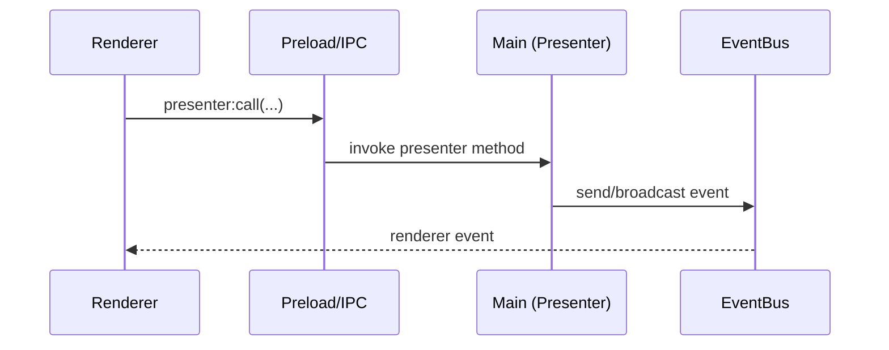

# DeepChat SDD Planning Template

Use `docs/spec-driven-dev.md` as the source of truth. Keep specs small, testable, and traceable.

## Usage

Activate this template when:

- You need a reliable `spec.md` / `plan.md` / `tasks.md` set under `docs/specs/<feature>/`.
- You are about to implement a non-trivial change and want spec → plan → code traceability.
- You need to clarify scope, risks, IPC surface, and test strategy before coding.

## Core rules

- **Planning first**: Do NOT modify code until user requests implementation. Default behavior is to draft spec.md, plan.md, and tasks.md only. Wait for user approval before writing any code.
- Write specs before code. Let code serve the spec.
- Keep scope small; prefer 1 vertical slice per increment.
- Mark unknowns as `[NEEDS CLARIFICATION]` and resolve them before implementation.
- Define acceptance criteria that can be verified by tests or deterministic checks.

## Repo guardrails (DeepChat-specific)

- **Main process**: Presenter pattern under `src/main/presenter/**`; app events via `src/main/eventbus.ts`.
- **Renderer**: Vue 3 + Pinia under `src/renderer/src/**`; user-facing strings via `src/renderer/src/i18n/**`.
- **IPC**: Secure bridge in `src/preload/**` (contextIsolation on). Prefer typed `presenter:call` (`src/renderer/src/composables/usePresenter.ts`).
- **Shared types**: Put cross-process request/response types in `src/shared/**`.
- **Tests**: Vitest under `test/main/**` and `test/renderer/**` mirroring source structure.
- **Renderer boundaries** (see `docs/specs/renderer-store-composables-rules/spec.md`):
  - Do not call `usePresenter` / `ipcRenderer` / `window.electron` from stores.
  - Centralize IPC subscriptions in Adapter composables; orchestrate in App composables; keep UI composables UI-only.
- **Agent/Tools/Skills**:
  - Gate model-facing tools tightly (prefer skill-gated tool injection).
  - Put skills under `resources/skills/<skill-name>/SKILL.md` (treat skills as context-control).
  - Consider tool output size + error presentation (see `docs/specs/tool-output-guardrails/spec.md`).

## Workflow

1. Create `docs/specs/<feature-slug>/`.
2. Draft `spec.md` using the template below.
3. Draft `plan.md` to map spec → architecture → tests.
4. Draft `tasks.md` as small, ordered tasks that map to commits/PRs.
5. Remove all `[NEEDS CLARIFICATION]` before implementation.

## spec.md template

```md
# <Feature Name>

## Overview
<What user problem does this solve? Why now? What is the smallest valuable increment?>

## Goals
- <Goal 1>
- <Goal 2>

## Non-Goals
- <Explicitly out-of-scope items to prevent scope creep>

## User Stories
- As a <user>, I want <capability> so that <benefit>.
- As a <user>, I want <capability> so that <benefit>.

## UX Notes
- Entry points: <where users discover/use this>
- States: loading / empty / error / disabled / permission-required
- Accessibility: keyboard, focus, contrast, screen-reader labels (if applicable)
- i18n: list user-facing strings that must become i18n keys

## Acceptance Criteria
- [ ] <Criterion 1>
- [ ] <Criterion 2>

## Open Questions [NEEDS CLARIFICATION]
1. <Question 1>
2. <Question 2>

## Security & Privacy Notes
- <Threat model: untrusted input? permissions? data exposure?>
- <Any sensitive data handling, storage, or logging constraints?>

## Compatibility & Migration
- <Any config/data format changes?>
- <Upgrade/rollback notes>
```

## plan.md template

````md
# Plan: <Feature Name>

## Summary (What changes and where)
- Main: <presenters/modules touched>
- Preload / IPC: <new/changed IPC surface>
- Renderer: <views/components/stores/composables touched>
- Shared: <new/changed types>

## Architecture decisions
- <Decision 1> — <rationale> — <alternatives considered>
- <Decision 2> — <rationale> — <alternatives considered>

## Component map (touch points)
- `src/main/presenter/<...>`
- `src/main/eventbus.ts` / `src/main/events.ts`
- `src/preload/<...>`
- `src/renderer/src/<...>`
- `src/shared/<...>`
- `test/main/<...>`
- `test/renderer/<...>`

## Event flow / sequence


## Data model & types
- New types: <add to `src/shared/**` when crossing processes>
- Persisted fields: <config/session/db changes; include compatibility notes>
- Validation: <runtime validation strategy for untrusted input>

## IPC surface (security-first)
- New/changed calls: <presenter methods and arguments>
- Return types: <success/error shape; prefer structured errors>
- Access control: <conversation-scoped checks? permission gating? allowlists?>
- Context isolation: keep renderer unprivileged; no direct Node access

## Renderer implementation notes
- Store: state + orchestration only; no IPC or DOM access
- Adapter composable: the only place calling `usePresenter` / IPC subscriptions
- App composable: orchestrate flows; read/write stores; call adapters
- UI composable: component-local behavior only

## Error handling & user messaging
- User-visible errors: <where/how rendered>
- Logging: <what to log; avoid secrets>
- Retry/rollback: <if partial failure is possible>

## Performance & limits
- <Large payload/tool output considerations>
- <Debounce/throttle considerations>
- <Max sizes and safeguards>

## Test strategy (pragmatic)
- Main tests: <critical validation, event flow, persistence>
- Renderer tests: <critical UI behavior>
- Manual checks: <focused checklist>

## Rollout / risk mitigation
- <Feature flag? default off?>
- <Fallback behavior if something fails>
````

## tasks.md template

```md
# Tasks: <Feature Name>

## 0) Spec & plan quality gate
1. Resolve all `[NEEDS CLARIFICATION]` items in `spec.md`.
2. Verify acceptance criteria are testable and mapped to planned tests.
3. Confirm touched modules/files match the architecture and boundaries.

## 1) Shared types & contracts (if needed)
1. Add/update shared types in `src/shared/**`.
2. Add runtime validation schema for untrusted inputs (main-side).

## 2) Main process (Presenter + EventBus)
1. Add/extend presenter method(s) under `src/main/presenter/<...>`.
2. Add/update event constants in `src/main/events.ts` (if introducing events).
3. Emit events via `EventBus` for renderer updates (if needed).
4. Add main Vitest coverage under `test/main/**`.

## 3) Preload / IPC surface (only if required)
1. Extend `src/preload/**` bridge types and calls.
2. Ensure the renderer surface remains minimal and typed.

## 4) Renderer (UI + state)
1. Add i18n keys under `src/renderer/src/i18n/**` for user-facing strings.
2. Implement Adapter composable (IPC) and ensure unsubscribe/dispose.
3. Implement App composable orchestration and state updates.
4. Implement UI components/views; cover loading/empty/error states.
5. Add renderer tests under `test/renderer/**` (critical paths only).

## 5) Quality gates
1. Run `pnpm run format`.
2. Run `pnpm run lint`.
3. Run `pnpm run typecheck`.
4. Run `pnpm test` (or targeted suites).
```

## Definition of Done (DoD)

- Acceptance criteria satisfied (ideally with tests)
- No unresolved `[NEEDS CLARIFICATION]`
- i18n applied to user-facing strings
- Security/privacy constraints met (no secrets leaked; IPC surface minimal)
- `pnpm run format && pnpm run lint && pnpm run typecheck` pass locally
- Tests for critical paths pass (`pnpm test` or targeted suites)
