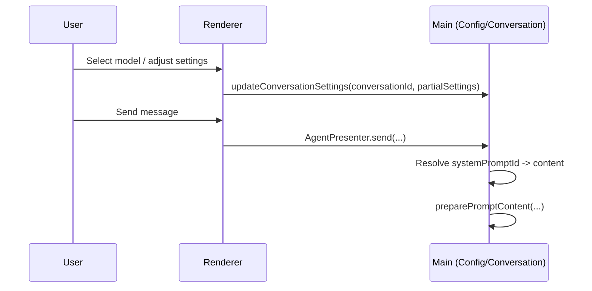

# Plan: Model Selector Config Popover

## Summary (What changes and where)
- Renderer:
  - Update `src/renderer/src/components/chat-input/ModelSelector.vue` to render a two-column popover.
  - Add a config panel component that reuses existing config logic (capabilities + ranges) but renders numeric inputs instead of sliders.
  - Update `src/renderer/src/components/settings/ModelConfigItem.vue` capability icons/tooltips.
  - Integrate system prompt selection with `useSystemPromptStore` / `configPresenter` methods.
- Shared:
  - Update `CONVERSATION_SETTINGS` type to include `systemPromptId` (and migration strategy).
- Main:
  - Resolve `systemPromptId` to prompt content during prompt building (before `preparePromptContent` uses `conversation.settings.systemPrompt`), or adjust prompt building to use `systemPromptId` directly.
- Tests:
  - Renderer unit tests for prompt selector rendering and range validation.
  - Main unit test for resolving prompt ID → content and fallback behavior.

## Architecture decisions
- Embed config UI into `ModelSelector.vue` popover — reduces UI surface area and matches the “model-first” workflow.
- Store prompt selection by ID in conversation settings — centralizes prompt content management in Settings, avoids per-thread free-form prompt drift.
- Render numeric inputs instead of sliders — faster precise edits and simpler UI, while keeping the same validation/ranges.

## Component map (touch points)
- `src/renderer/src/components/chat-input/ModelSelector.vue`
- `src/renderer/src/components/ModelChooser.vue` (reuse as left panel)
- `src/renderer/src/components/ChatConfig.vue` (reuse logic or refactor into reusable fields)
- `src/renderer/settings/components/PromptSetting.vue`
- `src/renderer/src/stores/systemPromptStore.ts`
- `src/shared/presenter.d.ts` (or wherever `CONVERSATION_SETTINGS` lives)
- `src/main/presenter/agentPresenter/message/messageBuilder.ts`
- `test/renderer/**`
- `test/main/**`

## Data model & types
- Add `systemPromptId?: string` to `CONVERSATION_SETTINGS`.
- Define precedence:
  - `systemPromptId` (if set) resolves to content at send time.
  - Fallback to legacy `systemPrompt` for old conversations until migration is complete.

## Event flow / sequence

## Renderer implementation notes
- Prefer a dedicated right-panel component (e.g. `ModelConfigPanel.vue`) to keep `ModelSelector.vue` small.
- Reuse existing composables for:
  - capability detection (`useModelCapabilities`, `useModelTypeDetection`)
  - ranges/defaults (`configPresenter.getModelDefaultConfig`, existing range constants)
- Replace slider UI with input UI; keep the same min/max/step rules.

## Error handling & user messaging
- If prompts fail to load, show a disabled prompt selector with a short error hint and default to “no prompt”.
- If `systemPromptId` points to a missing prompt, fall back to default or empty (decide in spec clarification).

## Test strategy (pragmatic)
- Renderer:
  - Prompt dropdown renders name + preview, includes “no prompt”.
  - Numeric inputs enforce ranges and show hints.
  - Fields show/hide based on mocked capabilities.
- Main:
  - `systemPromptId` resolves to content and participates in the final system prompt string.
  - Fallback behavior when prompt is missing or empty.

## Rollout / risk mitigation
- Keep legacy `systemPrompt` for one release behind `systemPromptId` precedence to avoid breaking existing conversations.
- Add minimal migration logging (no prompt contents) if needed.

