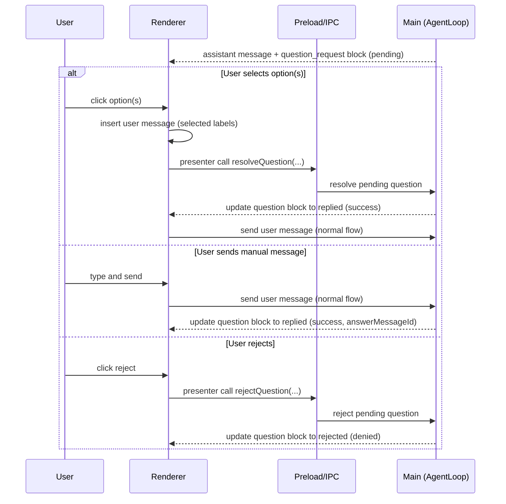

# Plan: Question Tool (Agent-to-User Choices)

## Summary (What changes and where)

- Main:
  - Add a built-in agent tool `question` (AgentToolManager).
  - Extend agent loop/tool execution to treat `question` as a “pause for user input” boundary.
  - Persist and update the question request block in the assistant message content.
- Preload / IPC:
  - Add a typed presenter method to resolve a pending question (`reply` / `reject`) if main-side resolution is required.
- Renderer:
  - Add `MessageBlockQuestionRequest.vue` (UI similar to `MessageBlockPermissionRequest.vue`).
  - Render the new block in `MessageItemAssistant.vue`.
  - Ensure auto-resolve when any new user message is sent while a question is pending.
  - Add i18n strings.
- Shared:
  - Extend `AssistantMessageBlock['action_type']` union to include `question_request`.
  - Add shared types for question tool payload/answer where cross-process.
- Tests:
  - Main: validate tool schema + pause/resume behavior.
  - Renderer: validate pending → replied/rejected transitions and insertion behavior.

## Architecture decisions

- Use `AssistantMessageBlock` (`type: 'action'`) for question UI — consistent with permission requests — avoids mixing with tool-call blocks.
- Reuse existing `status` values (`pending`/`success`/`denied`) for asked/replied/rejected — avoids widening status union.
- Enforce “standalone + last tool call” at runtime — reduces ambiguous UI state and avoids chained tool execution after asking the user.

## Component map (touch points)

- `src/main/presenter/agentPresenter/tools/toolManager.ts` (add tool definition + handler)
- `src/main/presenter/agentPresenter/loop/toolCallProcessor.ts` (pause boundary)
- `src/main/presenter/agentPresenter/loop/toolCallHandler.ts` (create/update question action block)
- `src/main/presenter/agentPresenter/session/sessionContext.ts` (optional: track `pendingQuestion`)
- `src/main/presenter/agentPresenter/index.ts` (new presenter method to resolve question)
- `src/preload/**` (typed IPC exposure for question resolution)
- `src/renderer/src/components/message/MessageBlockQuestionRequest.vue` (new)
- `src/renderer/src/components/message/MessageItemAssistant.vue` (render new block)
- `src/renderer/src/i18n/**` (new keys)
- `src/shared/types/core/chat.ts` and/or `src/shared/chat.d.ts` (new action_type and extra typing)
- `test/main/**` and `test/renderer/**`

## Event flow / sequence

## Data model & types

- Tool input (model): `QuestionInfo` (`header`, `question`, `options`, `multiple`, `custom`)
- Stored block fields: serialized in `AssistantMessageBlock.extra` for persistence.
- Optional runtime state:
  - `pendingQuestion: { messageId, toolCallId, conversationId }` to support auto-resolve when the next user message arrives.

Validation:

- Max options: 10 (v1)
- Max label length: 30 chars
- Max question length: 500 chars
- Description length: 200 chars

## IPC surface (security-first)

- New presenter methods (names TBD):
  - `resolveQuestion(messageId, toolCallId, answerText)` (idempotent)
  - `rejectQuestion(messageId, toolCallId)` (idempotent)
- Access control:
  - Only allow resolving questions for the active conversation/session.
  - Ignore stale/unknown toolCallId.

## Renderer implementation notes

- UI component reads `block.extra` only; no direct store mutations except sending a normal user message.
- Auto-resolve strategy:
  - Prefer main-side: when a user message is accepted by main while a question is pending, main resolves it using `answerMessageId` and updates the assistant message content.
  - Renderer-side: if needed for instant UI, optimistically collapse after send, but main is source of truth.

## Error handling & user messaging

- Invalid payload (too many options, invalid strings): show an error block in the assistant message and do not pause.
- Double submit: ignore subsequent resolves; keep first resolution.

## Performance & limits

- Keep payload small (labels/descriptions only).
- Avoid adding large serialized blobs to `extra`.

## Test strategy (pragmatic)

- Main tests:
  - `question` tool schema validation.
  - Tool call constraint enforcement (standalone + last).
  - Pause on asked; resume only after resolution.
  - Auto-resolve on next user message.
- Renderer tests:
  - Pending view renders options and custom input.
  - Selecting option inserts message and collapses block.
  - Reject collapses without insertion.

## Rollout / risk mitigation

- Feature flag (optional): gate tool injection behind a config toggle until stable.
- Safe fallback: if renderer does not recognize `question_request`, render as a generic action block with text only.

