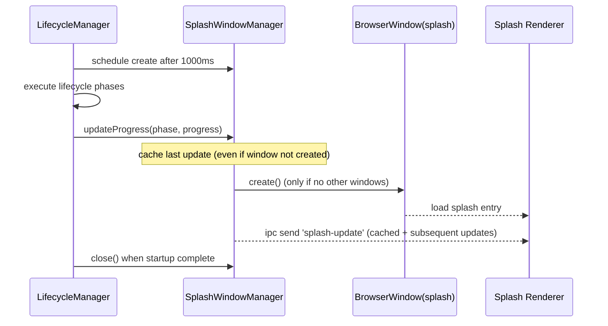

# Plan: Splash Window UX Refresh

## Summary (What changes and where)
- Main: `src/main/presenter/lifecyclePresenter/index.ts`, `src/main/presenter/lifecyclePresenter/SplashWindowManager.ts`
- Preload / IPC: reuse existing `preload/index.mjs` (no new surface)
- Renderer: `src/renderer/splash/loading.vue`, `src/renderer/splash/env.d.ts`

## Architecture decisions
- Delay splash creation in `LifecycleManager.start()` — avoids blocking startup while still preventing unnecessary windows.
- Store last progress update in `SplashWindowManager` — allows the splash UI to render meaningful status immediately after load.
- Use existing `window.electron.ipcRenderer` via preload — consistent with other renderer entries.

## Event flow / sequence

## Test strategy (pragmatic)
- Manual: verify fast start shows no splash; slow start shows compact splash with updating text.
- Optional later: main-process unit test via Electron mocks for delayed splash scheduling.

