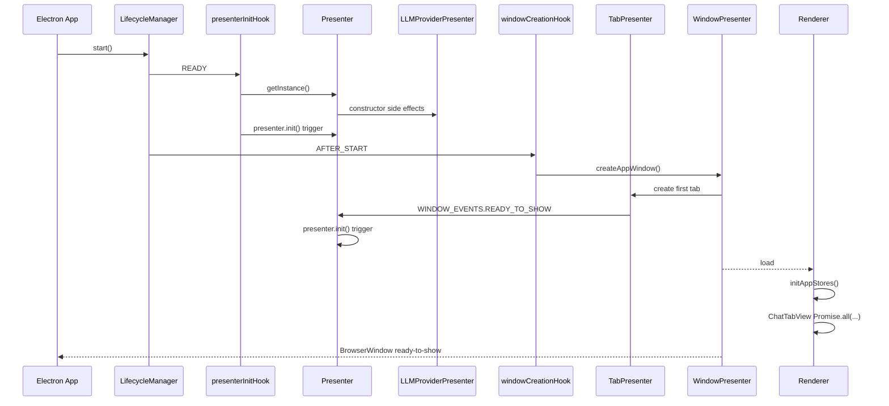
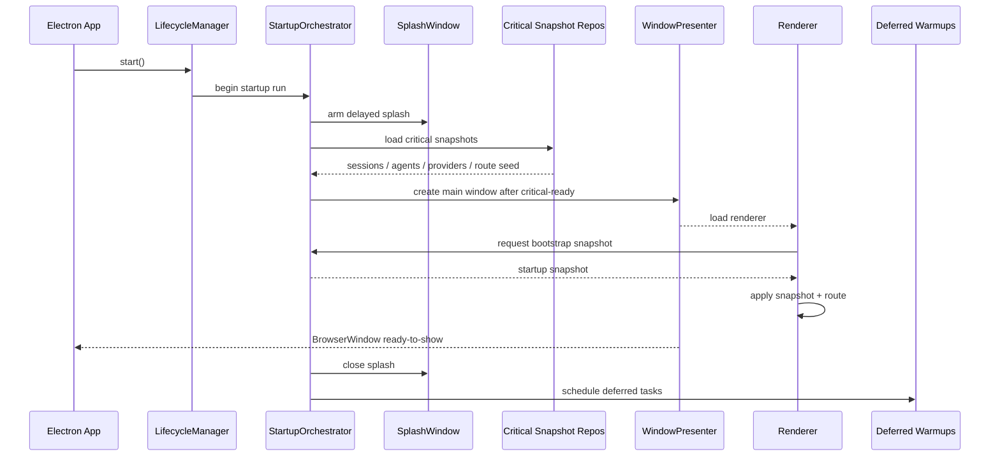

# Startup Orchestration 实施计划

## 规划结论

本次启动治理按一个清晰原则推进：

`Splash 承接关键准备 + Main 只消费关键快照 + Deferred 任务后台执行 + 全链路单次触发`

## 2026-04-21 阶段性进展

这轮实现先收敛 renderer 首个可交互边界，已经落地的内容如下：

1. 新增 `startupDeferred` 调度器，通过 `requestAnimationFrame x2 + requestIdleCallback/setTimeout` 把 post-interactive 任务统一延后。
2. `ChatTabView` 只把路由初始化和关键会话读取留在 critical path，`agent/project/model` warmup 进入 deferred hydration。
3. `ChatPage` 将 active thread 的历史消息恢复和 pending input 恢复移到 deferred queue。
4. `NewThreadPage` 将 `ensureAcpDraftSession(...)` 移到 deferred queue。
5. `ChatStatusBar` 将 `ACP` process warmup 和 config option sync 移到 deferred queue。
6. renderer 侧补齐了对应单测，覆盖 deferred release 前后行为。

本地一轮 `pnpm run dev` 采样结果：

1. `Window 2 is ready to show.` 出现在 `16:36:26.669`。
2. 首个 provider model store 访问延后到 `16:36:29.915`，较窗口 ready-to-show 明显后移。
3. 首个可交互窗口内未再出现启动即打满的 `ACP` warmup 和 active thread restore 突发。

## 当前链路结论

代码和一轮本地日志已经说明当前瓶颈来自三段叠加：

1. `ConfigPresenter` / `LLMProviderPresenter` 构造阶段已经执行了重量级副作用。
2. `presenter.init()` 被多个入口触发，provider/bootstrap 等启动任务重复执行。
3. renderer `App` 与 `ChatTabView` 在应用挂载后又把多路请求打回 main，继续占用主线程。

当前关键现象：

1. `WINDOW_EVENTS.READY_TO_SHOW` 目前由 `TabPresenter` 在首个 tab 建立时发出，它早于真实 `BrowserWindow.ready-to-show`。
2. `LLMProviderPresenter` 构造时已经 `providerInstanceManager.init()`。
3. `Presenter.init()` 又通过 `setProviders()` 触发一轮 provider instance rebuild。
4. `App.initAppStores()` 触发 `providerStore.initialize()`、`providerStore.refreshProviders()`、`modelStore.initialize()`。
5. `ChatTabView` 把 `pageRouter.initialize()`、`sessionStore.fetchSessions()`、`agentStore.fetchAgents()`、`projectStore.fetchProjects()` 一起放进首屏 `Promise.all(...)`。
6. `AgentSessionPresenter.getSessionList()` 仍按 session 串行构建状态。

## 当前剩余热点

当前窗口首个可交互前路径已经收窄，后续热点主要集中在 main 进程与 provider 链路：

1. `App.initAppStores()` 仍会较早触发 `providerStore.initialize()` / `refreshProviders()`。
2. provider model store 创建仍以串行 burst 方式持续发生，占用 main CPU 时间片。
3. `StartupOrchestrator`、splash phase 和 startup run 级日志尚未统一接管。
4. 启动事件语义、provider 去重、main deferred queue 仍需要主进程侧继续收敛。

## 当前链路时序



## 目标链路时序



## 核心设计

### 1. 引入 `StartupOrchestrator`

新增单一启动编排器，负责：

1. 生成 `startupRunId`
2. 定义 phase 与 task graph
3. 管理 splash 显示与关闭
4. 产出 bootstrap snapshot
5. 调度 deferred tasks
6. 输出统一日志

`StartupOrchestrator` 是唯一允许发起启动任务的地方。

### 2. 启动任务分层

| 层级 | 示例 | 阻塞 splash 完成 | 阻塞 main 可见 | 执行策略 |
| --- | --- | --- | --- | --- |
| boot mandatory | config、database、protocol | 是 | 是 | 顺序执行 |
| critical startup | route seed、active session binding、session snapshot、agent snapshot、provider summary | 是 | 是 | 明确依赖，有限并发 |
| window boot | create window、load renderer、deliver snapshot | 否 | 是 | critical 后执行 |
| deferred warmups | provider full warmup、model refresh、MCP auto-start、skill scan、remote control、usage backfill、legacy import、ACP env warmup | 否 | 否 | 后台队列，有限并发 |

### 3. Splash 只承接关键数据

`Splash` 承接的是“主窗口进入可用态必须要有的数据”，不是所有启动任务。

critical 数据集定义为：

1. `routeSeed`
2. `activeSessionBinding`
3. `sessionListSnapshot`
4. `agentListSnapshot`
5. `providerSummarySnapshot`
6. `defaultProjectPath` 或等价 lightweight project context

这些数据具备两个属性：

1. 足以让主窗口首屏立刻可用
2. 读取成本可控，不依赖全量 runtime warmup

### 4. Provider 启动策略

provider 启动分为两个层面：

1. `provider summary snapshot`
   - 关键路径可读
   - 只包含 renderer 首屏必要信息
   - 不触发完整 provider instance bootstrap
2. `provider full warmup`
   - deferred 执行
   - 每个 provider 只允许单次 warmup key
   - 有并发上限

明确禁止的路径：

1. provider constructor 直接承担 full startup bootstrap
2. `Presenter.init()`、event listener、renderer 回调分别触发 provider 初始化
3. renderer 首屏立刻全量 `modelStore.initialize()`

### 5. Session 与 Agent 快照策略

首屏列表使用 lightweight snapshot。

#### Session snapshot

读取来源：

1. 持久化 `new_sessions`
2. 当前 active binding
3. 可选的内存 runtime 状态 overlay

关键路径规则：

1. 不对每个 session 调用 `agent.getSessionState()`
2. 不在关键路径中恢复 generation settings
3. 冷启动 session 默认状态为 `idle`
4. 活动态由内存 runtime 覆盖

#### Agent snapshot

读取来源：

1. `AgentRepository`
2. 轻量 ACP enabled state

关键路径规则：

1. 不等待 registry 全量刷新
2. 不等待 install state 的重计算
3. 只返回首屏所需字段

### 6. Bootstrap Snapshot Contract

建议新增统一 contract：

```ts
type StartupBootstrapSnapshot = {
  startupRunId: string
  version: number
  routeSeed: {
    activeSessionId: string | null
    initialRoute: 'newThread' | 'chat'
  }
  sessions: SessionListSnapshotItem[]
  agents: AgentListSnapshotItem[]
  providers: ProviderSummaryItem[]
  defaultProjectPath: string | null
}
```

约束：

1. renderer 首屏只请求一次 snapshot。
2. snapshot 应用后，通过 typed events 订阅增量更新。
3. snapshot merge 采用 `entityId + version` 策略。

### 7. Renderer 启动策略

renderer 启动拆成两层：

#### First interactive path

1. 读取 bootstrap snapshot
2. 应用 `pageRouter`
3. 应用 `sessionStore`
4. 应用 `agentStore`
5. 渲染主窗口

#### Background refresh path

1. project recent list
2. provider full list / full model list
3. MCP 状态与 tool definitions
4. skills scanning
5. 其他非关键 store 初始化

关键变化：

1. `App.initAppStores()` 不再在应用挂载时触发全量 store 初始化。
2. `ChatTabView` ready 不再等待 `projectStore.fetchProjects()`。
3. `pageRouter.initialize()` 与 `sessionStore.fetchSessions()` 不再重复读取 `getActive()`。

### 8. 事件语义收口

当前 `WINDOW_EVENTS.READY_TO_SHOW` 与真实含义不一致。

规划动作：

1. 把“首个 tab 已建好”与“窗口真正 ready-to-show”拆成两个明确事件。
2. `Presenter.init()` 不再挂在命名含糊的事件上。
3. window lifecycle 与 startup lifecycle 各自拥有准确事件。

### 9. 并发与资源策略

启动任务执行策略：

1. `critical` phase 默认顺序执行。
2. phase 内只有明确独立的数据加载可以有限并发。
3. `deferred` phase 使用任务队列，默认并发上限 `1~2`。
4. 同类大任务禁止并发打满主进程。

推荐限制：

1. provider warmup queue: `maxConcurrency = 1`
2. snapshot repository reads: phase 内有限并发
3. registry/network refresh: deferred only

### 10. 观测与日志

启动日志标准化为：

1. `startup.run.begin/end`
2. `startup.phase.begin/end`
3. `startup.task.begin/end`
4. `startup.window.load-requested`
5. `startup.window.ready-to-show`
6. `startup.renderer.snapshot-applied`
7. `startup.renderer.interactive-ready`
8. `startup.deferred.begin/end`

每条日志至少包含：

1. `startupRunId`
2. `phase`
3. `taskName`
4. `durationMs`
5. `result`

## 风险与缓解

### 风险 1：Splash 变成新的阻塞容器

缓解：

1. 只把关键数据放进 splash phase。
2. deferred 任务严格下沉。
3. splash phase 每个 task 有超时和失败策略。

### 风险 2：快照变快但一致性变差

缓解：

1. snapshot 使用版本号。
2. active selection、排序和展开态由 renderer 保持稳定合并。
3. runtime active state 对持久化 snapshot 做覆盖。

### 风险 3：provider 去重后影响功能可用性

缓解：

1. summary snapshot 与 full warmup 分层。
2. full warmup 保持 on-demand lazy safe。
3. provider 功能可用性由调用路径按需等待对应 warmup。

### 风险 4：旧 listener 和旧初始化入口残留

缓解：

1. 启动入口集中到 orchestrator。
2. 增加启动 run 级别日志和断言。
3. 验收中检查重复 task、重复 provider bootstrap 和重复 listener。

## 测试策略

主进程：

1. `StartupOrchestrator` phase/task 顺序与去重
2. splash 延迟显示与关键完成时机关联
3. provider startup 去重
4. lightweight session/agent snapshot 读取
5. deferred queue 并发限制与错误隔离

renderer：

1. bootstrap snapshot 应用
2. `ChatTabView` 首屏 ready 条件缩小
3. session/agent snapshot merge 一致性
4. background refresh 不回退 active selection

联调：

1. 冷启动
2. 热启动
3. 大量 session
4. 大量 enabled providers
5. 离线/超时 provider 环境
