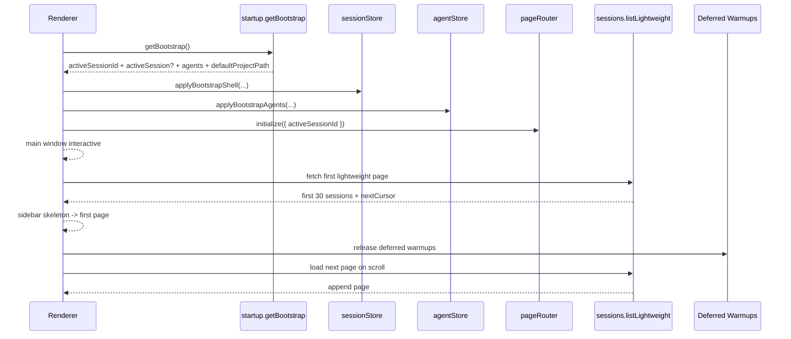

# Startup Orchestration 实施计划

## 规划结论

本轮实现按这条线推进：

`bootstrap shell 负责 route + agent`  
`session list 走 staged lightweight paging`  
`active session summary 由 restore 回填`  
`provider/model warmup 继续后置`

## 当前实现时序

## 已落地工作流

### 1. Bootstrap Shell

已落地：

1. `startup.getBootstrap`
2. `StartupBootstrapShell`
3. `ChatTabView` critical hydration 只消费 bootstrap shell

实现结果：

1. `pageRouter.initialize()` 优先使用 `activeSessionId`
2. `agentStore` 首屏直接使用 bootstrap agents
3. `defaultProjectPath` 在首屏一起应用

### 2. Session Lightweight Paging

已落地：

1. `sessions.listLightweight`
2. `sessions.getLightweightByIds`
3. `new_sessions` cursor pagination
4. `WindowSideBar` skeleton + on-scroll pagination

实现结果：

1. 首批 page size 为 `30`
2. `activeSessionId` 支持 `prioritizeSessionId`
3. 翻页只 append，不清空现有列表

### 3. Active Session Overlay

已落地：

1. `SessionListItem`
2. `ActiveSessionSummary`
3. `messageStore.loadMessages()` 返回 restore session
4. `ChatPage` 用 restore session 回填 active summary

实现结果：

1. sidebar list 只依赖 lightweight item
2. `providerId/modelId/projectDir` 由 restore 路径补齐

### 4. Deferred Warmups

已落地：

1. startup deferred queue
2. `modelStore.initialize()` / `ollamaStore.initialize()` 延后
3. `ChatPage` active restore 延后
4. `ACP` draft/bootstrap 与 config warmup 延后
5. provider warmup 日志落点

实现结果：

1. agent ready 先于 provider/model warmup
2. session 首批优先于 deferred warmups

### 5. Incremental Session Merge

已落地：

1. `sessionStore.refreshSessionsByIds(...)`
2. `sessionStore.removeSessions(...)`
3. main 侧 `sessions.updated` 携带具体 `sessionIds`

实现结果：

1. `created/updated/deleted` 走定向 merge
2. 空 `sessionIds` 才回落到首批轻量页刷新
3. 列表刷新粒度从整表回拉收敛到实体级 upsert/remove

## 剩余 follow-up

以下工作继续保留在后续轮次：

1. `providerStore.initialize()` 的更细粒度后移与优先级治理
2. session list virtualization
3. sidebar 全局搜索专用接口
4. 更完整的 startup run 级 trace 与 main/splash 统一编排
2. `Presenter.init()` 不再挂在命名含糊的事件上。
3. window lifecycle 与 startup lifecycle 各自拥有准确事件。

### 9. 并发与资源策略

启动任务执行策略：

1. `critical` phase 默认顺序执行。
2. phase 内只有明确独立的数据加载可以有限并发。
3. `deferred` phase 使用任务队列，默认并发上限 `1~2`。
4. 同类大任务禁止并发打满主进程。

推荐限制：

1. provider warmup queue: `maxConcurrency = 1`
2. snapshot repository reads: phase 内有限并发
3. registry/network refresh: deferred only

### 10. 观测与日志

启动日志标准化为：

1. `startup.run.begin/end`
2. `startup.phase.begin/end`
3. `startup.task.begin/end`
4. `startup.window.load-requested`
5. `startup.window.ready-to-show`
6. `startup.renderer.snapshot-applied`
7. `startup.renderer.interactive-ready`
8. `startup.deferred.begin/end`

每条日志至少包含：

1. `startupRunId`
2. `phase`
3. `taskName`
4. `durationMs`
5. `result`

## 风险与缓解

### 风险 1：Splash 变成新的阻塞容器

缓解：

1. 只把关键数据放进 splash phase。
2. deferred 任务严格下沉。
3. splash phase 每个 task 有超时和失败策略。

### 风险 2：快照变快但一致性变差

缓解：

1. snapshot 使用版本号。
2. active selection、排序和展开态由 renderer 保持稳定合并。
3. runtime active state 对持久化 snapshot 做覆盖。

### 风险 3：provider 去重后影响功能可用性

缓解：

1. summary snapshot 与 full warmup 分层。
2. full warmup 保持 on-demand lazy safe。
3. provider 功能可用性由调用路径按需等待对应 warmup。

### 风险 4：旧 listener 和旧初始化入口残留

缓解：

1. 启动入口集中到 orchestrator。
2. 增加启动 run 级别日志和断言。
3. 验收中检查重复 task、重复 provider bootstrap 和重复 listener。

## 测试策略

主进程：

1. `StartupOrchestrator` phase/task 顺序与去重
2. splash 延迟显示与关键完成时机关联
3. provider startup 去重
4. lightweight session/agent snapshot 读取
5. deferred queue 并发限制与错误隔离

renderer：

1. bootstrap snapshot 应用
2. `ChatTabView` 首屏 ready 条件缩小
3. session/agent snapshot merge 一致性
4. background refresh 不回退 active selection

联调：

1. 冷启动
2. 热启动
3. 大量 session
4. 大量 enabled providers
5. 离线/超时 provider 环境
