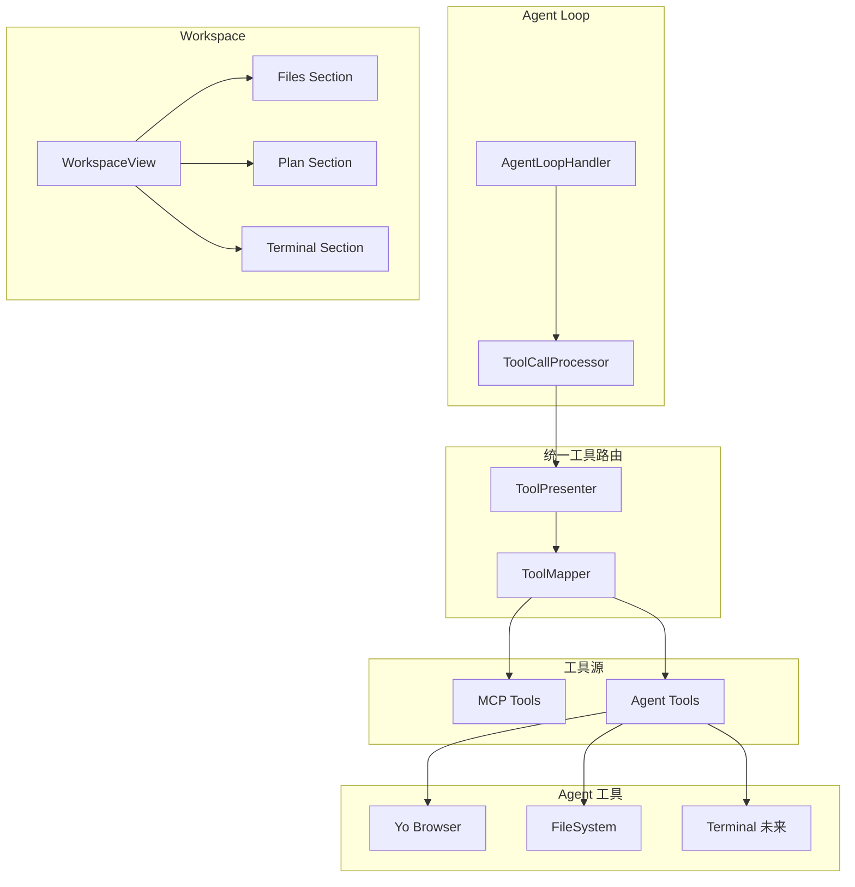

# 通用 Workspace 和 Agent 能力重构实施总结

## 概述

本次重构将 Workspace 和 Agent 能力从 ACP 专用扩展到所有模型，重构 filesystem MCP 为 Agent 工具，统一管理 MCP 和 Agent 工具调用注入逻辑，并重构 AcpWorkspaceView 为通用 Workspace 组件。

## 架构概览



## 已完成的工作

### 1. 统一工具路由架构 ✅

**实现文件**：
- `src/main/presenter/toolPresenter/index.ts` - 统一工具路由 Presenter
- `src/main/presenter/toolPresenter/toolMapper.ts` - 工具映射器

**功能**：
- 创建 `ToolPresenter` 类，统一管理所有工具源（MCP、Agent）
- 创建 `ToolMapper` 类，实现工具名称到工具源的映射机制
- 所有工具定义统一使用 MCP 规范格式（`MCPToolDefinition`）
- 工具调用时根据映射路由到对应的工具源处理器
- 支持工具去重和映射（如果 MCP 和 Agent 有同名工具，可以映射到 MCP 工具）

### 2. Agent 工具管理 ✅

**实现文件**：
- `src/main/presenter/llmProviderPresenter/agent/agentToolManager.ts` - Agent 工具管理器
- `src/main/presenter/llmProviderPresenter/agent/agentFileSystemHandler.ts` - 文件系统能力处理器

**功能**：
- 创建 `AgentToolManager` 类，管理所有 Agent 工具
- Agent 工具包括：
  - **Yo Browser**：保持现有实现，工具名称使用 `browser_` 前缀（如 `browser_navigate`）
  - **FileSystem**：新增，工具名称**不加前缀**（如 `read_file`, `write_file`）
  - **Terminal**：未来扩展
- 工具注入逻辑：
  - **chat 模式**：不注入 Agent 工具（只有 MCP 工具）
  - **agent 模式**：注入所有 Agent 工具（yo browser、filesystem 等）
  - **acp agent 模式**：根据 ACP 逻辑决定

### 3. 文件系统能力抽象 ✅

**实现文件**：
- `src/main/presenter/llmProviderPresenter/agent/agentFileSystemHandler.ts` - 文件系统处理器

**功能**：
- 创建 `AgentFileSystemHandler` 类，封装文件操作能力
- 工具名称不加前缀，例如：`read_file`, `write_file`, `list_directory` 等
- 从 `mcpConfHelper.ts` 中移除 `buildInFileSystem` 配置
- 从 `inMemoryServers/builder.ts` 中移除 filesystem server 的创建逻辑
- 添加数据迁移逻辑，将现有 buildInFileSystem 配置迁移

### 4. 通用 Mode Switch 配置 ✅

**实现文件**：
- `src/renderer/src/components/chat-input/composables/useChatMode.ts` - Chat Mode Switch composable
- `src/renderer/src/components/chat-input/ChatInput.vue` - 添加 Mode Switch 选择器

**功能**：
- 在配置存储（ElectronStore）中添加 `chatMode: 'chat' | 'agent' | 'acp agent'` 字段
- 在 `chatConfig` 中添加 `chatMode` 字段（从配置存储读取）
- 创建 `useChatMode` composable，管理模式状态
- 在 `ChatInput.vue` 中添加 Mode Switch 选择器（Icon + 下拉选择）
- 三种模式的区别：
  - **chat**：基础聊天模式，只有 MCP 工具，不支持 yo browser、文件读写等功能
  - **agent**：内置 agent 模式，包含 workdir 设置、各种工具（yo browser、文件读写等）、agent loop 定制内容
  - **acp agent**：ACP 模式，只有这个模式才能选择 ACP 模型，loop 和逻辑会有不同
- 配置持久化：通过 `configPresenter.setSetting('input_chatMode', value)` 存储

### 5. Workspace 组件通用化 ✅

**实现文件**：
- `src/main/presenter/workspacePresenter/index.ts` - 通用 Workspace Presenter
- `src/renderer/src/stores/workspace.ts` - 通用 Workspace Store
- `src/renderer/src/components/workspace/WorkspaceView.vue` - 通用 Workspace 组件
- `src/renderer/src/components/workspace/WorkspaceFiles.vue` - 文件列表组件
- `src/renderer/src/components/workspace/WorkspacePlan.vue` - 计划组件
- `src/renderer/src/components/workspace/WorkspaceTerminal.vue` - 终端组件

**功能**：
- 重命名 `AcpWorkspaceView.vue` → `WorkspaceView.vue`
- 重命名 `acpWorkspace` store → `workspace` store
- 重命名 `AcpWorkspacePresenter` → `WorkspacePresenter`
- 移除 ACP 特定的依赖，改为基于 Agent 模式判断
- 支持所有模型的 Agent 模式

### 6. Workspace 路径选择（统一化）✅

**实现文件**：
- `src/renderer/src/components/chat-input/composables/useAgentWorkspace.ts` - Workspace 路径选择 composable
- `src/renderer/src/components/chat-input/ChatInput.vue` - 添加统一的目录选择按钮

**功能**：
- 在 `chatConfig` 中添加 `agentWorkspacePath: string | null` 字段
- 创建 `useAgentWorkspace` composable，统一管理工作目录选择
- 在 `ChatInput.vue` 的 Tools 区域添加目录选择按钮（在 agent 或 acp agent 模式下显示）
- 目录选择按钮逻辑统一化：
  - **acp agent 模式**：使用 ACP workdir（现有的 ACP workdir 逻辑）
  - **agent 模式**：使用 filesystem 工具的工作目录
- 按钮样式和行为统一

### 7. 模型选择逻辑更新 ✅

**实现文件**：
- `src/renderer/src/components/ModelChooser.vue` - 更新模型选择逻辑

**功能**：
- 只有在 `acp agent` 模式下才显示 ACP 模型
- 其他模式隐藏 ACP 模型选项

### 8. ChatView 集成更新 ✅

**实现文件**：
- `src/renderer/src/components/chat/ChatView.vue` - 使用通用 WorkspaceView

**功能**：
- 更新 ChatView 使用通用 WorkspaceView
- 更新事件监听和状态同步逻辑

### 9. Agent Loop Handler 更新 ✅

**实现文件**：
- `src/main/presenter/llmProviderPresenter/managers/agentLoopHandler.ts` - 使用统一的 ToolPresenter
- `src/main/presenter/llmProviderPresenter/managers/toolCallProcessor.ts` - 使用 ToolPresenter 进行工具调用路由

**功能**：
- 更新 `AgentLoopHandler` 使用统一的 ToolPresenter
- 简化工具注入逻辑，不再区分工具源
- 更新 `ToolCallProcessor` 使用 `ToolPresenter.callTool()` 进行工具调用
- 根据工具映射自动路由到对应的处理器

### 10. 类型定义更新 ✅

**实现文件**：
- `src/shared/presenter.d.ts` - 更新类型定义
- `src/shared/types/presenters/tool.presenter.d.ts` - 添加 ToolPresenter 接口

**功能**：
- 添加 ToolPresenter 接口和 ChatMode 类型
- 更新 Workspace 相关接口
- 添加 Agent 模式相关类型

### 11. i18n 翻译 ✅

**实现文件**：
- `src/renderer/src/i18n/*/chat.json` - 添加模式相关翻译
- `src/renderer/src/i18n/*/toolCall.json` - 添加工具调用相关翻译

**功能**：
- 添加所有新增 UI 元素的 i18n 翻译（中文、英文等）
- 更新相关翻译键

## 新增文件

1. `src/main/presenter/toolPresenter/index.ts` - 统一工具路由 Presenter
2. `src/main/presenter/toolPresenter/toolMapper.ts` - 工具映射器
3. `src/main/presenter/llmProviderPresenter/agent/agentToolManager.ts` - Agent 工具管理器
4. `src/main/presenter/llmProviderPresenter/agent/agentFileSystemHandler.ts` - 文件系统能力处理器
5. `src/renderer/src/stores/workspace.ts` - 通用 Workspace Store
6. `src/main/presenter/workspacePresenter/index.ts` - 通用 Workspace Presenter
7. `src/renderer/src/components/workspace/WorkspaceView.vue` - 通用 Workspace 组件
8. `src/renderer/src/components/workspace/WorkspaceFiles.vue` - 文件列表组件
9. `src/renderer/src/components/workspace/WorkspacePlan.vue` - 计划组件
10. `src/renderer/src/components/workspace/WorkspaceTerminal.vue` - 终端组件
11. `src/renderer/src/components/chat-input/composables/useChatMode.ts` - Chat Mode Switch composable
12. `src/renderer/src/components/chat-input/composables/useAgentWorkspace.ts` - Workspace 路径选择 composable
13. `src/shared/types/presenters/tool.presenter.d.ts` - ToolPresenter 类型定义

## 修改的文件

1. `src/main/presenter/llmProviderPresenter/managers/agentLoopHandler.ts` - 使用统一的 ToolPresenter
2. `src/main/presenter/llmProviderPresenter/managers/toolCallProcessor.ts` - 使用 ToolPresenter 进行工具调用路由
3. `src/main/presenter/configPresenter/mcpConfHelper.ts` - 移除 buildInFileSystem 配置，添加数据迁移
4. `src/main/presenter/mcpPresenter/inMemoryServers/builder.ts` - 移除 filesystem server
5. `src/renderer/src/stores/chat.ts` - 添加 chatMode 和 agentWorkspacePath 配置
6. `src/shared/presenter.d.ts` - 更新类型定义
7. `src/renderer/src/components/chat-input/ChatInput.vue` - 添加 Mode Switch 选择器和路径选择器
8. `src/renderer/src/components/ModelChooser.vue` - 更新模型选择逻辑
9. `src/renderer/src/components/chat/ChatView.vue` - 使用通用 WorkspaceView
10. `src/main/presenter/index.ts` - 初始化 ToolPresenter 和 WorkspacePresenter

## 删除/废弃文件

1. `src/renderer/src/components/acp-workspace/` - 整个目录（重构为 workspace）
2. `src/renderer/src/stores/acpWorkspace.ts` - 重构为 workspace.ts
3. `src/main/presenter/acpWorkspacePresenter/` - 重构为 workspacePresenter（保留部分用于向后兼容）

## 关键技术点

### 工具命名规范

- **MCP 工具**：保持原样（如 `read_files`, `write_file`）
- **Agent 工具**：**不加前缀**（如 `read_file`, `write_file`）
- Yo Browser：保持 `browser_` 前缀（已存在）
- FileSystem：不加前缀（如 `read_file`, `write_file`）
- Terminal：未来不加前缀（如 `execute_command`）

### 工具路由机制

- 所有工具定义统一使用 MCP 规范格式（`MCPToolDefinition`）
- `ToolMapper` 维护工具名称到工具源的映射
- 工具调用时根据映射自动路由：
  - 如果工具名称映射到 MCP → 调用 `mcpPresenter.callTool()`
  - 如果工具名称映射到 Agent → 调用 `agentToolManager.callTool()`
- 支持工具去重：如果 MCP 和 Agent 有同名工具，可以配置映射到 MCP 工具

### Agent 工具注入机制（基于 Mode）

- 根据 `chatMode` 决定工具注入：
  - **chat 模式**：不注入 Agent 工具，只有 MCP 工具
  - **agent 模式**：注入所有 Agent 工具（yo browser、filesystem 等）
  - **acp agent 模式**：根据 ACP 逻辑决定
- 工具注入逻辑：
  - Yo Browser：在 agent 或 acp agent 模式下，当浏览器窗口打开时注入
  - FileSystem：在 agent 或 acp agent 模式下注入
  - Terminal：未来按需扩展

### 配置持久化

- `chatMode` 通过 `configPresenter.setSetting('input_chatMode', value)` 存储
- 通过 `configPresenter.getSetting('input_chatMode')` 读取
- 类型：`'chat' | 'agent' | 'acp agent'`
- 默认值：`'chat'`
- 存储方式：与 `input_webSearch`、`input_deepThinking` 相同，存储在 ElectronStore 中
- 在 `useChatMode` composable 的初始化时自动加载保存的模式

### Mode Switch 与 ACP Session Mode 的区别

- **Chat Mode Switch**：全局模式选择，决定整个会话的行为和可用功能
  - chat：基础聊天模式
  - agent：内置 agent 模式
  - acp agent：ACP 专用模式
- **ACP Session Mode**：ACP agent 模式下的会话模式（如 plan、code 等），由 ACP agent 内部定义
- 两者是不同层级的概念，互不干扰

### 路径安全

- Agent 模式下的文件操作必须限制在用户选择的 workspace 路径内
- 临时目录在会话结束后自动清理
- 所有路径操作都需要验证权限
- `WorkspacePresenter` 维护允许的 workspace 路径列表

### 向后兼容

- 保留 ACP Provider 的现有功能
- 迁移现有 ACP Workspace 数据到通用 Workspace
- 确保现有 MCP filesystem 配置能平滑迁移
- 保留 `AcpWorkspacePresenter` 用于向后兼容（标记为 legacy）

## 如何测试

### 测试 Mode Switch

```bash
pnpm run dev
```

1. 打开应用，在 ChatInput 中找到 Mode Switch 按钮
2. 点击按钮，选择不同的模式（chat、agent、acp agent）
3. 验证模式切换后，UI 和功能是否正确更新
4. 重新打开应用，验证模式是否被正确持久化

### 测试 Workspace 路径选择

1. 切换到 `agent` 或 `acp agent` 模式
2. 点击目录选择按钮
3. 选择一个工作目录
4. 验证目录是否正确设置和显示
5. 在 `acp agent` 模式下，验证是否使用 ACP workdir 逻辑
6. 在 `agent` 模式下，验证是否使用 filesystem 工具的工作目录

### 测试工具路由

1. 在 `agent` 模式下，发送消息触发工具调用
2. 验证文件系统工具（如 `read_file`, `write_file`）是否正确路由到 Agent 工具处理器
3. 验证 MCP 工具是否正确路由到 MCP 处理器
4. 验证工具调用结果是否正确返回

### 测试 Workspace 组件

1. 在 `agent` 或 `acp agent` 模式下，打开 Workspace 视图
2. 验证文件列表是否正确显示
3. 验证计划列表是否正确显示
4. 验证终端输出是否正确显示
5. 验证不同模式下的 Workspace 行为是否一致

### 测试模型选择

1. 切换到 `chat` 或 `agent` 模式，验证 ACP 模型是否隐藏
2. 切换到 `acp agent` 模式，验证 ACP 模型是否显示
3. 验证模型选择逻辑是否正确

## 架构说明

### 数据流

```
用户选择 Mode
  ↓
useChatMode (管理模式状态)
  ↓
ChatInput (显示 Mode Switch)
  ↓
AgentLoopHandler (根据模式注入工具)
  ↓
ToolPresenter (统一工具路由)
  ↓
ToolMapper (路由到对应工具源)
  ↓
MCP Tools / Agent Tools
```

### Workspace 数据流

```
用户选择 Workspace 路径
  ↓
useAgentWorkspace (统一管理工作目录)
  ↓
WorkspacePresenter (注册 workspace)
  ↓
WorkspaceStore (管理状态)
  ↓
WorkspaceView (显示 UI)
```

### 工具调用流程

```
Agent Loop
  ↓
ToolCallProcessor
  ↓
ToolPresenter.callTool()
  ↓
ToolMapper (查找工具源)
  ↓
MCP Presenter / Agent Tool Manager
  ↓
工具执行
  ↓
返回结果
```

## 注意事项

1. **文件大小限制**：确保每个文件不超过 200 行（TypeScript）
2. **文件夹文件数限制**：每个文件夹不超过 8 个文件
3. **UI 一致性**：Mode Switch 和目录选择按钮的样式和行为应该与现有的 UI 元素保持一致
4. **性能**：工具路由机制应该高效，避免不必要的查找和转换
5. **安全**：所有文件操作必须限制在允许的 workspace 路径内
6. **向后兼容**：确保现有功能不受影响，平滑迁移

## 未来扩展

1. **Terminal 工具**：添加终端命令执行能力
2. **按需工具注入**：支持更细粒度的工具注入控制
3. **工具去重优化**：改进工具名称冲突处理机制
4. **Workspace 模板**：支持预设的 workspace 配置
5. **多 Workspace 支持**：支持同时管理多个 workspace

